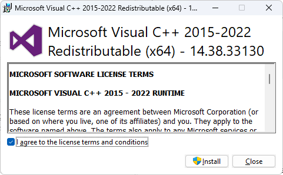
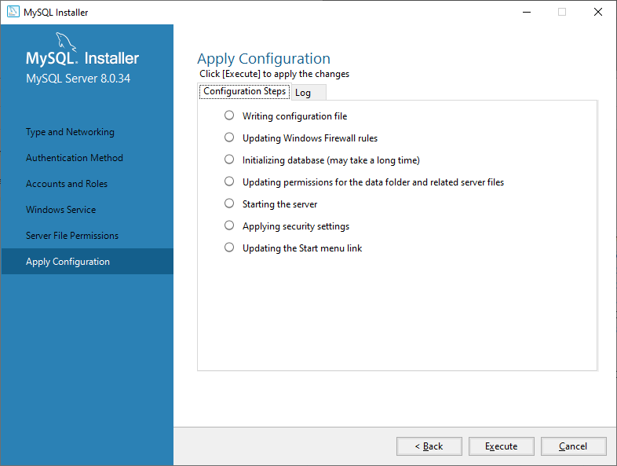

# MySQL installation procedure
These are the steps for using MySQL with Exment.   
※Various steps may differ depending on the OS, version, installation time, etc.   


## MySQL settings (Windows)

- **(Only if MySQL5.7 is present)**  
[Database backup](https://dev.mysql.com/doc/refman/8.0/en/mysqldump-sql-format.html).

- **(Only if MySQL5.7 is present)**  
Type Command Prompt into the search bar to the right of the Start button.   
Right-click Command Prompt, which appears at the top of the most matching search results.   
Right-click and select Run as administrator from the menu that appears.
   
Stop MySQL.   

~~~
net stop mysql57
~~~

- Access the site below and download MySQL.   
[MySQL Download](https://downloads.mysql.com/archives/installer/)  

- Select the latest version with Product Version 8.0.X.   


- In the row that does not include web in the file name, click Download on the row with the largest file size to download.   


- Run the downloaded file and proceed with the installation.   

- For Choosing a Setup type, select Custom.   
  

- Under Select Products and Features, click MySQL Servers > MySQL Server > MySQL Server 8.0 and you'll see MySQL Server X64 and X86.   
Click on one line according to the version of the OS you are using, and then click → in the middle.     
  

- (Optional) If you want to install MySQL Workbench, click Applications > MySQL Workbench > MySQL Workbench 8.0 and MySQL Workbench will be displayed.   
Click on this line and click → in the middle.     
※MySQL Workbench is an application that makes it easier to access MySQL data from a GUI.   
  


- Click Yes or Install until completed.   
  

- On the Installation page, click Execute to begin the installation.   
  

-Click Next.   
  

- For Type and Networking, use the default settings.   
  

- Enter the root user password.   
Be sure to remember this, as you will need it when using MySQL with Exment etc. in the future.   
  

- After that, follow the wizard and press Next several times to proceed with the installation.
  
  

- Installation is complete.   
  

- Fix my.ini. (C:\ProgramData\MySQL\MySQL Server 8.0\my.ini)

~~~
# Add the following to the end

local-infile=1
~~~

- Start a command prompt with administrator privileges and stop MySQL.   

~~~
net stop mysql80
~~~  

- Start MySQL.

~~~
net start mysql80
~~~

### Add environment variables

- From Explorer, right-click This PC and click Properties.


- Click Advanced system settings.


- Click on Environment Variables.   


- Click Path under User Environment Variables and click Edit.   


- If the C:\Program Files\MySQL\MySQL Server 5.7\bin variable exists, remove it.


- Click New and add the following line.   
C:\Program Files\MySQL\MySQL Server 8.2\bin   


- Once you have made your entries, click OK on any dialogs that launch to complete them.   


## MySQL settings (Linux)
This is the installation procedure for MySQL on Linux.   
※ Add sudo to the beginning of the command if necessary.   
※If the installation destination is CentOS8, RHEL8, etc., please use the dnf command instead of yum.

### If MySQL5.7 exists (update from MySQL5.7 to MySQL8.0)
- Delete the MySQL5.7 package.
~~~
sudo killall mysqld; sudo killall mysqld_safe;
sudo rpm -e --nodeps mysql57-community-release
sudo yum remove mysql mysql-server mysql-client mysql-common mysql-devel mysql-community-client-plugins -y
~~~

- Install and start MySQL 8.0.

```bash
# For CENTOS STREAM

rpm -ivh https://dev.mysql.com/get/mysql80-community-release-el9-1.noarch.rpm
rpm --import https://repo.mysql.com/RPM-GPG-KEY-mysql-2023
dnf clean packages
dnf update -y

# Install and start mysql-community-server
dnf install mysql-community-server -y
systemctl start mysqld
systemctl enable mysqld
```

```bash
# For CENTOS 8

sudo rpm -ivh http://dev.mysql.com/get/mysql80-community-release-el7-11.noarch.rpm
sudo rpm --import https://repo.mysql.com/RPM-GPG-KEY-mysql-2022

# Check if mysql-community-server exists
sudo yum search mysql-community-server

# If you get a message like "Error: Unable to find a match: mysql-community-server", run the following command first:
sudo yum -y module disable mysql

# Install and start mysql-community-server
sudo yum -y install mysql-community-server
sudo systemctl enable mysqld.service
sudo systemctl start mysqld
```
- Fix my.cnf.

~~~
vi /etc/my.cnf

# Add the following to the end

local-infile=1
~~~

- Start MySQL.

~~~
sudo systemctl start mysqld
~~~

### If MySQL5.7 does not exist (new installation of MySQL8.0)
- Install and start MySQL8.0.

```bash
# For CENTOSSTREAM

rpm -ivh https://dev.mysql.com/get/mysql80-community-release-el9-1.noarch.rpm
rpm --import https://repo.mysql.com/RPM-GPG-KEY-mysql-2023
dnf clean packages
dnf update -y

# Install and start mysql-community-server
dnf install mysql-community-server -y
systemctl start mysqld
systemctl enable mysqld
```

```bash
# For CENTOS 8

sudo rpm -ivh http://dev.mysql.com/get/mysql80-community-release-el7-11.noarch.rpm
sudo rpm --import https://repo.mysql.com/RPM-GPG-KEY-mysql-2022

# Check if mysql-community-server exists
sudo yum search mysql-community-server

# If you get a message like "Error: Unable to find a match: mysql-community-server", run the following command first:
sudo yum -y module disable mysql

# Install and start mysql-community-server
sudo yum -y install mysql-community-server
sudo systemctl enable mysqld.service
sudo systemctl start mysqld
```


- Check the initial password for MySQL.

~~~
cat /var/log/mysqld.log | grep password

#The following log will be output, so check the password
2016-09-01T13:09:03.337119Z 1 [Note] A temporary password is generated for root@localhost: uhsd!XXXXXX
~~~

- (Optional) Disable password policy.

~~~
vi /etc/my.cnf

#Add the following validate_password
[mysqld]
validate_password=OFF
~~~


- Restart MySQL.

~~~
sudo systemctl restart mysqld
~~~

- Perform initial settings for MySQL. Run the following command:

~~~
mysql_secure_installation

Enter password for user root: (enter the password you copied earlier)

New password: (enter new password)
Re-enter new password: (enter new password)

Change the password for root? : n

Remove anonymous users? : y #Remove anonymous user account
Disallow root login remotely? : y # Remove root account that is accessible only from localhost
Remove test database and access to it? : y # Remove test database
Reload privilege tables now? : y #reload privilege tables
~~~

- Log in to MySQL.

~~~
mysql -u root -p(password)
~~~
- Fix my.cnf.

~~~
vi /etc/my.cnf

# Add the following to the end

local-infile=1
~~~

- Restart MySQL.

~~~
sudo systemctl restart mysqld
~~~

- Create a database and user for Exment.   
※Here, let the database name be exment_database and the user exment_user.   
Also, assume the connection source IP address is 192.168.137.%.

~~~
CREATE DATABASE exment_database;
CREATE USER 'exment_user'@'192.168.137.%' IDENTIFIED BY '(password for exment_user)';
GRANT ALL ON exment_database.* TO 'exment_user'@'192.168.137.%';
FLUSH PRIVILEGES;
~~~

- Firewall settings allow MySQL access only from the IP address of the connection source.   
※Here, the connection source IP address is 192.168.137.%.

~~~
firewall-cmd --permanent --new-zone=from_webserver
firewall-cmd --reload
firewall-cmd --permanent --zone=from_webserver --add-source="192.168.137.0/24"
firewall-cmd --permanent --zone=from_webserver --add-port=3306/tcp
firewall-cmd --zone=from_webserver --add-service=mysql
firewall-cmd --reload
~~~
