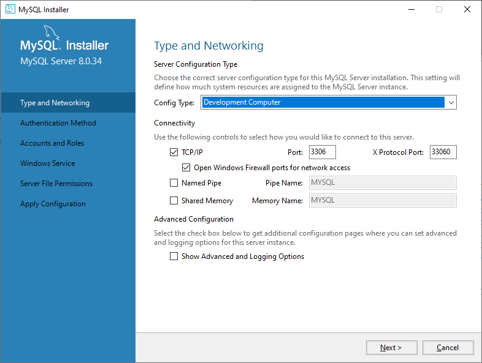

# (old) MySQL installation procedure
> ※At the time of writing this manual, MariaDB included with XAMPP was a version not compatible with Exment, and had to be installed separately.  
Currently, it is updated to a version compatible with Exment, and this step is unnecessary.  

- Access the following site and download MySQL.  
[MySQL Download](https://downloads.mysql.com/archives/installer/)  

- Select the latest version whose Product Version is "5.7.X".  

- Click "Download" on the line with the larger capacity in the line where "web" is not included in the file name.  

- Execute the downloaded file and proceed with the installation.  

- For "Choosing a Setup type", select "Custom".  
  

- Under "Select Products and Features", click on "MySQL Servers> MySQL Server> MySQL Server 5.7" and you will see MySQL Server X64 and X86.  
Click one line according to the version of the OS you are using, and click "→" in the middle.  
  

- (Optional) If you want to install MySQL Workbench, click "Apploications> MySQL Workbench> MySQL Workbench 8.0" to display "MySQL Workbench".  
Click this line and click the "→" in the middle.  
※MySQL Workbench is an application that makes it easy to access MySQL data from a GUI.  
  

- "Check Requirements" may be displayed.  
In that case, click "Execute" and install the related components. 

- Click "Yes" or "Install" until done.  
  

- On the "Installation" page, click "Execute" to complete the installation.  
  

- When complete, click Next.  
  

- Use the default settings for "Group Replication" and "Type and Networking".  
  
  

- Enter the root user password.  
It is necessary for future use of MySQL for Exment, so be sure to remember it.  
  

- It is necessary for future use of MySQL for Exment, so be sure to remember it.  
  
  

- Installation is completed.  
  

