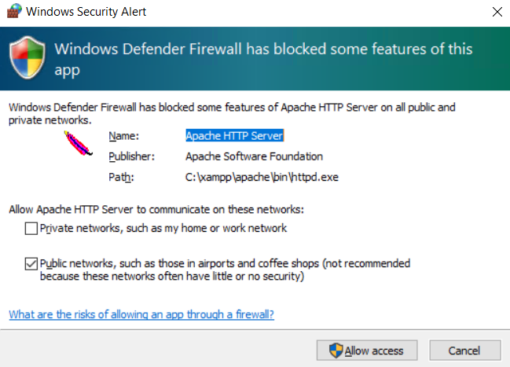
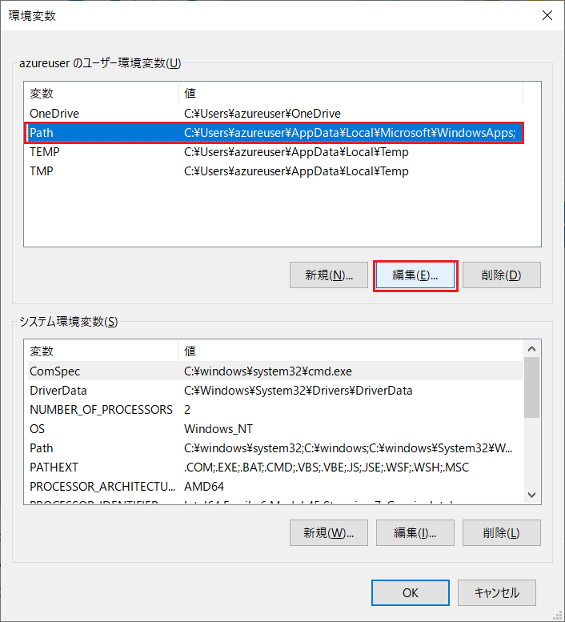
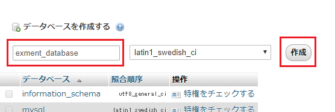
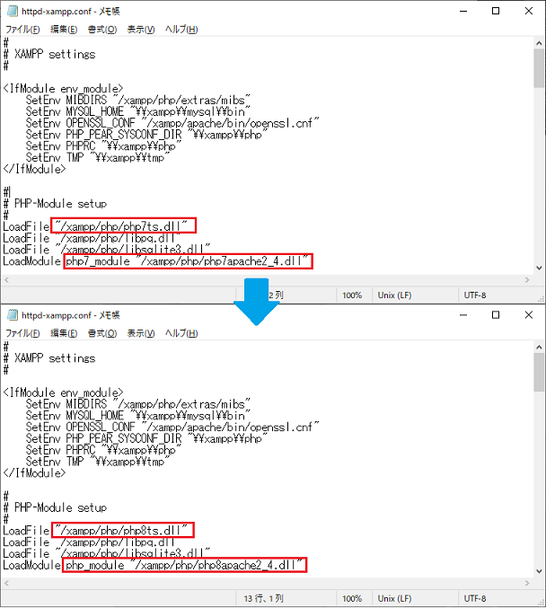

# Environment construction using XAMPP
If you are building an environment with PHP, Apache, or MySQL as a development environment from the beginning, we recommend XAMPP.   
Please note that this manual is based on Windows.

## Important point
- **Please use XAMPP installation only for development and verification purposes. We recommend that you do not use it as a production environment**

## Installation instructions

### XAMPP installation instructions
- Access the site below and download XAMPP.   
[XAMPP download](https://www.apachefriends.org/jp/download.html)

- From the page below, select the one that requires PHP 8.2 or higher and download it.   

- Then proceed with the installation of XAMPP.  

- On the way, you will be asked to select the XAMPP components, so select Apache and MySQL.   
Also add a check to phpMyAdmin.   
※Other than that, please check as you like  
Then click Next.   

- Follow the on-screen instructions to complete the installation.

- Once the installation is complete, launch the XAMPP control panel.   

- Click Start on the top Apache and MySQL row.  

- If firewall settings appear, click Allow.  

- This will start Apache.  

#### 【Important point】
- If you restart the OS, you will need to start the XAMPP control panel again and restart Apache.

### Add environment variables
When running mysql from the command prompt, you need to pass the path to the environment variables.   

- From Explorer, right-click This PC and click Properties.  

- Click Advanced system settings.  

- Click on Environment Variables.  

- Click Path under User Environment Variables and click Edit.   

- Click New and add the following line.   

~~~
C:\xampp\mysql\bin  
~~~

- Once you have made your entries, click OK on any dialogs that launch to complete them.   

##### When running Mysql under XAMPP
- When running Mysql under XAMPP, add the path to the folder where the executable file is located in .env in the root directory of Exment during the [Exment installation](#Exment-installation) step. please.   
~~~
#example  
EXMENT_MYSQL_BIN_DIR="C:/xampp/mysql/bin"
~~~

#### Create database
- After starting the XAMPP control panel, click Admin in the MySQL line.   

- Click New on the left menu.   

- In the line where you want to create a database, enter any alphanumeric database name and click Create.   
  
This completes database creation.  

### Subdomain settings
With normal settings, you can use Exment by placing the Exment project file in the "C:\xampp\htdocs" folder.
However, for example, by accessing the URL [http://localhost/exment/.env](http://localhost/exment/.env), a configuration file including database information will be displayed on the screen. , there is a big problem.   
Therefore, we strongly recommend settings to prevent these problems from occurring. Please follow the steps below to make the settings.   

- Create a folder local in the folder C:\xampp.  

- Open "C:\xampp\apache\conf\extra\httpd-vhosts.conf".

- Add the following to the end of the line. **※DocumentRoot must have /public at the end**  

~~~
<VirtualHost *:80>
    DocumentRoot "C:/xampp/htdocs"
    ServerName localhost
    # For v6.1.xx or later, add the following to the end
    Header set Content-Security-Policy "default-src 'self'; script-src 'self' 'unsafe-inline'; style-src 'self' 'unsafe-inline'; img-src 'self' data: blob:; font-src 'self' data:; object-src 'self'; frame-src 'self'; connect-src 'self'; form-action 'self'; frame-ancestors 'self'"
    Header set X-Frame-Options "SAMEORIGIN"
    Header set X-Content-Type-Options "nosniff"
    Header set X-XSS-Protection "1; mode=block"
</VirtualHost>

<VirtualHost *:80>
  DocumentRoot "C:/xampp/local/exment/public"
  ServerName exment.localapp
    # For v6.1.xx or later, add the following to the end
    Header set Content-Security-Policy "default-src 'self'; script-src 'self' 'unsafe-inline'; style-src 'self' 'unsafe-inline'; img-src 'self' data: blob:; font-src 'self' data:; object-src 'self'; frame-src 'self'; connect-src 'self'; form-action 'self'; frame-ancestors 'self'"
    Header set X-Frame-Options "SAMEORIGIN"
    Header set X-Content-Type-Options "nosniff"
    Header set X-XSS-Protection "1; mode=block"
</VirtualHost>

<Directory "C:\xampp\local\exment\public">
  Allow from all
  AllowOverride All
  Require all granted
</Directory>
~~~

- Open "C:\WINDOWS\system32\drivers\etc\hosts" and edit it.   
※This file cannot be edited directly, so copy it to your desktop, edit it, and then overwrite it in the original location.   

~~~
127.0.0.1       localhost
127.0.0.1      exment.localapp
~~~

- In the XAMPP control panel, restart Apache. In the XAMPP control panel, click the Stop button in the Apache line, then click Start again.   

- As a result, you will be able to access Exment using the URL below.   
http://exment.localapp/admin

### Exment installation
Install Exment by following the Exment [Installation Instructions](/ja/quickstart).   
Exment installation is normally done in the "C:\xampp\local" folder.   
Here, it is assumed that the installation was performed in the "C:\xampp\local\exment" folder.   

- When installing Exment in the future, there will be a screen where you can enter database settings, so please enter them as shown below.   
    - Database type: MariaDB
    - Host name: 127.0.0.1
    - Port: 3306
    - Database: (database name created above)
    - Username: root
    - Password: (blank)

## Correspondence when upgrading PHP version
If you want to change the PHP version, please update it by following the steps below.   
※Exment will not be accessible while the version is being upgraded.   
※The example below is the procedure for updating from PHP7.4 to PHP8.2. This is also a way to replace only PHP without updating all of XAMPP.   
※The version upgrade method may differ depending on the environment, installation time, version, and installation method.   

- In preparation for work, stop apache and MySQL and exit the XAMPP control panel.   

- Back up the PHP folder (default is C:\xampp\php) and Apache folder (default is C:\xampp\apache) under the currently used XAMPP. Choose your preferred method, such as renaming the folder or copying it to another location.

- Download new XAMPP in ZIP format.   

   1. Access [XAMPP download](https://www.apachefriends.org/jp/download.html)
   2. Download the file according to the OS and PHP version you want to use.   
      > At that time, please select the zip file instead of installer.exe. (You can use 7z files as long as you have an environment where you can unzip them.)
      

   3. Unzip the ZIP file and copy the PHP folder and Apache folder directly under the extracted folder to the XAMPP folder.   

- Modify the php.ini file if necessary.   
※ If you have modified the original ini file, the new ini file must also have the same changes. Compare the backed up php.ini file with the new php.ini file and add various settings.   

- Launch the XAMPP control panel.   

- Press the Apache config button and select Apache (httpd-xampp.conf) from the pulldown.
   

- Edit httpd-xampp.conf.
   1. First, replace all "php7_module" with "php_module".
   2. Replace all remaining "php7" with "php8".  
   

- Press the Shell button to launch the command screen and check that the PHP version is new.   

~~~
php -v
~~~

- Click Start in the Apache and MySQL row.   

   > An error may occur when starting Apache.   
   In that case, open Logs → Apache (error.log) on ​​the right side of the same line.   
   If the latest line in the log shows PHP Warning: 'vcruntime140.dll'..., you need to install the Visual C++ Redistributable Package.   
   Access [Microsoft's download site](https://visualstudio.microsoft.com/en/downloads/) and scroll to the bottom → open Other Tools, Frameworks, and Redistributables.   
   Click the download button for Microsoft Visual C++ Redistributable for Visual Studio 2022 to get the installer → Run it.   
