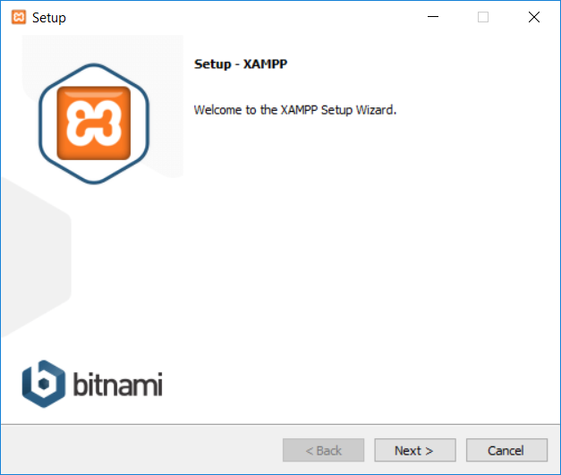
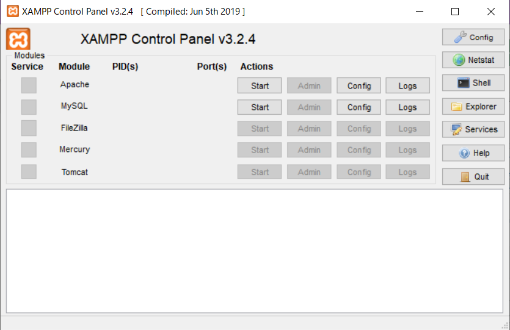
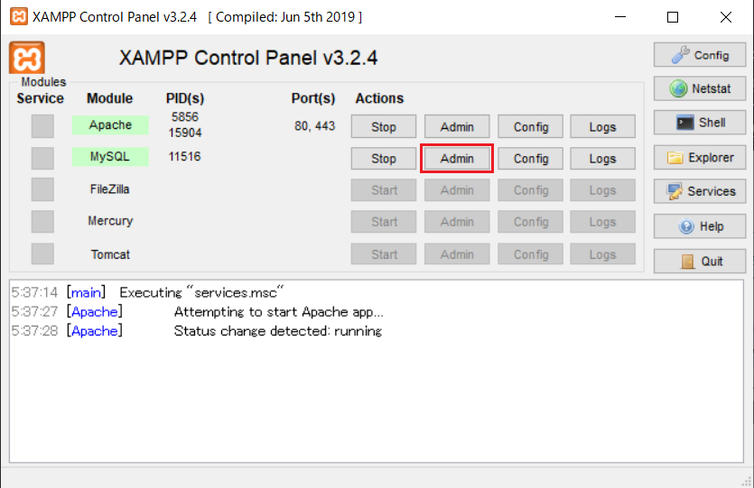
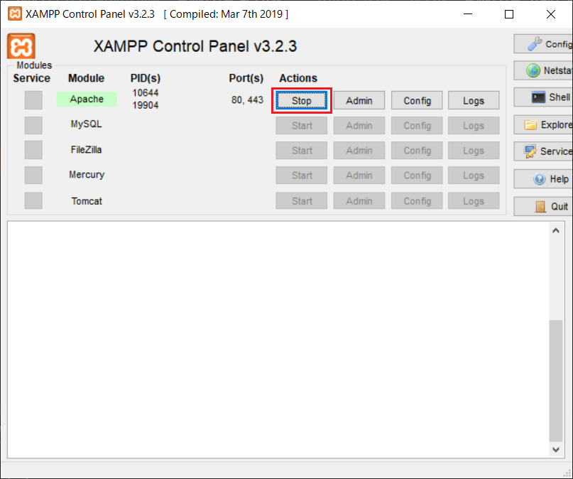

# Environment construction with XAMPP
XAMPP is recommended when building an environment with PHP, Apache, and MySQL as a development environment from the beginning.  
In this manual, Windows is introduced.  

- For other inquiries, please feel free to [contact us](https://exment.net/inquiry) for free.  

## important point
- **Please use XAMPP installation only for development and verification. We recommend that you do not use it as a production environment.** 

## Installation procedure

### XAMPP installation procedure
- Access the following site and download XAMPP.  
From the following page, select the one with "PHP7.1" or higher and download it.  
[XAMPP Download](https://www.apachefriends.org/jp/download.html)  

- After that, proceed with the installation of XAMPP.  

- On the way, the screen for selecting the XAMPP component will be displayed. Select Apache and MySQL.  
Also add a check to "phpMyAdmin".  
※ Otherwise, please check arbitrarily and then click "Next".  

- Follow the instructions on the screen to complete the installation.  

- When installation is complete, launch the XAMPP control panel.  

- Click "Start" in the top "Apache" and "MySQL" rows.  

- When the firewall settings are displayed, click "Allow".  

- This will start Apache.  

#### 【important point】
- When the OS is restarted, it is necessary to start the XAMPP control panel again and restart Apache.  

### Add environment variable
If you run mysql from the command prompt, you need to pass the path to "environment variables".  

- From Explorer, right-click "PC" and click "Properties".  

- Click "Advanced system settings".

- Click Environment Variables.

- Click "Path" of "User environment variable", and click "Edit".

- Click New and add the following line:

~~~
C:\Program Files\MySQL\MySQL Server 5.7\bin  
~~~

- After inputting, click “OK” to complete all the dialogs that have been started.

#### Create database
- After starting the XAMPP control panel, click "Admin" in the "MySQL" row.

- Click "New" on the left menu.

- In the "Create database" line, enter any database name in alphanumeric characters and click "Create".

Completes the database creation.

### Subdomain settings
Under normal settings, you can use Exment by placing the Exment project file in the "C: \ xampp \ htdocs" folder.  
However, there is a big problem, for example, when accessing the URL of [http: //localhost/exment/.env](http://localhost/exment/.env), the configuration file including the database information is displayed on the screen.  
Therefore, we strongly recommend that you avoid these issues. Please set according to the following procedure.  

- Create a folder "local" in the folder "C: \ xampp".

- Open "C: \ xampp \ apache \ conf \ extra \ httpd-vhosts.conf".

- Add the following description at the end of the line.  
**※"/ Public" is required at the end of DocumentRoot**  

~~~
<VirtualHost *:80>
    DocumentRoot "C:/xampp/htdocs"
    ServerName localhost
</VirtualHost>

<VirtualHost *:80>
  DocumentRoot "C:/xampp/local/exment/public"
  ServerName exment.localapp
</VirtualHost>

<Directory "C:\xampp\local\exment\public">
  Allow from all
  AllowOverride All
  Require all granted
</Directory>
~~~

- Open "C: \ WINDOWS \ system32 \ drivers \ etc \ hosts" and edit.  
※  Since this file cannot be edited directly, copy it to the desktop etc., edit it, and overwrite it in the original location.  

~~~
127.0.0.1       localhost
127.0.0.1       exment.localapp
~~~

- Restart Apache in the XAMPP control panel. In the XAMPP control panel, click the "Stop" button in the "Apache" line and click "Start" again.  

- This will allow you to access Exment from the URL below.  
http://exment.localapp/admin

### Exmentインストール
Install Exment according to the Exment [installation procedure](/quickstart).
Exment installation is usually performed in the "C: \ xampp \ local" folder.
Here, it is assumed that the installation was performed in the "C: \ xampp \ local \ exment" folder.

- In the future installation of Exment, there is a screen to fill in the database settings, please enter as follows.  
    - Database type: MariaDB
    - Host name: 127.0.0.1
    - Port: 3306
    - Database: (Database name created above)
    - User name: root
    - Password: (blank)