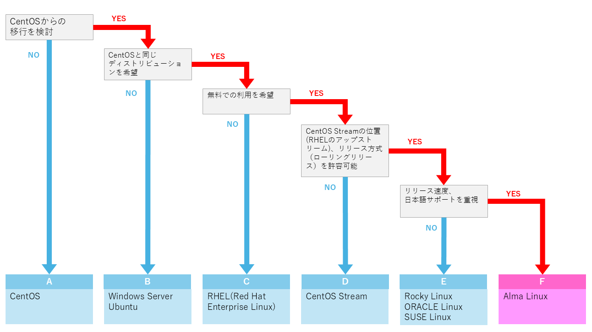

# CentOSからの移行について

株式会社カジトリが、Exmentを運用することを考慮した、CentOS環境からの移行先環境を以下に提案いたします。

# CentOSについて

## CentOSの現在（2025.04.30現在）

CentOSは、The CentOS Projectによって開発、提供されていたOSです。
現在、CentOSの開発は終了しており、最もサポート期間が長い「CentOS 7」は、2024年06月30日にサポート終了を迎えております。
したがいまして、今後の新機能、セキュリティ更新の提供はありません。

## 後継の「CentOS Stream」について

The CentOS Projectは、CentOSの後継OSとして「CentOS Stream」の開発、提供を開始しております。
ただし、「CentOS」と「CentOS Stream」では、Red Hat Enterprise Linux(RHEL)に対する立ち位置、リリースサイクルが異なります。
したがって、Exmentを導入する環境として、エンドユーザー様の想定する「サーバー基準」等にマッチしない可能性があります。
なお、こちらの解説では、「CentOS」と「CentOS Stream」の違いについての詳しい説明は割愛させていただきます。

# CentOSの移行先OSの候補

CentOSの移行先OSの候補の選択方法として、Yes/Noチャートをご用意しました。
こちらを参考に、エンドユーザー様の「サーバー基準」にマッチしたOSをお選びください。

なお、全ての移行先OSに対してインストール手順をご用意できておりませんので、あらかじめご了承ください。

### 移行先OS候補 A:CentOS

CentOSからの移行を検討していない場合、エンドユーザー様の責任の下、引き続きCentOS上でExmentをご利用ください。
なお、有料ですが、企業様によるCentOSの延長サポートが提供されております。
「CentOS 延長サポート」で検索してみてください。

### 移行先OS候補 B:Windows Server, Ubuntuなど

CentOSからの移行を検討しており、CentOSと同じディストリビューション(Red Hat系)にこだわらない場合、「Windows Server」や別のディストリビューション(Debian系)の「Ubuntu」などでExmentをご利用ください。
- [XAMPP構築(開発・検証環境) - Windows](/ja/install_xampp)  
- [AWSに構築-シングル構成 - Ubuntu](ja/install_aws_ubuntu_single)

### 移行先OS候補 C:RHEL(Red Hat Enterprise Linux)
CentOSからの移行を検討しており、CentOSと同じディストリビューション(Red Hat系)を希望し、有料OSでも構わない場合、「RHEL(Red Hat Enterprise Linux)」でExmentをご利用ください。
- [Linuxに構築 - RHEL(Red Hat Enterprise Linux)](/ja/install_almalinux)  

### 移行先OS候補 D:CentOS Stream
CentOSからの移行を検討しており、CentOSと同じディストリビューション(Red Hat系)で無料OSを希望し、「CentOS Stream」の立ち位置(RHELのアップストリーム)、リリース方法(ローリングリリース)を許容可能な場合、「CentOS Stream」でExmentをご利用ください。
- [Linuxに構築 - CentOS Stream](/ja/install_centos_stream)  

### 移行先OS候補 E:Rocky Linux, ORACLE Linux, SUSE Linuxなど
CentOSからの移行を検討しており、CentOSと同じディストリビューション(Red Hat系)で無料OSを希望するが、「CentOS Stream」は採用できず、リリース速度や日本語のサポートを重要視しない場合、「Rocky Linux」や「ORACLE Linux」、「SUSE Linux」でExmentをご利用ください。

### 移行先OS候補 F:AlmaLinux
CentOSからの移行を検討しており、CentOSと同じディストリビューション(Red Hat系)で無料OSを希望するが、「CentOS Stream」は採用できず、リリース速度や日本語のサポートを重要する場合、「AlmaLinux」でExmentをご利用ください。
- [Linuxに構築 - AlmaLinux](/ja/install_almalinux)  

# 推奨する移行先OS : AlmaLinux

株式会社カジトリでは、CentOSからの移行先OSとして「AlmaLinux」を推奨いたします。
理由は、Yes/Noチャートと重複しますが、以下の通りです。

- CentOSと同じディストリビューション(Red Hat系)
- CentOSと同じ無償OS
- RHELのリリース後の新バージョンリリース速度が他のOSに比べて早い
- リリース後のバージョンのサポート期間が長い
   ⇒最新版の「AlmaLinux 9」のセキュリティサポート終了日は 2032年05月31日 です
- 有償ですが、日本語によるサポートも受けられる
   ⇒「MIRACLE LINUX」の開発元である「サイバートラスト株式会社」様より、[複数のサポートプラン](https://www.cybertrust.co.jp/almalinux/)が提供されております。
