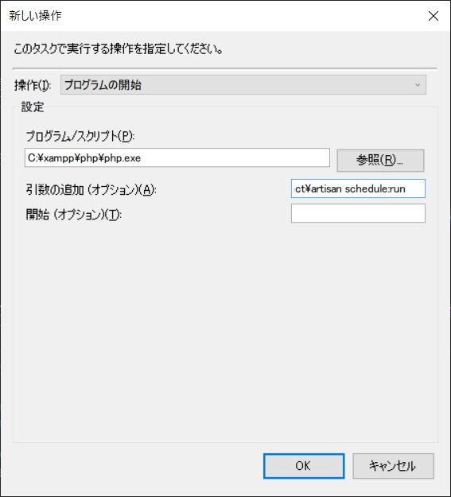
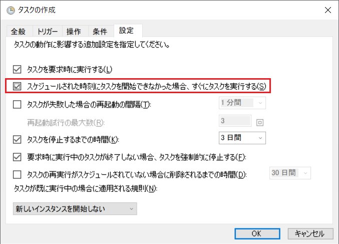

# タスクスケジュール
Exmentでは、タスクスケジュール機能があります。  
具体的には、以下の用途で使用されます。  
- データベースやファイルを、決まった時間に日次バックアップする。  
- あらかじめ設定しておいた通知設定により、特定の条件に合致したデータの関係者に、特定の時刻にメールを送信する。

これらの機能を実行するためには、サーバー側で追加の作業を行う必要があります。  
なお、LinuxとWindowsによって、手順が異なります。

### 設定手順(Linux)
- 以下のコマンドを実行します。

~~~
crontab -e
~~~

- Cronの設定画面が表示されるので、以下の内容を記入します。  
この設定により、artisan scheduleコマンドが毎分実行されます。その後はExmentのシステムにより、決まった時間にタスクが実行されます。  
※下記は一例です。OSやサービスによって、記法や設定が異なる場合があります。

~~~
# 通常のLinux
* * * * * cd /(Exmentのルートディレクトリ) && php artisan schedule:run >> /dev/null 2>&1

# XServer(PHPバージョンによってパスは異なる。下記はPHP7.2の場合)
* * * * * cd /(Exmentのルートディレクトリ) && /usr/bin/php7.2 artisan schedule:run >> /dev/null 2>&1

# さくらインターネット
* * * * * cd /(Exmentのルートディレクトリ); php artisan schedule:run >> /dev/null 2>&1
~~~

### 設定手順(Windows)
- 以下のコマンドを実行し、php.exeファイルがあるパスをコピーします。  

~~~
where php
// C:\xampp\php\php.exe
~~~

- windowsメニューで、「task」と入力し、タスクスケジューラを起動します。  


- タスクスケジューラで、「タスクの作成」をクリックします。


- 「全般」タブで、以下のように設定します。（「名前」は任意の名称です）


- 「トリガー」タブをクリックします。2つのトリガーを作成します。  
    (1)「新規」ボタンをクリックします。  
    その後、以下のように入力します。  
    - タスクの開始：スタートアップ時
    - 繰り返し間隔：1分間
    - 継続時間：無期限
    - 「有効」にチェック  
    完了したら「OK」をクリックします。  


    (2)再度、「新規」ボタンをクリックします。  
    その後、以下のように入力します。  
    - タスクの開始：タスクの作成/変更時
    - 繰り返し間隔：1分間
    - 継続時間：無期限
    - 「有効」にチェック  
    完了したら「OK」をクリックします。  


- 「操作」タブで、「新規」ボタンをクリックします。  
その後、以下のように入力します。
    - 操作：プログラムの開始
    - プログラム/スクリプト：先ほどコピーしたphpまでのパス
    - 引数の追加： (Exmentのルートディレクトリ)/artisan schedule:run


- 「設定」タブで、「スケジュールされた時刻にタスクを開始できなかった場合、すぐにタスクを実行する」にチェックします。


- ノートPCの場合、「条件」タブで、「コンピューターをAC電源で使用している場合のみタスクを開始する」のチェックを外します。 


- これらの設定が完了したら、OKをクリックします。  
その後、ユーザーの資格情報を入力する画面が表示されるので、パスワードを入力してください。  


- 設定完了後、「タスク スケジューラ ライブラリ」にて、作成したタスクを選択肢、「実行」をクリックしてください。 


これで設定完了です。


## うまく動作しない場合の検証(v4.0.6以降)
うまく動作しない場合は、以下の手順で、検証を進めていくことを推奨しています。

### ログ出力
ログ出力を行いながら、検証を行っていくことを推奨します。  
v4.0.6、スケジュール実行のためのデバッグログを追加しましたので、以下の手順で、確認を行ってください。

#### 設定手順 
- .envファイルに、以下の内容を追加し、保存します。

~~~
EXMENT_DEBUG_MODE_SCHEDULE=true
~~~

- これにより、/storage/logs/laravel.logに、スケジューリング定義・実行時にログが出力されるようになります。  
タスクスケジュール設定が正常に行われていれば、1分おきにログが出力されます。


#### 出力ログ内容

- Exment schedule debug defined.  
→下記のログ出力・スケジューリング設定が完了した場合に、出力されるログです。  
→このログが出力されていない場合は、スケジューリング定義や呼び出しが正常に完了されていない場合がありますので、cron設定やタスク スケジューラ設定を見直してください。

- Exment schedule debug everyMinute called.  
→毎分出力されるログです。スケジューリング定義が正常に完了していれば、毎分ログ出力されます。  
→このログが出力されていない場合は、スケジューリング定義や呼び出しが正常に完了されていない場合がありますので、cron設定やタスク スケジューラ設定を見直してください。

- Exment schedule debug hourly called.  
→毎時0分に出力されるログです。スケジューリング定義が正常に完了していれば、毎時ログ出力されます。  
また、Exmentの本来のスケジューリングコマンドと同様の定義です。そのため、まずはこのログが出力されているかどうかを確認してください。

- Exment schedule command called.  
→Exmentのスケジュールコマンドの実行開始時に出力されるログです。このログが出力されている場合、少なくともスケジュールコマンドは正常に実行されています。  
このログが出力されているにも関わらず、想定通りの通知やバックアップが実行されない場合、設定値を見直してください。


#### 注意点
このログ出力では、「スケジューリング実行か、通常のコマンド実行か」の判別は出来ないため、通常のコマンド実施時にも、ログが出力されます。  
そのため、スケジューリングの検証を行う時以外は、設定値EXMENT_DEBUG_MODE_SCHEDULEを削除してください。


### 直接コマンドを実行
通知やバックアップが正常に動作していない場合、もう一つの切り分けとして、Exmentのスケジューリングコマンドを直接実行し、検証する方法があります。  
以下のコマンドを実行してください。

```
php artisan exment:schedule
```

このコマンドでは、以下内容を実施します。

- 通知（時間の経過）で、「通知時間」が合致している通知の実行。本来であれば00分でないと動作しませんが、直接コマンドを実行することで、すぐに実行されます。
- 自動バックアップで、「自動バックアップ開始時間(時)」が合致しているバックアップの実行。本来であれば00分でないと動作しませんが、直接コマンドを実行することで、すぐに実行されます。

このコマンドを実行した結果、想定通りの動作が行われた場合は、何かしらの理由で、スケジューリングが正常に動いていない可能性があります。  
切り分けの参考としてください。


[←追加設定一覧へ戻る](/ja/quickstart_more)