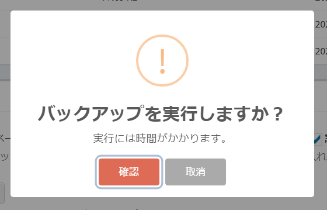
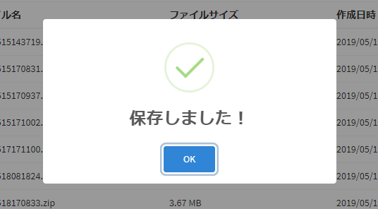
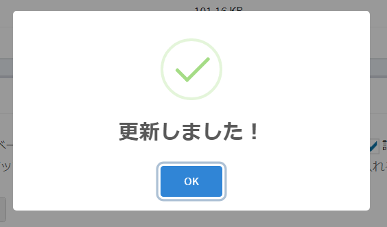

# バックアップ・リストア
Exmentのデータのバックアップとリストアを行うことができます。  

## 概要
Exmentでは、データのバックアップとリストアを行うことができます。  
例えば、以下のようなことを実行できます。  

- 大きなデータ更新を行う前に、事前にバックアップを行っておき、万が一不備が発生した場合に元に戻す。
- 毎日バックアップを保持しておき、予期せぬ障害に備える。
- 今ある環境から別の環境に全データを移行する。（実施前に、必ず動作確認をお願いいたします。）

バックアップ対象は、以下の通りです。
- データベース
- プラグインファイル
- 添付ファイル
- ログファイル
- 設定ファイル

## 注意
- 環境から別の環境に移行を行う場合、それぞれの環境によっては、正常に完了しない場合があります。  
**特に、OSから別のOS(WindowsやLinux)、異なるデータベースの種類(MySQLやMariaDB)、異なるデータベースのバージョンに移行する場合、さまざまな要因により、正常に完了しない場合があります。**  
そのため、必ず事前に、確認を行ってください。  

- 事前確認として、主に以下のような内容を推奨しています。
    - 移行先を、開発環境などで実施する。
    - テーブル定義のみを作成した段階で、移行を試す。
    - データベースの種類、データベースのバージョンを揃える。

## 画面
- 左メニューより、「管理者設定 > バックアップ」を選択します。  
もしくは、以下のURLにアクセスしてください。  
http(s)://(ExmentのURL)/admin/backup  
これにより、バックアップ画面が表示されます。

## バックアップ
バックアップを行う方法として、「手動」と「自動」の2種類あります。  

### 手動バックアップ実行
手動でバックアップを実施する手順です。  
任意のタイミングでバックアップを実行することができます。  

- ページ右上の［バックアップ］ボタンをクリックします。  
  

- 確認ダイアログが表示されますので、［確認］をクリックし、そのままお待ち下さい。  
**※バックアップは非常に時間がかかります。そのまま操作せずお待ち下さい。**
  

- 完了すると、メッセージが表示されます。  
その後、バックアップ一覧にて、作成日時が実行日時のファイルが作成されます。
  
  

- 作成したバックアップファイルは、ダウンロードを行うことができます。  
バックアップの行の［ダウンロード］リンクをクリックしてください。  
  

- 作成したバックアップのファイル名は、変更をすることが出来ます。  
バックアップの行の［ファイル名編集］リンクをクリックしてください。   
※半角カナ、記号、を含む名前は設定することが出来ません。
  
- ファイル名を入力後、［送信］ボタンをクリックしてください。
  

- 完了するとメッセージが表示され、バックアップ一覧でのファイル名が変更されています。
  

  

### 自動バックアップ実行
Exmentでは、決まった時刻に自動的にバックアップを行うことができます。  
定期的にバックアップを取っておくことによって、万が一の大幅なデータ更新ミスなどがあった場合でも、復元することが可能です。  
**※事前に、[タスクスケジュール](/ja/quickstart_more?id=タスクスケジュール)設定を行う必要があります。**
    
例として、「夜間3時」に「1日おき」に、「7世代分のバックアップ」の設定を行う方法です。  

- 「バックアップ設定」より、「自動バックアップ」の選択を「YES」にします。
  

- オプションの設定を変更します。
  

- その後、ページ下部の［保存］ボタンをクリックします。  

<h3 id="backup_command">
<a href="#/ja/backup?id=backup_command" data-id="backup_command" class="anchor">(上級者向け)コマンドによるバックアップ</a>
</h3>

コマンドによるバックアップも可能です。プロジェクトのルートディレクトリで、以下のコマンドを実行してください。

~~~
php artisan exment:backup
~~~

## リストア
データをリストア(復元)する方法として、「バックアップ一覧から選択」と「アップロード」の2種類あります。  

### リストア時の注意
- バックアップを行った時点のExmentのバージョンと、現在インストールされているExmentのバージョンが異なっていた場合、リストア後、データベースの最新化が必要です。  
例： バックアップ時点のバージョン：v1.1.6 現在のバージョン：v1.2.0  →データベースの最新化が必要
その場合、リストア後、以下のコマンドを実行してください。  

~~~
php artisan exment:update
~~~

- リストア後は、自動的にサインアウトされます。バックアップされていたユーザーのIDとパスワードでログインを行ってください。

### バックアップ一覧から選択
過去に実施したバックアップ一覧から、バックアップするファイルを選択して、データを復元させる方法です。  

- バックアップ一覧から、［リストア］リンクをクリックします。  
  

- 確認ダイアログが表示されますので、［確認］をクリックし、そのままお待ち下さい。  
**※リストアは非常に時間がかかります。そのまま操作せずお待ち下さい。**
  

- 完了メッセージが表示されれば、バックアップした時点での環境に復元されます。  
自動的にログインページへリダイレクトされます。  
  

### アップロード
ローカルに保存しているバックアップをExmentにアップロードし、データを復元させる方法です。  
**※アップロードファイルの容量が大きすぎると、正常に完了しない場合があります。** その場合、下記のメニュー[容量が大きくてアップロードできない場合](#容量が大きくてアップロードできない場合)を参照ください。  

- ページ右上の［リストア］ボタンをクリックします。  
  

- ファイルアップロードのダイアログが表示されますので、ローカルにダウンロードしたバックアップファイルを選択し、「送信」をクリックします。  
  

- 「送信」ボタンをクリックしたら、そのままお待ち下さい。  
**※リストアは非常に時間がかかります。そのまま操作せずお待ち下さい。**

- 完了メッセージが表示されれば、バックアップした時点での環境に復元されます。  
  

### 容量が大きくてアップロードできない場合
「アップロード」方式でリストア時に、バックアップファイルの容量が大きすぎる場合、リストアに失敗する場合があります。  
その場合、以下のいずれかの手順でリストアを行ってください。  

#### (1)アップロード上限を変更する

- [こちら](/ja/additional_php_ini)の手順で、アップロード上限サイズを変更してください。

#### (2)サーバーに直接バックアップファイルを配置する

- ダウンロードしたバックアップファイルを、サーバーの以下のパスに配置します。  

~~~
(プロジェクトのルートディレクトリ)/storage/app/backup/list
~~~

- バックアップ画面をリロードします。  

- バックアップ一覧に、配置したバックアップファイルが追加されているので、上記メニューの「バックアップ一覧から選択」より、リストアを行ってください。

### バックアップ画面やコマンドで、エラーが表示される場合
バックアップ画面やコマンドで、以下のようなメッセージが表示される場合があります。

  

このエラーが表示される場合、Exmentのバックアップ・リストアに必要な設定が行われていない場合があります。  
[こちら](/ja/troubleshooting#バックアップ・リストアに失敗する)をご確認いただき、サーバー設定を変更してください。

### リストア後、カスタムデータなどを初期化する場合
リフレッシュ後、保存していたExmentのカスタムデータなどをリフレッシュし、データを1から作成することができます。  
詳細は[こちら](/ja/refresh_data)をご参照ください。

### SQL Serverを使用している場合
SQLServerを使用している場合、現状Exmentでは画面からのバックアップ／リストアに対応しておりません。手動で作業を行っていただく必要があります。  
詳細は[こちら](/ja/backup_sqlserver)をご参照ください。

<h3 id="restore_command">(上級者向け)コマンドによるリストア</h3>

コマンドによるリストアも可能です。

- ダウンロードしたバックアップファイルを、サーバーの以下のパスに配置します。  

~~~
(プロジェクトのルートディレクトリ)/storage/app/backup/list
~~~

- プロジェクトのルートディレクトリで、以下のコマンドを実行してください。

~~~
php artisan exment:restore (zipファイル名)
~~~

### (上級者向け)バックアップ先の変更
通常は、バックアップファイルはWebサーバー上に配置されます。  
しかし、バックアップファイルを別の場所に配置したいというご要望はあるはずです。  
別の場所に配置すれば、Webサーバーが何らかの理由で故障し、起動できなくなっても、別の場所からバックアップファイルをダウンロードし、Exmentを復元できます。  
  
※設定方法手順は[こちら](/ja/additional_file_saveplace)に移動しました。

### 注意事項
- サーバーによって、上記バックアップ先変更が実施できない場合がございます。  
特にレンタルサーバーの場合、**提供会社の設定により、FTPなどを制限している場合がございます。**あらかじめご了承ください。