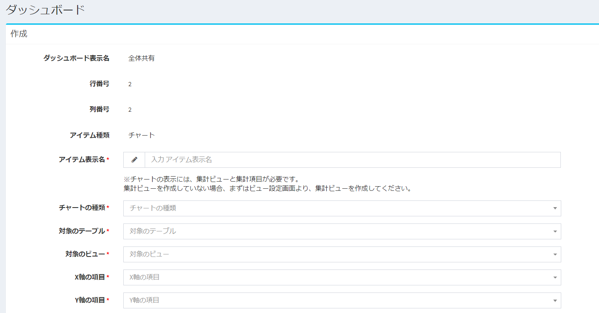

# ダッシュボード
Exmentへのログイン時や「HOME」「左上に表示のサイト名」をクリックした際に表示される画面です。  
表示方法を自由にカスタマイズすることで、Exmentで管理している情報を様々な形式にて表示できます。  
### ダッシュボードの表示例

## ダッシュボードの新規作成
- ダッシュボード画面右上にある「ダッシュボード新規作成」をクリックします。  

  
- ダッシュボードに必要事項を設定していきます。  

## ダッシュボードの設定項目
#### ダッシュボード名(英数字)
ダッシュボードの名称を表します。  
保存後に変更することは出来ません。

#### ダッシュボード表示名
ダッシュボードを選択する際、画面に表示する名前です。  
日本語の設定が可能で、保存後も変更することが出来ます。

#### ダッシュボード種類
「システムダッシュボード」or「ユーザーダッシュボード」どちらかを選択します。  

「システムダッシュボード」：システム管理者にだけ表示可能となるダッシュボードの設定です。  
「ユーザーダッシュボード」：システム管理者以外にもユーザー全員に表示可能となるダッシュボードの設定です。

#### 既定
「YES」or「NO」どちらかを選択します。  
ダッシュボードを複数作成している場合、ダッシュボードを開いた際に表示されるのは「YES」に設定しているダッシュボードになります。  
※一覧から選択することで「NO」に設定しているダッシュボードも表示することが出来ます。  
※「既定」を「YES」に設定できるのは、１つのダッシュボードのみです。  
2つ以上のダッシュボードで「YES」とした場合、最後に「YES」に設定したダッシュボード以外は「NO」に変更されます。

#### 列数の選択
ダッシュボードの各行に表示する列数を選択します。  
1行あたり最大4列まで表示することが可能です。  
※列数と１つあたりの表示面積は反比例します。  

### １行に４列表示している例
  

# 表示するアイテムを選択
作成したダッシュボードの各列右上「新規」にある  
「データ一覧」「システム」「チャート」「カレンダー」  
この4種類から表示したいアイテムを選ぶことが出来ます。  

  

次に、アイテムごとの具体的な表示内容を設定していきます。

## データ一覧
Exmentで管理している情報の中から、任意のテーブル、ビューを指定することでダッシュボードにデータ一覧を表示することが出来ます。

### データ一覧の表示例

### データ一覧の設定項目

#### アイテム表示名
画面に表示するアイテムの名前を入力します。

#### 表示
一度に何件のデータを表示するか選択します。

#### 対象のテーブル
[カスタムテーブル設定](/ja/table.md)で作成済のテーブルの中から表示する対象を選びます。

#### 対象のビュー
選択した対象のテーブル内にある[ビュー](/ja/view.md)の中から表示する対象を選びます。  

## システム
ダッシュボードにシステムに関する表示を行うことが出来ます。  
※現在は「ガイドライン」が表示として可能です。

### システムの表示例

### システムの設定項目

#### アイテム表示名
画面に表示するアイテムの名前を入力します。

#### 表示アイテム
「ガイドライン」を選択することで、表示例のようにシステムに関する案内表示が出来ます。

## チャート
Exmentの集計ビューによって管理しているデータを  
「棒グラフ」「折れ線グラフ」「円グラフ」  
3種類のグラフデータの内、任意の形式に変換してダッシュボードに表示することが出来ます。

### 棒グラフの表示例

### 折れ線グラフの表示例  

### 円グラフの表示例

### チャートの設定項目

#### アイテム表示名
画面に表示するアイテムの名前を入力します。

#### チャートの種類
「棒グラフ」「折れ線グラフ」「円グラフ」  
この3種類から表示したいグラフを選びます。

#### 対象のテーブル
[カスタムテーブル設定](/ja/table.md)で作成済のテーブルの中から表示する対象を選びます。  
※集計ビューを設定しているテーブルのみが選択肢として表示されます。

#### 対象のビュー
選択した対象のテーブル内にある集計ビューの中から表示する対象を選びます。  

#### X軸の項目
グラフとして表示するX軸（横軸）を選択します。  
※集計ビュー設定でグループ列として指定している列が選択可能です。  

#### Y軸の項目
グラフとして表示するY軸（縦軸）を選択します。  
※集計ビュー設定で集計列として指定している列が選択可能です。  

#### その他グラフ種類に応じたチェックボックス
  
チェックした表示形式がグラフに反映されます。

## カレンダー
Exmentのカレンダービューによって管理しているデータを  
「月別」「リスト」  
2種類の表示形式の内、任意の形式にてダッシュボードに表示することが出来ます。

### 月別の表示例
  

### リストの表示例
  

### カレンダーの設定項目

  

#### アイテム表示名
画面に表示するアイテムの名前を入力します。

#### カレンダーの種類
「月別」「リスト」  
この2種類から表示したいカレンダーを選びます。

#### 対象のテーブル
[カスタムテーブル設定](/ja/table.md)で作成済のテーブルの中から表示する対象を選びます。  
※カレンダービューを設定しているテーブルのみが選択肢として表示されます。

#### 対象のビュー
選択した対象のテーブル内にあるカレンダービューの中から表示する対象を選びます。  

