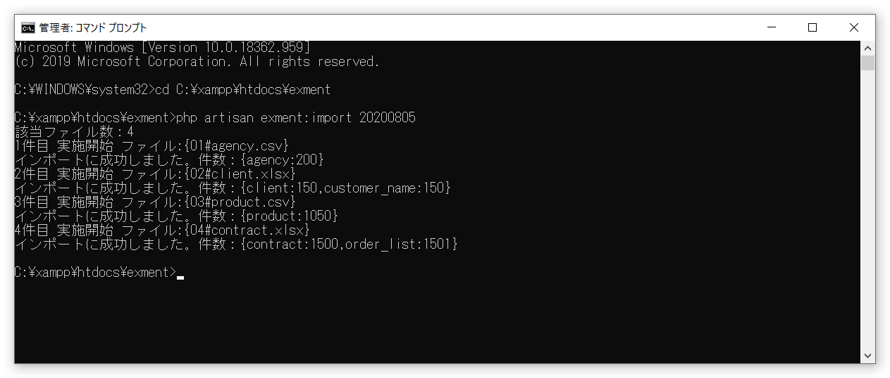

# データインポート（バッチ）
Exmentのカスタムテーブルに、指定フォルダ内のファイルからデータを一括投入します。  
※使用できるファイルは、画面からのインポートと同じ形式のEXCELファイル又はcsvファイルです。  
※画面では制限されている1000件を超えるデータも投入できます。  

## 注意点
- ZIP形式に圧縮したCSVファイルは処理対象外です。  

- 画面からのインポートと同様にエラーチェックを行っているため、大量にデータを投入した場合、非常に時間がかかることがあります。  

- 取り込みデータは100件単位で処理されます。最初の100件を正常に登録→次の100件でデータに不備があった場合、その時点でファイルの処理がキャンセルされます。既に登録された100件を元に戻すことはできません。手動削除、またはファイルから登録済のデータを除く等で対応してください。  

## データの準備
最初にインポート用のファイルを作成します。詳細は[こちら](/ja/data_import_export?id=テンプレート出力) をご覧ください。  

※ファイル名は **「(カスタムテーブルの名前).csv」**  (例：client.csv)です。フォルダ内のファイルは名前順に取り込まれるため、 **「連番#(カスタムテーブルの名前).csv」** (例：001#client.csv)のように先頭に連番を付与することもできます。   

※取込み可能なcsvファイルの文字コードは<strong>UTF-8</strong>です。  

## 操作方法

1. サーバーの以下のパスに作業用のフォルダを作成します。フォルダ名は今回の作業の内容がわかるものや日付等がおすすめです。  

~~~
(プロジェクトのルートディレクトリ)/storage/app/import/(フォルダ名)
~~~

2. 作成したcsvファイル又はEXCELファイル（複数可）を上記のフォルダに配置します。

#### フォルダの配置例
  

3. コマンドラインで、以下のコマンドを実行します。
~~~
php artisan exment:import {フォルダ名}
~~~

#### コマンド実行例
  
