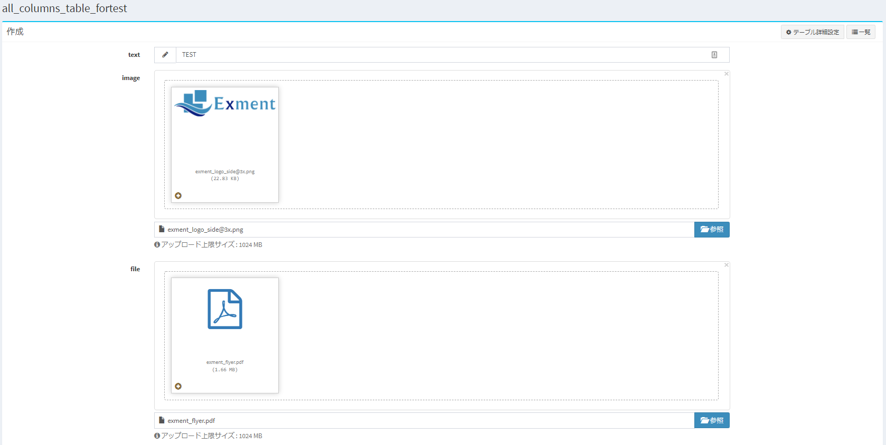
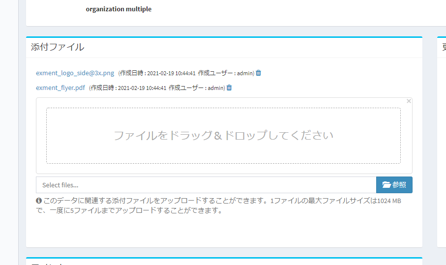
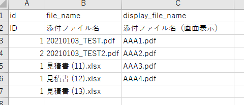

# データインポート・エクスポート（コマンド）
Exmentに保存している、各テーブルのデータを、コマンドからインポート、エクスポートします。  

> データのインポート・エクスポートの概要については、[こちら](/ja/data_import_export)をご確認ください。

## データエクスポート
Exmentに保存している、各テーブルのデータを、コマンドからエクスポート（出力）します。  
出力データのフォーマットは、csv、xlsxに対応しております。  


### 操作方法

- コマンドラインで、以下のコマンドを実行します。

~~~
php artisan exment:export (テーブル名)

# 例
php artisan exment:export information
~~~

- 上記のコマンドを実行することで、フォルダ「(Exmentのルートフォルダ)/storage/app/export/(実行日時：yyyyMMddHHiiss)」に、csvデータが出力されます。

### コマンドの引数

```
php artisan exment:export (テーブル名) {--action=default} {--type=all} {--page=1} {--count=} {--format=csv} {--view=} {--dirpath=} {--add_setting=0} {--add_relation=0}
```

- ##### テーブル名  
(必須)出力する対象のテーブル名(英数字)。

- ##### action  
(オプション)エクスポートを実施する方法。
    - default : すべてのシステム列・カスタム列を出力。既定値。
    - view : 指定のビュー形式で出力。

- ##### type  
(オプション)エクスポートするデータの種類(件数)。
    - all : 全データ。既定値。
    - page : 指定のページ。

- ##### page    
(オプション)typeがpageの場合、ページ番号。整数。未指定の場合、1ページ目を出力。

- ##### count    
(オプション)typeがpageの場合、出力する最大データ件数。未指定の場合、対象のビューで指定されているデータ件数。

- ##### format  
(オプション)エクスポートするファイル形式。
    - csv : CSV形式。既定値。
    - xlsx : Xlsx(Excel)形式。

- ##### view  
(オプション)出力対象のビュー。idかsuuidで指定。未設定の場合、全件ビューで出力。

- ##### dirpath  
(オプション)エクスポートするフォルダパス。フルパス。未設定の場合、(Exmentのルートフォルダ)/storage/app/export/(実行日時：yyyyMMddHHiiss)。

- ##### add_relation  
(オプション)リレーションデータも出力するかどうか。既定値は0(出力しない)。Xlsx形式、ならびにactionがdefaultの場合でのみ有効。

- ##### add_setting  
(オプション)設定データも出力するかどうか。既定値は0(出力しない)。Xlsx形式、ならびにactionがdefaultの場合でのみ有効。


<h2 id="export_chunk"><a href="#/ja/data_cmd_import_export?id=export_chunk" data-id="export_chunk" class="anchor"><span>データエクスポート(chunkモード)</span></a></h2>

指定の件数(既定値：1000件)毎に、データを分割して出力します。大量データの出力を行う場合、1ファイル内の行数を削減することができます。  


### 操作方法

- コマンドラインで、以下のコマンドを実行します。

~~~
php artisan exment:chunkexport (テーブル名)

# 例
php artisan exment:chunkexport information
~~~

- 上記のコマンドを実行することで、フォルダ「(Exmentのルートフォルダ)/storage/app/export/(実行日時：yyyyMMddHHiiss)」に、csvデータが出力されます。


### コマンドの引数

```
exment:chunkexport {テーブル名} {--action=default} {--start=1} {--end=1000} {--count=1000} {--seqlength=1}  {--format=csv} {--view=} {--dirpath=}
```

- ##### テーブル名  
(必須)出力する対象のテーブル名(英数字)。

- ##### action  
(オプション)エクスポートを実施する方法。
    - default : すべてのシステム列・カスタム列を出力。既定値。
    - view : 指定のビュー形式で出力。

- ##### start  
(オプション)出力を開始するファイル番号。エクスポートが途中で終了してしまった場合、指定の連番からエクスポートを再開することもできます。未指定の場合、1。

- ##### end  
(オプション)出力を終了するファイル番号。未指定の場合、1000。

- ##### count    
(オプション)1ファイルに出力する最大データ件数。未指定の場合、1000。

- ##### seqlength    
(オプション)連番の0埋めの桁数。例として「3」と入力した場合、"001", "002"のように連番を出力。未指定の場合、1。

- ##### format  
(オプション)エクスポートするファイル形式。
    - csv : CSV形式。既定値。
    - xlsx : Xlsx(Excel)形式。

- ##### view  
(オプション)出力対象のビュー。idかsuuidで指定。未設定の場合、全件ビューで出力。

- ##### dirpath  
(オプション)エクスポートするフォルダパス。フルパス。未設定の場合、(Exmentのルートフォルダ)/storage/app/export/(実行日時：yyyyMMddHHiiss)。


### 出力仕様

- ファイル名は、 **「(カスタムテーブルの名前).連番.csv」** (例：client.1.csv)のように、連番で出力されます。

```
#例
client.1.csv
client.2.csv
client.3.csv

#例(seqlength=3と指定した場合)
client.001.csv
client.002.csv
client.003.csv
```

- データ件数やcountオプションによらず、1回の実行での最大ファイル数は、1000件です。


## データインポート
Exmentのカスタムテーブルに、指定フォルダ内のファイルからデータを一括投入します。  
※使用できるファイルは、画面からのインポートと同じ形式のEXCELファイル又はcsvファイルです。  
※画面では制限されている5000件を超えるデータも投入できます。  

### 注意点
- ZIP形式に圧縮したCSVファイルは処理対象外です。  

- 画面からのインポートと同様にエラーチェックを行っているため、大量にデータを投入した場合、非常に時間がかかることがあります。  

- 取り込みデータは100件単位で処理されます。最初の100件を正常に登録→次の100件でデータに不備があった場合、その時点でファイルの処理がキャンセルされます。既に登録された100件を元に戻すことはできません。手動削除、またはファイルから登録済のデータを除く等で対応してください。  

- <span class="red">コマンドによるインポートでも、非常に件数の多いデータの取込は、メモリの制約でエラーとなる場合があります。</span>  
現在、鋭意改善中ですが、大量データ取込の場合は、[大量データ一括投入](/ja/data_bulk_insert)をご利用ください。

- csv取込の場合、現在は、対象のテーブルデータの取込のみに対応しています。リレーションデータの取込を行う場合は、xlsx取込で実施してください。


### データの準備
最初にインポート用のファイルを作成します。詳細は[こちら](/ja/data_import_export?id=テンプレート出力) をご覧ください。  

- 取込み可能なcsvファイルの文字コードは<strong>UTF-8</strong>です。  

- ファイル名は、以下のいずれかの形式で設定してください。  
※フォルダ内のファイルは名前順に取り込まれます。そのため、リレーションを行っているデータを同時に取り込む場合など、取込む順番が重要な場合は、3.の方法で、取り込む順に連番を指定してください。

    1. 「(カスタムテーブルの名前).csv」    ※例：client.csv
    2. 「(カスタムテーブルの名前).(連番).csv」   ※例：client.1.csv、client.002.csv
    3. 「(連番).(カスタムテーブルの名前).csv」   ※例：01.client.csv、02.estimate.csv

- <span class="small">v3.8.0未満では、「<span class="bold">連番<span class="red">#</span>(カスタムテーブルの名前).csv</span>」のファイル名形式でのインポートに対応していました。  
v3.8.0で、[インポート時のライブラリを変更](/ja/update/v3_8)した都合で、このファイル名形式でインポートが不可になりました。  
そのため、連番を指定してのインポートを行う場合は、「<span class="bold">連番<span class="red">.</span>(カスタムテーブルの名前).csv</span>」の形式と変更し、インポートを行ってください。

### 操作方法

- サーバーの以下のパスに作業用のフォルダを作成します。フォルダ名は今回の作業の内容がわかるものや日付等がおすすめです。  

~~~
(プロジェクトのルートディレクトリ)/storage/app/import/(フォルダ名)
~~~

- 作成したcsvファイル又はEXCELファイル（複数可）を上記のフォルダに配置します。

#### フォルダの配置例
  

- コマンドラインで、以下のコマンドを実行します。
~~~
php artisan exment:import {フォルダ名}
~~~

#### コマンド実行例
  


## データインポート - 画像・ファイル列の添付ファイル取込
Exmentのカスタム列種類「画像」「ファイル」列に、添付ファイルを一括で登録することができます。下記の画面に該当する箇所です。  

  

### 仕様
- すでに添付ファイルが登録されているカスタム列に、新たに添付ファイルを追加した場合、過去のファイルは削除されます。


### 取込データの準備

- サーバーの以下のパスに作業用のフォルダを作成します。フォルダ名は今回の作業の内容がわかるものや日付等がおすすめです。  

~~~
(プロジェクトのルートディレクトリ)/storage/app/file-import/(フォルダ名)
~~~

- 作成後のフォルダに、「files」フォルダを作成します。

- 「files」フォルダに、インポートを行いたい添付ファイル一覧を配置します。

### インポート情報記入
- インポート用のファイルを作成します。以下からインポート用ファイルをダウンロードしてください。  
    - [xlsx形式](https://exment.net/downloads/template/file_import_ja.xlsx)
    - [csv形式](https://exment.net/downloads/template/file_import_ja.csv)

- 取込み可能なcsvファイルの文字コードは<strong>UTF-8</strong>です。  

- ファイル名は、以下のいずれかの形式で設定してください。  
※フォルダ内のファイルは名前順に取り込まれます。そのため、リレーションを行っているデータを同時に取り込む場合など、取込む順番が重要な場合は、3.の方法で、取り込む順に連番を指定してください。

    1. 「(カスタムテーブルの名前).csv」    ※例：client.csv
    2. 「(カスタムテーブルの名前).(連番).csv」   ※例：client.1.csv、client.002.csv
    3. 「(連番).(カスタムテーブルの名前).csv」   ※例：01.client.csv、02.estimate.csv

- xslxの場合、ファイル名は任意となります。シート名を、以下の形式で設定してください。  

    1. 「(カスタムテーブルの名前)」    ※例：client

- シートに値を記入します。後述の「取込項目一覧」に従い、値を記入してください。

- 作成したインポート用のファイルは、「(プロジェクトのルートディレクトリ)/storage/app/file-import/(フォルダ名)」に配置してください。

#### 取込項目一覧

  

##### id(ID)  
添付ファイルの取込を行う対象の、カスタムデータのIDです。データ登録時に自動的に連番される、正の整数です。  

##### column_name(列名)  
添付ファイルの取込を行う対象の、カスタム列英数字名です。(例：estimate_file, avatar)  

##### file_name(添付ファイル名)  
「files」フォルダに配置した、添付ファイル名を記入してください。

##### display_file_name(添付ファイル名（画面表示）)  
添付ファイルを画面で表示したり、ダウンロードを行う際の添付ファイル名です。※未記入も可能です。未記入の場合、file_nameの値が、ダウンロードを行う際の添付ファイル名になります。

### 取込前のフォルダ構成
取込実施時のフォルダ構成は、以下のようになります。

```
(プロジェクトのルートディレクトリ)/storage/app/file-import/(フォルダ名)
    - インポート用ファイル(例：client.csv)
    - files
        - 取込ファイル(例：添付ファイル1.pdf)
        - 取込ファイル(例：添付ファイル2.pdf)
        - 取込ファイル(例：添付ファイル3.jpg)
```

### 操作方法

- コマンドラインで、以下のコマンドを実行します。
~~~
php artisan exment:file-import {フォルダ名}
~~~


## データインポート - ドキュメント(添付ファイル)一覧
指定のカスタムデータの、ドキュメント(添付ファイル)に、ファイルを一括で登録することができます。下記の画面に該当する箇所です。  

  

### 仕様
- 同一のカスタムデータに、複数の添付ファイルを追加する事が可能です。すでに添付ファイルが登録されている場合でも、過去のファイルは削除されません。


### 取込データの準備

- サーバーの以下のパスに作業用のフォルダを作成します。フォルダ名は今回の作業の内容がわかるものや日付等がおすすめです。  

~~~
(プロジェクトのルートディレクトリ)/storage/app/document-import/(フォルダ名)
~~~

- 作成後のフォルダに、「documents」フォルダを作成します。

- 「documents」フォルダに、インポートを行いたい添付ファイル一覧を配置します。

### インポート情報記入
- インポート用のファイルを作成します。以下からインポート用ファイルをダウンロードしてください。  
    - [xlsx形式](https://exment.net/downloads/template/document_import_ja.xlsx)
    - [csv形式](https://exment.net/downloads/template/document_import_ja.csv)

- 取込み可能なcsvファイルの文字コードは<strong>UTF-8</strong>です。  

- ファイル名は、以下のいずれかの形式で設定してください。  
※フォルダ内のファイルは名前順に取り込まれます。そのため、リレーションを行っているデータを同時に取り込む場合など、取込む順番が重要な場合は、3.の方法で、取り込む順に連番を指定してください。

    1. 「(カスタムテーブルの名前).csv」    ※例：client.csv
    2. 「(カスタムテーブルの名前).(連番).csv」   ※例：client.1.csv、client.002.csv
    3. 「(連番).(カスタムテーブルの名前).csv」   ※例：01.client.csv、02.estimate.csv

- xslxの場合、ファイル名は任意となります。シート名を、以下の形式で設定してください。  

    1. 「(カスタムテーブルの名前)」    ※例：client

- シートに値を記入します。後述の「取込項目一覧」に従い、値を記入してください。

- 作成したインポート用のファイルは、「(プロジェクトのルートディレクトリ)/storage/app/document-import/(フォルダ名)」に配置してください。

#### 取込項目一覧

  

##### id(ID)  
添付ファイルの取込を行う対象の、カスタムデータのIDです。データ登録時に自動的に連番される、正の整数です。  

##### file_name(添付ファイル名)  
「files」フォルダに配置した、添付ファイル名を記入してください。

##### display_file_name(添付ファイル名（画面表示）)  
添付ファイルを画面で表示したり、ダウンロードを行う際の添付ファイル名です。※未記入も可能です。未記入の場合、file_nameの値が、ダウンロードを行う際の添付ファイル名になります。

### 取込前のフォルダ構成
取込実施時のフォルダ構成は、以下のようになります。

```
(プロジェクトのルートディレクトリ)/storage/app/document-import/(フォルダ名)
    - インポート用ファイル(例：client.csv)
    - documents
        - 取込ファイル(例：添付ファイル1.pdf)
        - 取込ファイル(例：添付ファイル2.pdf)
        - 取込ファイル(例：添付ファイル3.jpg)
```

### 操作方法

- コマンドラインで、以下のコマンドを実行します。
~~~
php artisan exment:document-import {フォルダ名}
~~~