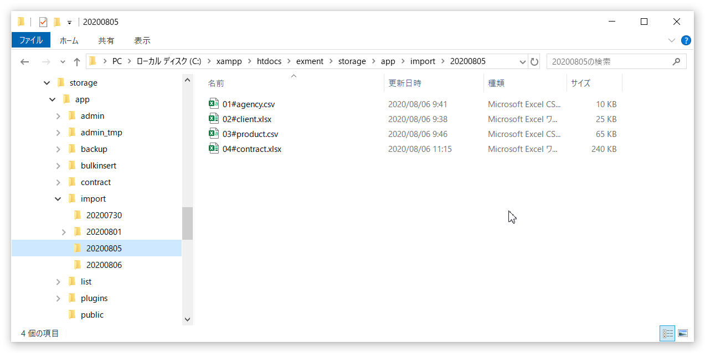

# データインポート・エクスポート（コマンド）
Exmentに保存している、各テーブルのデータを、コマンドからインポート、エクスポートします。  

> データのインポート・エクスポートの概要については、[こちら](/ja/data_import_export)をご確認ください。

## データエクスポート
Exmentに保存している、各テーブルのデータを、コマンドからエクスポート（出力）します。  
出力データのフォーマットは、csv、xlsxに対応しております。  


### 操作方法

- コマンドラインで、以下のコマンドを実行します。

~~~
php artisan exment:export (テーブル名)

# 例
php artisan exment:export information
~~~

- 上記のコマンドを実行することで、フォルダ「(Exmentのルートフォルダ)/storage/app/export/(実行日時：yyyyMMddHHiiss)」に、csvデータが出力されます。

### コマンドの引数

```
php artisan exment:export (テーブル名) {--action=default} {--type=all} {--page=1} {--count=} {--format=csv} {--view=} {--dirpath=} {--add_setting=0} {--add_relation=0}
```

- ##### テーブル名  
(必須)出力する対象のテーブル名(英数字)。

- ##### action  
(オプション)エクスポートを実施する方法。
    - default : すべてのシステム列・カスタム列を出力。既定値。
    - view : 指定のビュー形式で出力。

- ##### type  
(オプション)エクスポートするデータの種類(件数)。
    - all : 全データ。既定値。
    - page : 指定のページ。

- ##### page    
(オプション)typeがpageの場合、ページ番号。整数。未指定の場合、1ページ目を出力。

- ##### count    
(オプション)typeがpageの場合、出力する最大データ件数。未指定の場合、対象のビューで指定されているデータ件数。

- ##### format  
(オプション)エクスポートするファイル形式。
    - csv : CSV形式。既定値。
    - xlsx : Xlsx(Excel)形式。

- ##### view  
(オプション)出力対象のビュー。idかsuuidで指定。未設定の場合、全件ビューで出力。

- ##### dirpath  
(オプション)エクスポートするフォルダパス。フルパス。未設定の場合、(Exmentのルートフォルダ)/storage/app/export/(実行日時：yyyyMMddHHiiss)。

- ##### add_relation  
(オプション)リレーションデータも出力するかどうか。既定値は0(出力しない)。Xlsx形式でのみ有効。

- ##### add_setting  
(オプション)設定データも出力するかどうか。既定値は0(出力しない)。Xlsx形式でのみ有効。


<h2 id="export_chunk">データエクスポート(chunkモード)</h2>
指定の件数(既定値：1000件)毎に、データを分割して出力します。大量データの出力を行う場合、1ファイル内の行数を削減することができます。  


### 操作方法

- コマンドラインで、以下のコマンドを実行します。

~~~
php artisan exment:chunkexport (テーブル名)

# 例
php artisan exment:chunkexport information
~~~

- 上記のコマンドを実行することで、フォルダ「(Exmentのルートフォルダ)/storage/app/export/(実行日時：yyyyMMddHHiiss)」に、csvデータが出力されます。


### コマンドの引数

```
exment:chunkexport {テーブル名} {--action=default} {--start=1} {--end=1000} {--count=1000} {--seqlength=1}  {--format=csv} {--view=} {--dirpath=}
```

- ##### テーブル名  
(必須)出力する対象のテーブル名(英数字)。

- ##### action  
(オプション)エクスポートを実施する方法。
    - default : すべてのシステム列・カスタム列を出力。既定値。
    - view : 指定のビュー形式で出力。

- ##### start  
(オプション)出力を開始する番号。エクスポートが途中で終了してしまった場合、指定の連番からエクスポートを再開することもできます。未指定の場合、1。

- ##### end  
(オプション)出力を終了する番号。未指定の場合、1000。

- ##### count    
(オプション)1ファイルに出力する最大データ件数。未指定の場合、1000。

- ##### seqlength    
(オプション)連番の0埋めの桁数。例として「3」と入力した場合、"001", "002"のように連番を出力。未指定の場合、1。

- ##### format  
(オプション)エクスポートするファイル形式。
    - csv : CSV形式。既定値。
    - xlsx : Xlsx(Excel)形式。

- ##### view  
(オプション)出力対象のビュー。idかsuuidで指定。未設定の場合、全件ビューで出力。

- ##### dirpath  
(オプション)エクスポートするフォルダパス。フルパス。未設定の場合、(Exmentのルートフォルダ)/storage/app/export/(実行日時：yyyyMMddHHiiss)。


### 出力仕様

- ファイル名は、 **「(カスタムテーブルの名前).連番.csv」** (例：client.1.csv)のように、連番で出力されます。

```
#例
client.1.csv
client.2.csv
client.3.csv

#例(seqlength=3と指定した場合)
client.001.csv
client.002.csv
client.003.csv
```

- データ件数やcountオプションによらず、1回の実行での最大ファイル数は、1000件です。


## データインポート
Exmentのカスタムテーブルに、指定フォルダ内のファイルからデータを一括投入します。  
※使用できるファイルは、画面からのインポートと同じ形式のEXCELファイル又はcsvファイルです。  
※画面では制限されている1000件を超えるデータも投入できます。  

### 注意点
- ZIP形式に圧縮したCSVファイルは処理対象外です。  

- 画面からのインポートと同様にエラーチェックを行っているため、大量にデータを投入した場合、非常に時間がかかることがあります。  

- 取り込みデータは100件単位で処理されます。最初の100件を正常に登録→次の100件でデータに不備があった場合、その時点でファイルの処理がキャンセルされます。既に登録された100件を元に戻すことはできません。手動削除、またはファイルから登録済のデータを除く等で対応してください。  


### データの準備
最初にインポート用のファイルを作成します。詳細は[こちら](/ja/data_import_export?id=テンプレート出力) をご覧ください。  

※ファイル名は **「(カスタムテーブルの名前).csv」**  (例：client.csv)です。フォルダ内のファイルは名前順に取り込まれるため、 **「連番#(カスタムテーブルの名前).csv」** (例：001#client.csv)のように先頭に連番を付与することもできます。   

※取込み可能なcsvファイルの文字コードは<strong>UTF-8</strong>です。  

### 操作方法

- サーバーの以下のパスに作業用のフォルダを作成します。フォルダ名は今回の作業の内容がわかるものや日付等がおすすめです。  

~~~
(プロジェクトのルートディレクトリ)/storage/app/import/(フォルダ名)
~~~

- 作成したcsvファイル又はEXCELファイル（複数可）を上記のフォルダに配置します。

#### フォルダの配置例
  

- コマンドラインで、以下のコマンドを実行します。
~~~
php artisan exment:import {フォルダ名}
~~~

#### コマンド実行例
  
