# データインポート・エクスポート
Exmentに保存している、各テーブルのデータをインポート、エクスポートします。  

## データエクスポート・インポート機能の種類
- Exmentのデータのエクスポート・インポート機能は、現在以下の種類があります。
    - エクスポート  
    保存している各テーブルのデータを、すべての列を対象にエクスポート（出力）します。  

    - エクスポート(ビュー)  
    現在表示しているビューの形式で、各テーブルのデータをエクスポート（出力）します。  

    - インポート  
    Exmentに、csv、xlsxのフォーマットを使用して、各テーブルのデータをインポート（入力）します。  

- 各テーブルのデータ一覧画面で、ボタンは、以下のように表示されます。
    - エクスポート：赤色
    - エクスポート(ビュー)：青色
    - インポート：青色
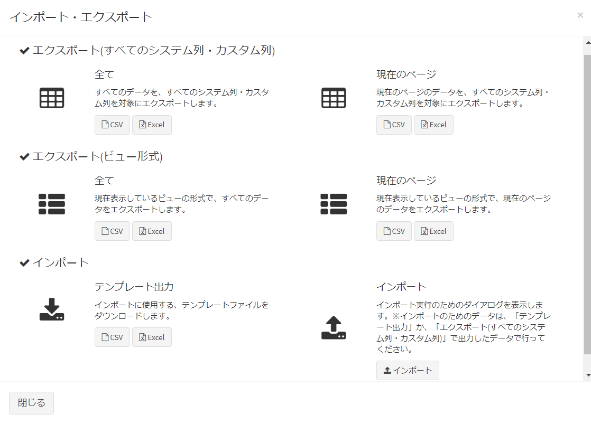  

> 現在、データエクスポート・インポートのメニューが、非常に縦長になっています。  
そのため、この表示方法は、将来的に変更になる場合があります。  
また、不要な項目がある場合は、[設定値](/ja/config#インポート・エクスポート)により、非表示にすることができます。

## データエクスポート
Exmentに保存している、各テーブルのデータをエクスポート（出力）します。  
出力データのフォーマットは、csv、xlsx(推奨)に対応しております。  

### 操作方法
- データ一覧画面を表示します。
  

- ページ右上に［インポート・エクスポート］ボタンが表示されるので、クリックします。  
  

- メニューが表示されるので、「出力(CSV)」もしくは「出力(Excel)」の中から、出力したい項目を選択してください。
  
    - 全て  
    そのテーブルの全データを出力します。  
    ※ただし、**ログインユーザーが権限のないデータは出力されません。**  
    
    - 現在のページ  
    現在開いているページのデータ一覧を出力します。

- それぞれの「出力」ボタンをクリックすることにより、データがファイルでダウンロードされます。

### 出力項目一覧
##### ID  
データ登録時に自動的に連番される、正の整数です。  

##### 内部ID(20桁)  
画面にはあまり表示されない、データ登録時に自動的に採番される、20桁の英数字です。データの移行などで使用します。  

##### 親データのID  
そのテーブルが、リレーション設定の「1:n」のnとして登録している場合、親テーブルのidです。リレーション設定が行われていない場合、空欄になります。  

##### 親データのテーブル名  
そのテーブルが、リレーション設定の「1:n」のnとして登録している場合、親テーブル名（英数字）です。リレーション設定が行われていない場合、空欄になります。  

##### カスタム列一覧  
カスタム列として登録しているデータの一覧が表示されます。  

##### 作成日時、更新日時、削除日時  
データを作成した日時、更新した日時、削除した日時がそれぞれ出力されます。  

### 1:nリレーションのエクスポート
- リレーション設定の「1:n」の「1」として登録しているテーブルで、データエクスポートを行った場合、**リレーションを行っている「n」のデータ一覧も、同時にエクスポートされます。**  

例：「契約情報」を1、「契約明細情報」をnとして、リレーション設定を保存している場合  
  
- 「契約情報」画面で、データのエクスポートを実行した場合（※画像の「顧客」はテストデータです）  
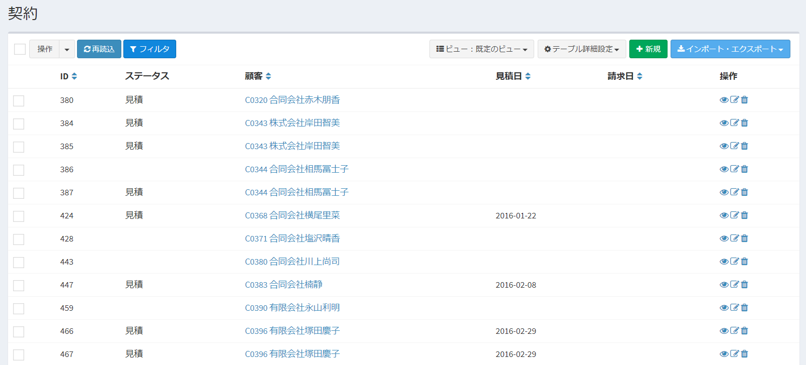  
- 「契約情報」と、「契約明細情報」のデータの両方が出力されます。
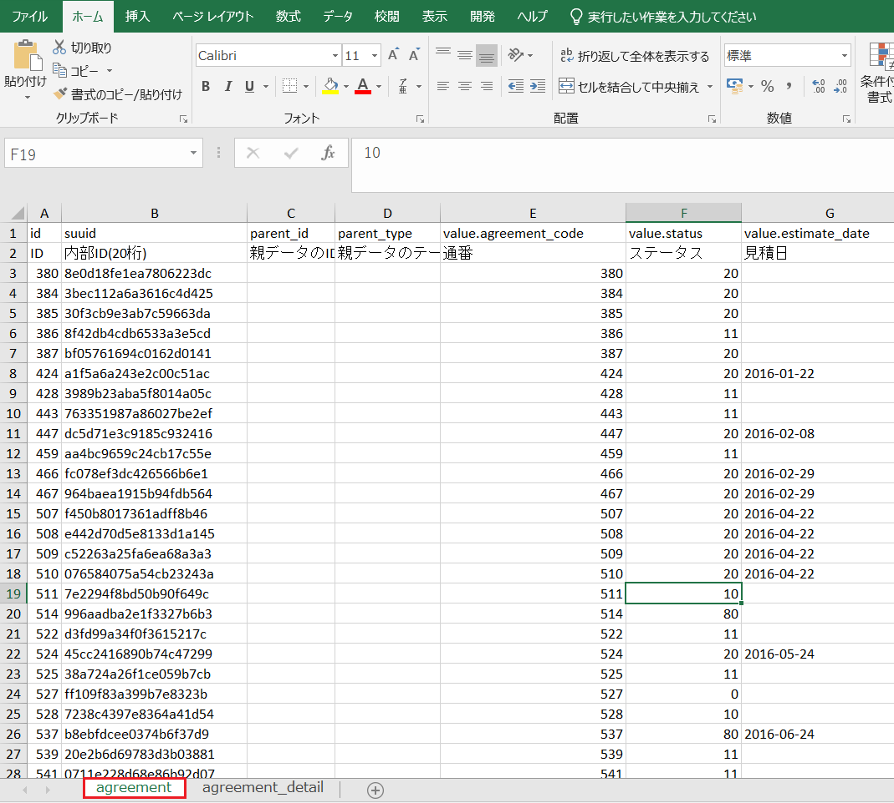  
  
- リレーション設定の「1:n」のnとして登録しているデータ一覧の、「親データのID」「親データのテーブル名」には、リレーション先の親テーブルのID、テーブル名が出力されます。

### n:nリレーションのエクスポート
- リレーション設定の「n:n」の、大元のnとして登録しているテーブルで、データエクスポートを行った場合、**リレーション先の「n」との関連情報も、同時にエクスポートされます。**  

例：「組織情報」と「ユーザー情報」をn:nとして、リレーション設定を保存している場合  
  
- 「組織情報」画面で、データのエクスポートを実行した場合、  
  
- 「組織情報」のデータが出力され、さらに「ユーザー情報」と「組織情報」を関連付けるデータが出力されます。
  
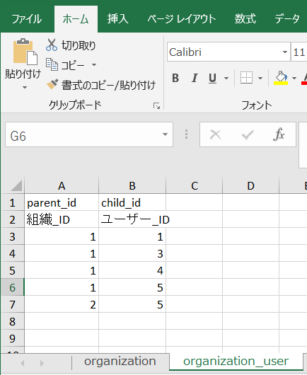  
- 「parent_id」には、親となる組織情報のID、「child_id」には、子となるユーザー情報のIDが表示されます。  

### その他特記事項
- CSV形式、Excel形式ともに、1行目が列名（英数字）、2行目が列表示名（日本語）が表示されます。CSV形式であっても、ヘッダーは2行となりますので、ご了承ください。
- CSV形式で出力した場合、文字コードはUTF-8、改行コードはLF、BOMなしファイルとして出力されます。
- リレーション設定によって、複数のデータが出力される場合、Excel形式の場合は複数のシートで、CSV形式の場合は複数のcsvファイルをzip化します。  

### エクスポート時の、出力値の変更
エクスポート時、「親データのID」、「選択肢 (他のテーブルの値一覧から選択)」、「ユーザー」、「組織」の列は、通常は参照先のテーブルのデータのIDを出力しますが、**参照先のカスタム列の値を出力することができます。**  
カスタム列の値を出力するための手順を記載します。  

#### parent_id(親データのID)の場合
- リレーション設定画面に遷移します。  

- 「エクスポート時のキー列」を、エクスポート時に値の出力に使用するカスタム列を設定し、保存します。  
  

- その後、データのエクスポートすると、出力値がidに変わって、選択したカスタム列の値になります。 

※通常時
  
  
※「エクスポート時のキー列」指定時
  

#### 「選択肢 (他のテーブルの値一覧から選択)」、「ユーザー」、「組織」の場合
- 上記の列設定を行っている、カスタム列設定画面に遷移します。  

- 「エクスポート時のキー列」を、エクスポート時に値の出力に使用するカスタム列を設定し、保存します。  
  

- その後、参照元のテーブルでデータのエクスポートすると、出力値がidに変わって、選択したカスタム列の値になります。 

※通常時
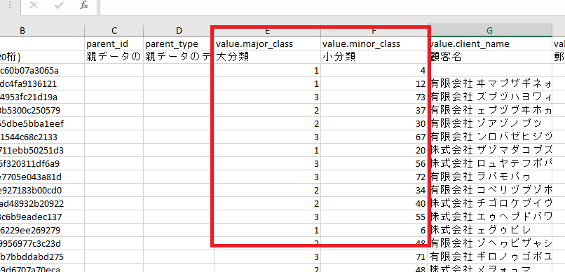  
  
※「エクスポート時のキー列」指定時
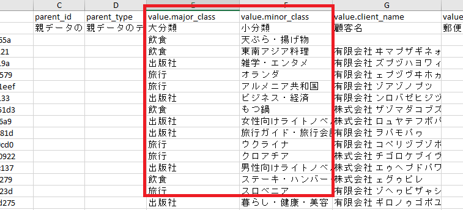  

## データエクスポート(ビュー)
Exmentに保存している、各テーブルのデータを、現在表示しているビューを使用してエクスポート（出力）します。  
出力データのフォーマットは、csv、xlsx(推奨)に対応しております。  

### 操作方法
- データ一覧画面を表示します。
  

- ページ右上に［インポート・エクスポート］ボタンが表示されるので、クリックします。  
  

- メニューが表示されるので、「ビュー出力(CSV)」もしくは「ビュー出力(Excel)」の中から、出力したい項目を選択してください。
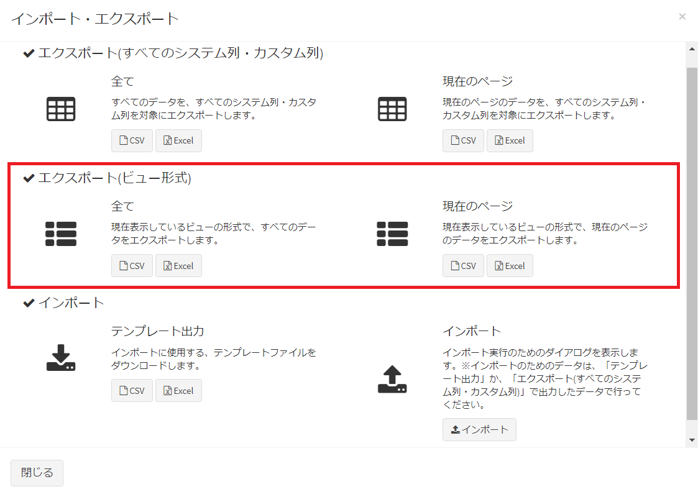  
    - 全て  
    そのテーブルの全データを出力します。  
    ※ただし、**ログインユーザーが権限のないデータは出力されません。**  

    - 現在のページ  
    現在開いているページのデータ一覧を出力します。

- それぞれの［出力］ボタンをクリックすることにより、データがファイルでダウンロードされます。現在表示しているビューの項目が、そのまま出力されます。  

## データインポート
Exmentに、各テーブルのデータをインポート（入力）します。  
インポートデータのフォーマットは、csv、xlsx(推奨)に対応しており、あらかじめExmentで指定した形式に従ってデータの加工が必要です。  

> 現在、パフォーマンスの都合から、1度にインポートする件数は1000件までに制限させていただいております。  
1000件を超えるデータを1度に登録する場合、[大量データ投入](/ja/data_bulk_insert)をご検討ください。

### 操作方法

#### テンプレート出力
データ取り込みのためのテンプレートを出力します。

- データ一覧画面を表示します。
  

- ページ右上に［インポート・エクスポート］ボタンが表示されるので、クリックします。  
  

- 「インポート(CSV)」もしくは「インポート(Excel)」の中から、「テンプレート出力」をクリックします。
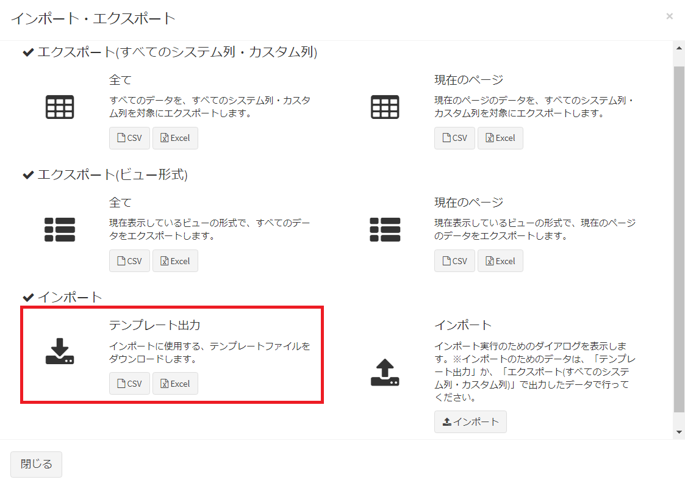  

- データ取り込み用のCSVもしくはExcelファイルがダウンロードされます。
  
※ファイルのフォーマットは、「エクスポート」を実行した時の形式と同様です。  
テンプレート出力時は、データが0件で出力されます。  

- 出力したテンプレートに、取り込みたいデータの情報を記入してください。

### 取込項目一覧
##### ID  
データ登録時に自動的に連番される、正の整数です。  
取込時に、このIDを明確に指定したい場合、記入してください。  
特に指定のない場合、空欄にしてください。取込時に、システムにより自動的に値が設定されます。  

##### 内部ID(20桁)  
画面にはあまり表示されない、データ登録時に自動的に採番される、20桁の英数字です。  
取込時に、この内部IDを明確に指定したい場合、記入してください。  
特に指定のない場合、空欄にしてください。システムにより自動的に値が設定されます。  

##### 親データのID  
基本的に、空欄に設定します。  
取込するテーブルが、リレーション設定の「1:n」のnとして登録している場合、親テーブルのidを入力してください。  
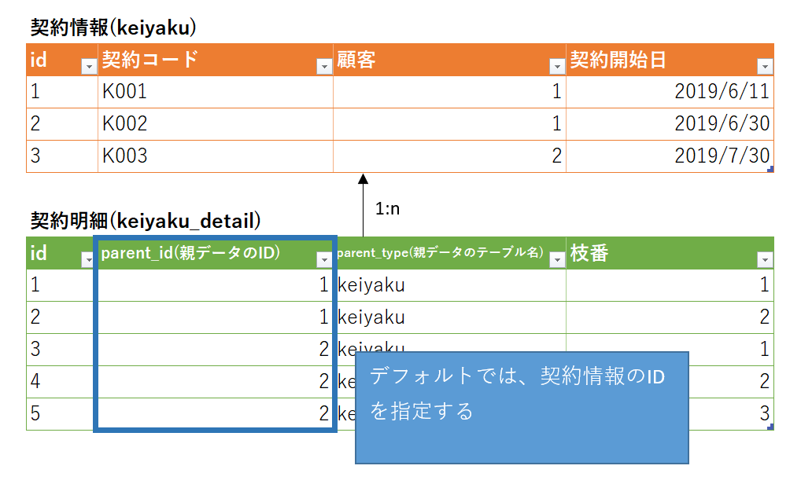  
※デフォルト設定では、親テーブルのデータのIDを指定しますが、**カスタム列を指定して、取込を行うことができます。**詳細は「[親テーブルのデータの指定方法変更](#親テーブルのデータの指定方法変更)」をご参照ください。  

##### 親データのテーブル名  
基本的に、空欄に設定します。 
そのテーブルが、リレーション設定の「1:n」のnとして登録している場合、親テーブル名（英数字）を入力します。  
  

##### カスタム列一覧  
カスタム列として登録する値を記入してください。  
※列の種類によって、値の入力方法が異なります。下記のメニュー「[インポート時のカスタム列入力方法](#インポート時のカスタム列入力方法)」をご確認ください。

##### 作成日時、更新日時、削除日時  
基本的に、空欄となります。  
データを作成した日時、更新した日時、削除した日時を指定したい場合に記入してください。  
空欄の場合、取込時に、システムにより自動的に値が設定されます。

### データインポート実行
画面から、インポートを実行します。

- データ一覧画面を表示します。
  

- ページ右上に［インポート・エクスポート］ボタンが表示されるので、クリックします。  
  

- 「インポート(CSV)」もしくは「インポート(Excel)」の中から、「インポート」をクリックします。
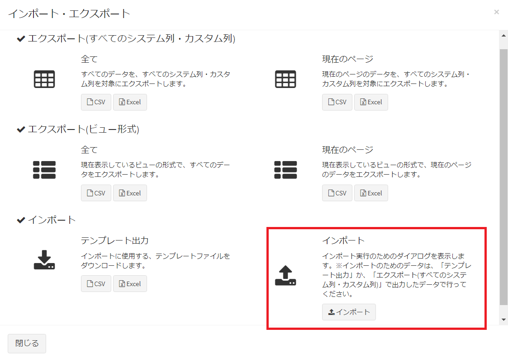  

- インポートダイアログが表示されます。  
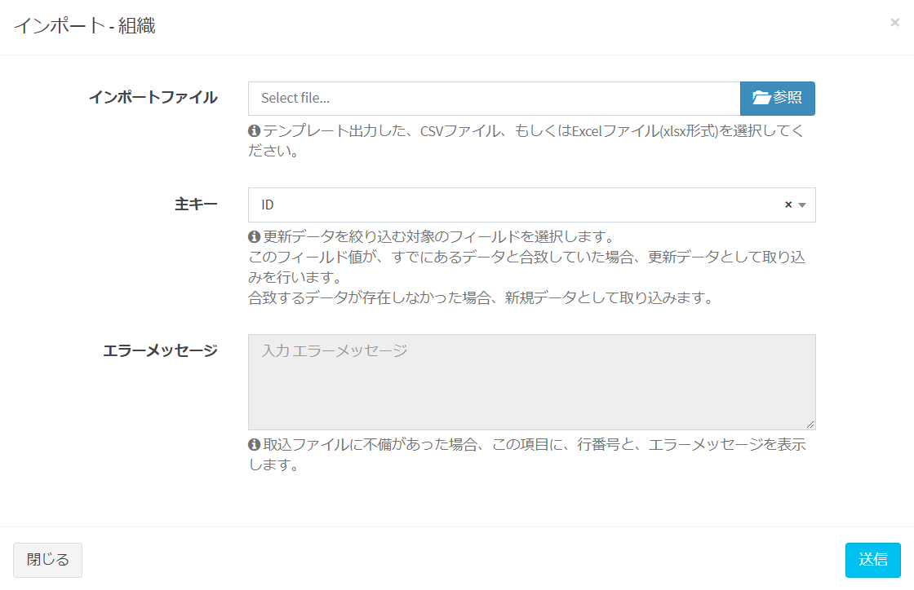  

- 「インポートファイル」には、作成した取込用テンプレートファイルを選択します。  

- 「主キー」には、取込時に新規・更新を判定するための主キーを選択します。  
詳細は、下記の「主キーの種類」をご確認ください。  

- 設定が完了したら、ダイアログの［送信］をクリックします。  

- 取込データに問題があった場合、「エラーメッセージ」に、ヘッダー以降の行番号とエラー内容が表示されます。

※ カスタム列の設定で「[必須](/ja/column?id=記入項目の詳細共通)」としている項目に対して、データ入力がされていない場合にはインポートが成功しません。取込用テンプレートファイルに入力漏れがないかご確認ください。
- 取込が正常に完了したら、ダイアログが閉じられ、データが再読込されます。

### 新規追加データ、更新データの判定方法
データの取込時に、各行ごとに、新規追加データとして取り込むか、更新データとして取り込むかの判定を行います。  
その判定方法について記載します。  

- あらかじめ、データの取込時の画面で、判定のために使用する、「主キー」となる列を指定します。（ここでは「ID」とします）  
※主キーの指定は、データ取込時に選択します。後述します  

- データ取込処理時、システム内部で、取込データのID列の値を取得します。
  

    - 取込データのIDの値が空欄のとき、新規追加データとして扱われます。
  

    - 取込データのIDに値がある場合、すでに登録しているデータ一覧の中から、同じIDのデータがあるかどうかを検索します。  
  
    同じIDのデータがあった場合、そのデータを対象に、取込データを更新します。  
    なかった場合、取込データを新規追加します。その際、IDは取込データのIDとなります。  

### 主キーの種類

- ##### ID(おすすめ)  
システムで自動的に採番される整数です。他のテーブルとのリレーションなどにも使用します。  
手軽で、あらかじめ値をセットしやすいですが、環境から環境への移行を行う場合、自動的に連番を振ってしまう項目のため、予期せぬズレが発生してしまう可能性があります。

- ##### 内部ID(20桁)  
データの保存時、システムで自動的に採番される20桁の英数字です。  
環境から環境への移行を行う場合には、更新対象のデータを明確にするため、この内部IDを使用することをおすすめしております。  

- ##### ユニーク(一意)列  
カスタム列の設定で、 「ユニーク(一意)」にしている列は、主キーとして選択することができます。(例：Eメールアドレス、ユーザーコード)    

### インポート時のカスタム列入力方法
カスタム列の種類によって、インポート時の値の入力方法が異なります。  
下記の内容をご確認ください。

##### 選択肢 (値・見出しを登録)  
データベースに登録する「値」、もしくは画面に表示されている「見出し」を入力してください。  

##### 選択肢 (他のテーブルの値一覧から選択)、ユーザー、組織  
**参照先のテーブルのID**を入力してください。  
  
※デフォルト設定では、参照先のテーブルのデータのIDを指定しますが、**カスタム列を指定して、取込を行うことができます。**詳細は「[親テーブルのデータの指定方法変更](#親テーブルのデータの指定方法変更)」をご参照ください。  

##### YES/NO  
「YES」または「NO」、もしくは「1」または「0」を入力してください。  

##### 2値の選択  
カスタム列画面で入力した、「2値の選択」の表示もしくは値を入力してください。  
  

##### それ以外  
登録する値をそのまま入力してください。  

### 別テーブルのデータの指定方法変更
データのインポート時、「親データのID」、「選択肢 (他のテーブルの値一覧から選択)」、「ユーザー」、「組織」の列は、通常は参照先のテーブルのデータのIDを指定しますが、**カスタム列を指定して、取込を行うことができます。**  
カスタム列によって、取込を行うための手順を記載します。  

#### parent_id(親データのID)の場合
- リレーション設定画面に遷移します。  

- 「インポート時のキー列」を、インポート時に値の検索に使用するカスタム列を設定し、保存します。  
※指定できる列は、カスタム列設定にて「検索インデックス」に指定している列のみです。  
  

- その後、子テーブルで取込用のExcelファイルをダウンロードすると、「##setting##」シートに、子テーブル名、「parent_id」、指定した親テーブルのカスタム列名が出力されています。  
  

- このシートの情報は編集せず、子テーブルのシートに、取込データを記入してください。  
その際、「parent_id」列には、**インポート時のキー列**で登録したカスタム列の値を記入します。  
下記の例の場合、親テーブル「契約情報」の、「契約コード」の値を入力します。
  
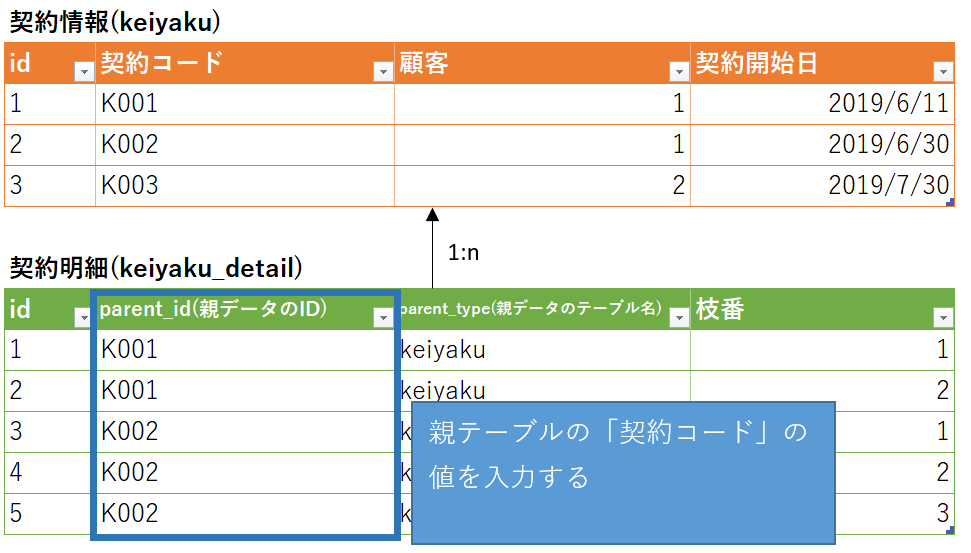  

- その後、インポートを実行します。

#### 「選択肢 (他のテーブルの値一覧から選択)」、「ユーザー」、「組織」の場合
- 上記の列設定を行っている、カスタム列設定画面に遷移します。  

- 「インポート時のキー列」を、インポート時に値の検索に使用するカスタム列を設定し、保存します。  
※指定できる列は、カスタム列設定にて「検索インデックス」に指定している列のみです。  
  

- その後、参照元のテーブルで取込用のExcelファイルをダウンロードすると、「##setting##」シートに、参照元のテーブル名、「value.」 + 参照元のカスタム列名、参照先のカスタム列名が出力されています。  
  

- このシートの情報は編集せず、参照元のテーブルのシートに、取込データを記入してください。  
その際、参照元のカスタム列には、**インポート時のキー列**で登録した、参照先のカスタム列の値を記入します。  
下記の例の場合、参照先のテーブル「顧客マスター」の、「顧客コード」の値を入力します。
  
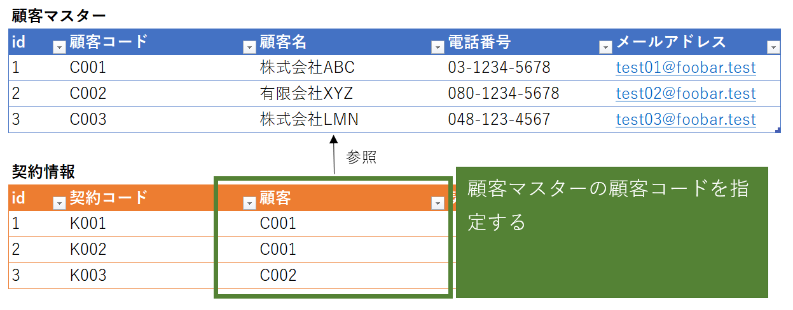  

- その後、インポートを実行します。

#### 注意点
- Excel形式での取込のみ対応しております。CSV形式では現在対応しておりません。

