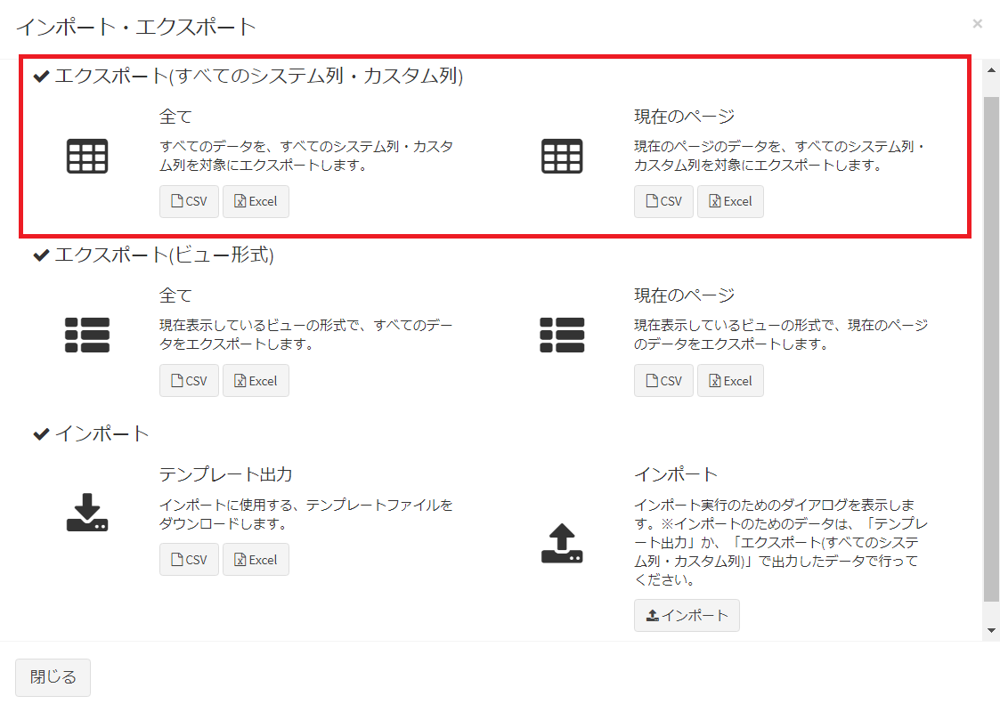

# データインポート・エクスポート
Exmentに保存している、各テーブルのデータをインポート、エクスポートします。  

## データエクスポート
Exmentに保存している、各テーブルのデータをエクスポート（出力）します。  
出力データのフォーマットは、csv、xlsx(推奨)に対応しております。  

### 操作方法
- データ一覧画面を表示します。
  

- ページ右上に「インポート・エクスポート」ボタンが表示されるので、クリックします。  
  

- メニューが表示されるので、「出力(CSV)」もしくは「出力(Excel)」の中から、出力したい項目を選択してください。
  
    - 全て：そのテーブルの全データを出力します。ただし、**ログインユーザーが権限のないデータは出力されません。**
    - 現在のページ：現在開いているページのデータ一覧を出力します。
    - 選択行のみ：現在開いているページのデータの中から、チェックを行っているデータ一覧を出力します。

- それぞれの「出力」ボタンをクリックすることにより、データがファイルでダウンロードされます。

### 出力項目一覧
- ID : データ登録時に自動的に連番される、正の整数です。  

- 内部ID(20桁) : 画面にはあまり表示されない、データ登録時に自動的に採番される、20桁の英数字です。データの移行などで使用します。  

- 親データのID : そのテーブルが、リレーション設定の「1:n」のnとして登録している場合、親テーブルのidです。リレーション設定が行われていない場合、空欄になります。  

- 親データのテーブル名 : そのテーブルが、リレーション設定の「1:n」のnとして登録している場合、親テーブル名（英数字）です。リレーション設定が行われていない場合、空欄になります。  

- カスタム列一覧：カスタム列として登録しているデータの一覧が表示されます。  

- 作成日時、更新日時、削除日時：データを作成した日時、更新した日時、削除した日時がそれぞれ出力されます。  

### 1:nリレーションのエクスポート
- リレーション設定の「1:n」の「1」として登録しているテーブルで、データエクスポートを行った場合、**リレーションを行っている「n」のデータ一覧も、同時にエクスポートされます。**  
例：「契約情報」を1、「契約明細情報」をnとして、リレーション設定を保存している場合  
  
「契約情報」画面で、データのエクスポートを実行した場合（※画像の「顧客」はテストデータです）  
  
「契約情報」と、「契約明細情報」のデータの両方が出力されます。
  
  
- リレーション設定の「1:n」のnとして登録しているデータ一覧の、「親データのID」「親データのテーブル名」には、リレーション先の親テーブルのID、テーブル名が出力されます。

### n:nリレーションのエクスポート
- リレーション設定の「n:n」の、大元のnとして登録しているテーブルで、データエクスポートを行った場合、**リレーション先の「n」との関連情報も、同時にエクスポートされます。**  
例：「組織情報」と「ユーザー情報」をn:nとして、リレーション設定を保存している場合  
  
「組織情報」画面で、データのエクスポートを実行した場合、  
  
「組織情報」のデータが出力され、さらに「ユーザー情報」と「組織情報」を関連付けるデータが出力されます。
  
  
- 「parent_id」には、親となる組織情報のID、「child_id」には、子となるユーザー情報のIDが表示されます。  

### その他特記事項
- CSV形式、Excel形式ともに、1行目が列名（英数字）、2行目が列表示名（日本語）が表示されます。CSV形式であっても、ヘッダーは2行となりますので、ご了承ください。
- CSV形式で出力した場合、文字コードはUTF-8、改行コードはLF、BOMなしファイルとして出力されます。
- リレーション設定によって、複数のデータが出力される場合、Excel形式の場合は複数のシートで、CSV形式の場合は複数のcsvファイルをzip化します。  

## データインポート
Exmentに、各テーブルのデータをインポート（入力）します。  
インポートデータのフォーマットは、csv、xlsx(推奨)に対応しており、あらかじめExmentで指定した形式に従ってデータの加工が必要です。  

### 新規追加データ、更新データの判定方法
データの取込時に、各行ごとに、新規追加データとして取り込むか、更新データとして取り込むかの判定を行います。  
その判定方法について記載します。  

- あらかじめ、データの取込時の画面で、判定のために使用する、「主キー」となる列を指定します。（ここでは「ID」とします）  
※主キーの指定は、データ取込時に選択します。後述します  

- データ取込処理時、システム内部で、取込データのID列の値を取得します。
  

    - 取込データのIDの値が空欄のとき、新規追加データとして扱われます。
  

    - 取込データのIDに値がある場合、すでに登録しているデータ一覧の中から、同じIDのデータがあるかどうかを検索します。  
  
    同じIDのデータがあった場合、そのデータを対象に、取込データを更新します。  
    なかった場合、取込データを新規追加します。その際、IDは取込データのIDとなります。  

### 主キーの種類

- ID(おすすめ): システムで自動的に採番される整数です。他のテーブルとのリレーションなどにも使用します。  
手軽で、あらかじめ値をセットしやすいですが、環境から環境への移行を行う場合、自動的に連番を振ってしまう項目のため、予期せぬズレが発生してしまう可能性があります。

- 内部ID(20桁)： データの保存時、システムで自動的に採番される20桁の英数字です。  
環境から環境への移行を行う場合には、更新対象のデータを明確にするため、この内部IDを使用することをおすすめしております。  

- ユニーク(一意)列: カスタム列の設定で、 「ユニーク(一意)」にしている列は、主キーとして選択することができます。(例：Eメールアドレス、ユーザーコード)    

### 操作方法

#### テンプレート出力
データ取り込みのためのテンプレートを出力します。

- データ一覧画面を表示します。
  

- ページ右上に「インポート・エクスポート」ボタンが表示されるので、クリックします。  
  

- 「インポート(CSV)」もしくは「インポート(Excel)」の中から、「テンプレート出力」をクリックします。
  

- データ取り込み用のCSVもしくはExcelファイルがダウンロードされます。
  
※ファイルのフォーマットは、「エクスポート」を実行した時の形式と同様です。  
テンプレート出力時は、データが0件で出力されます。  

- 出力したテンプレートに、取り込みたいデータの情報を記入してください。

### 取込項目一覧
- ID : データ登録時に自動的に連番される、正の整数です。  
取込時に、このIDを明確に指定したい場合、記入してください。  
特に指定のない場合、空欄にしてください。取込時に、システムにより自動的に値が設定されます。  

- 内部ID(20桁) : 画面にはあまり表示されない、データ登録時に自動的に採番される、20桁の英数字です。  
取込時に、この内部IDを明確に指定したい場合、記入してください。  
特に指定のない場合、空欄にしてください。システムにより自動的に値が設定されます。  

- 親データのID : 基本的に、空欄に設定します。  
取込するテーブルが、リレーション設定の「1:n」のnとして登録している場合、親テーブルのidを入力してください。  

- 親データのテーブル名 : 基本的に、空欄に設定します。 
そのテーブルが、リレーション設定の「1:n」のnとして登録している場合、親テーブル名（英数字）を入力します。  

- カスタム列一覧：カスタム列として登録する値を記入してください。  

- 作成日時、更新日時、削除日時：基本的に、空欄となります。  
データを作成した日時、更新した日時、削除した日時を指定したい場合に記入してください。  
空欄の場合、取込時に、システムにより自動的に値が設定されます。

### データのインポート
画面から、インポートを実行します。

- データ一覧画面を表示します。
  

- ページ右上に「インポート・エクスポート」ボタンが表示されるので、クリックします。  
  

- 「インポート(CSV)」もしくは「インポート(Excel)」の中から、「インポート」をクリックします。
  

- インポートダイアログが表示されます。  
  

- 「インポートファイル」には、作成した取込用テンプレートファイルを選択します。  

- 「主キー」には、取込時に新規・更新を判定するための主キーを選択します。  
詳細は、上項の「主キーの種類」をご確認ください。  

- 設定が完了したら、ダイアログの「送信」をクリックします。  

- 取込データに問題があった場合、「エラーメッセージ」に、ヘッダー以降の行番号とエラー内容が表示されます。

- 取込が正常に完了したら、ダイアログが閉じられ、データが再読込されます。