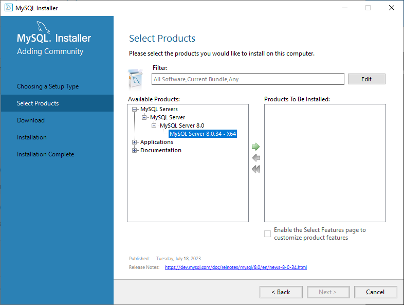
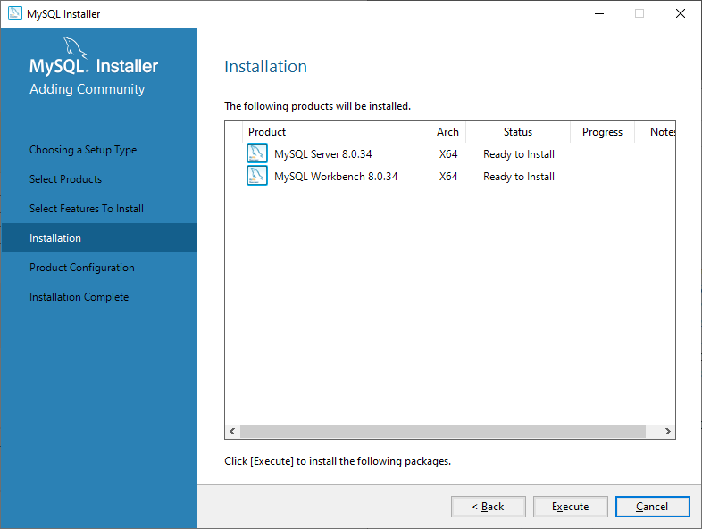
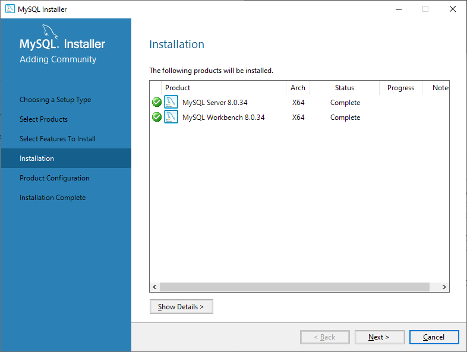

# (old)MySQLインストール手順
> ※本マニュアル作成時は、XAMPPに付属していたMariaDBがExmentに非対応のバージョンであり、個別にインストールが必要でした。  
現在はExmentに対応バージョンに更新され、本手順は不要です。

- 以下のサイトにアクセスし、MySQLをダウンロードします。  
[MySQLダウンロード](https://downloads.mysql.com/archives/installer/)  

- Product Versionが「5.7.X」となっている、最新版のものを選択します。  

- ファイル名に「web」が"入っていない"方の行で、容量が大きい行の「Download」をクリックし、ダウンロードします。  

- ダウンロードしたファイルを実行し、インストールを進めます。  

- 「Choosing a Setup type」では、「Custom」を選択します。  
  

- 「Select Products and Features」では、「MySQL Servers > MySQL Server > MySQL Server 5.7」をクリックすると、MySQL Server X64とX86が表示されます。  
ご利用のOSのバージョンに合わせ、1行クリックし、真ん中の「→」をクリックしてください。    
  

- (任意)MySQLのワークベンチを導入したい場合、「Apploications > MySQL Workbench > MySQL Workbench 8.0」をクリックすると、「MySQL Workbench」が表示されます。  
この行をクリックし、真ん中の「→」をクリックしてください。    
※MySQL Workbenchは、MySQLのデータをGUIからアクセスしやすくするためのアプリケーションです。  
  

- 「Check Requirements」が表示することがあります。  
そのときには、「Execute」をクリックしたら、コンポーネントなどを関連してインストールします。
  

- 完了するまで「Yes」や「Install」をクリックします。  
  

- 「Installation」ページで、「Execute」をクリックして、インストール完了させます。
  

- 完了したら、「Next」をクリックします。
  

- 「Group Replication」や「Type and Networking」では、既定の設定とします。
  
  

- rootユーザーのパスワードを入力します。  
今後ExmentなどでMySQLを使用する場合に必要ですので、必ず覚えておいてください。  
  

- その後はウィザードに従い、「Next」を何回か押下して、インストールを進めていきます。
  
  

- インストールが完了しました。
  

