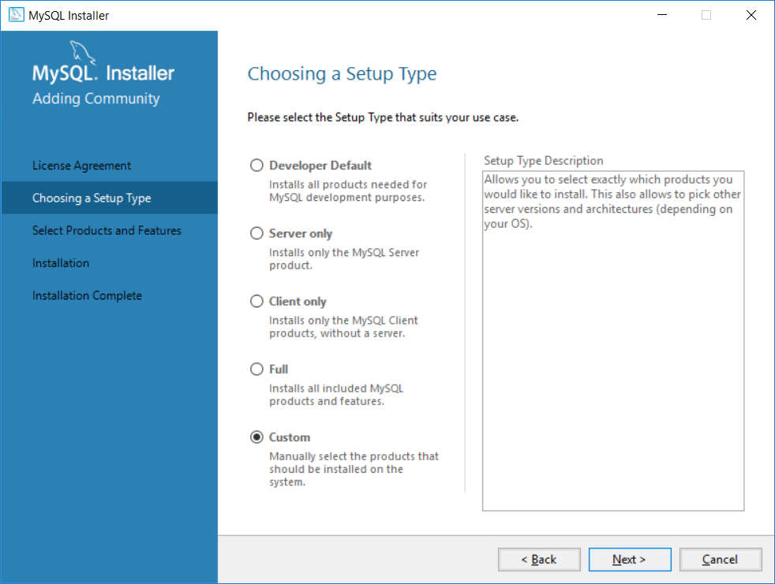
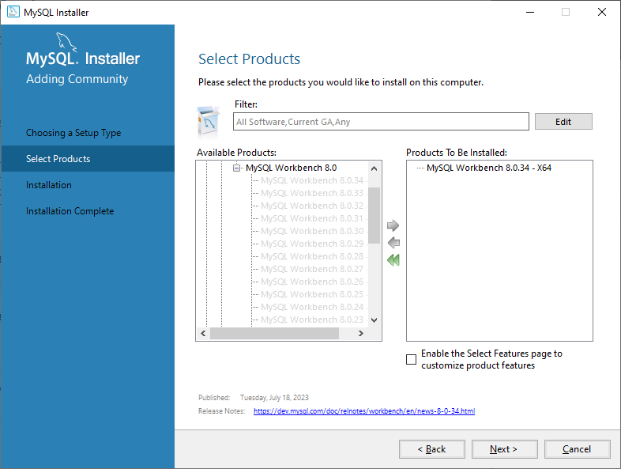
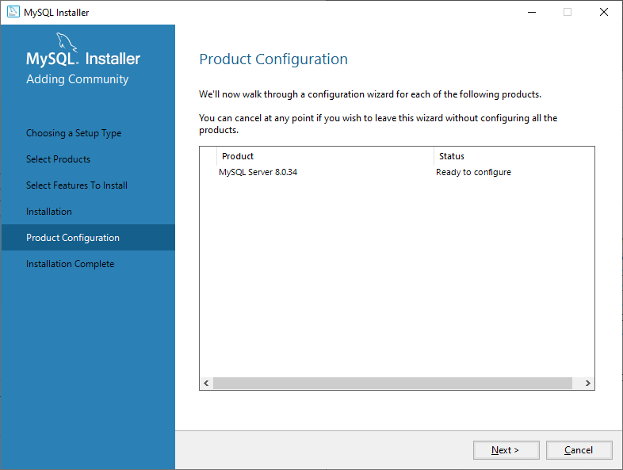

# MySQLインストール手順
Exmentで、MySQLを使用するための手順です。  
※各種手順は、OSやバージョン、インストール時期などにより、異なる場合があります。  

## MySQL設定(Windows)

- 以下のサイトにアクセスし、MySQLをダウンロードします。  
[MySQLダウンロード](https://downloads.mysql.com/archives/installer/)  

- Product Versionが「5.7.X」となっている、最新版のものを選択します。  

- ファイル名に「web」が"入っていない"方の行で、容量が大きい行の「Download」をクリックし、ダウンロードします。  

- ダウンロードしたファイルを実行し、インストールを進めます。  

- 「Choosing a Setup type」では、「Custom」を選択します。  
  

- 「Select Products and Features」では、「MySQL Servers > MySQL Server > MySQL Server 5.7」をクリックすると、MySQL Server X64とX86が表示されます。  
ご利用のOSのバージョンに合わせ、1行クリックし、真ん中の「→」をクリックしてください。    
  

- (任意)MySQLのワークベンチを導入したい場合、「Apploications > MySQL Workbench > MySQL Workbench 8.0」をクリックすると、「MySQL Workbench」が表示されます。  
この行をクリックし、真ん中の「→」をクリックしてください。    
※MySQL Workbenchは、MySQLのデータをGUIからアクセスしやすくするためのアプリケーションです。  
  

- 「Check Requirements」が表示することがあります。  
そのときには、「Execute」をクリックしたら、コンポーネントなどを関連してインストールします。
  

- 完了するまで「Yes」や「Install」をクリックします。  
  

- 「Installation」ページで、「Execute」をクリックして、インストール完了させます。
  

- 完了したら、「Next」をクリックします。
  

- 「Group Replication」や「Type and Networking」では、既定の設定とします。
  
  

- rootユーザーのパスワードを入力します。  
今後ExmentなどでMySQLを使用する場合に必要ですので、必ず覚えておいてください。  
  

- その後はウィザードに従い、「Next」を何回か押下して、インストールを進めていきます。
  
  

- インストールが完了しました。
  

## MySQL設定(Linux)
LinuxでのMySQLのインストール手順です。  
※必要に応じて、コマンドの頭にsudoを付与してください。

- MySQL5.7をインストールし起動します。
~~~
rpm -ivh http://dev.mysql.com/get/mysql57-community-release-el7-11.noarch.rpm
rpm --import https://repo.mysql.com/RPM-GPG-KEY-mysql-2022
dnf -y install mysql-community-server
systemctl enable mysqld.service
systemctl start mysqld.service
~~~

※インストール時に「Error: Unable to find a match: mysql-community-server」のメッセージが出た場合はmysql のモジュールストリームを無効化する必要があります。以下のコマンドを実行してから、処理を続けてください。

~~~
sudo dnf -y module disable mysql
sudo dnf search mysql-community-server
~~~

- MySQLの初期パスワードを確認します。

~~~
cat /var/log/mysqld.log | grep password

#以下のようなログが出力されるので、パスワードを確認する
2016-09-01T13:09:03.337119Z 1 [Note] A temporary password is generated for root@localhost: uhsd!XXXXXX
~~~

- (任意)パスワードポリシーを無効化します。

~~~
vi /etc/my.cnf

#以下のvalidate-passwordを追加
[mysqld]
validate-password=OFF
~~~

- mysqlを再起動します。
~~~
systemctl restart mysqld.service
~~~

- mysqlの初期設定を行います。以下のコマンドを実行します。

~~~
mysql_secure_installation

Enter password for user root: (先ほどコピーしたパスワードを入力)

New password: (新しいパスワードを入力)
Re-enter new password: (新しいパスワードを入力)

Change the password for root? : y

Remove anonymous users? : y #匿名ユーザーアカウントを削除
Disallow root login remotely? : y # ローカルホスト以外からアクセス可能な root アカウントを削除
Remove test database and access to it? : y # test データベースの削除
Reload privilege tables now? : y #privilegeテーブルを再読込
~~~

- MySQLにログインします。

~~~
mysql -u root -p(パスワード)
~~~

- Exment用のデータベースと、ユーザーを作成します。  
※ここでは、データベース名を「exment_database」、ユーザーを「exment_user」とします。  
また、接続元のIPアドレスを「192.168.137.%」とします。

~~~
CREATE DATABASE exment_database;
CREATE USER 'exment_user'@'192.168.137.%' IDENTIFIED BY '(exment_user用のパスワード)';
GRANT ALL ON exment_database.* TO exment_user identified by '(exment_user用のパスワード)';
FLUSH PRIVILEGES;
~~~

- ファイアウォール設定で、接続元のIPアドレスからのMySQLアクセスのみ許可します。  
※ここでは、接続元のIPアドレスを「192.168.137.%」とします。

~~~
firewall-cmd --permanent --new-zone=from_webserver
firewall-cmd --reload
firewall-cmd --permanent --zone=from_webserver --add-source="192.168.137.0/24"
firewall-cmd --permanent --zone=from_webserver --add-port=3306/tcp
firewall-cmd --zone=from_webserver --add-service=mysql
firewall-cmd --reload
~~~