# SQL Serverインストール手順
Exmentで、SQL Serverを使用するための手順です。  
※各種手順は、OSやバージョン、インストール時期などにより、異なる場合があります。


## SQL Server設定

### SQL Serverインストール
- 以下のサイトにアクセスし、SQL Serverをダウンロードします。  
※エディションについては、用途や事業規模などによって、選定をお願いします。  
[SQL Serverダウンロード](https://www.microsoft.com/ja-jp/sql-server/sql-server-downloads)  

- ダウンロードしたファイルを実行し、インストールを進めます。  
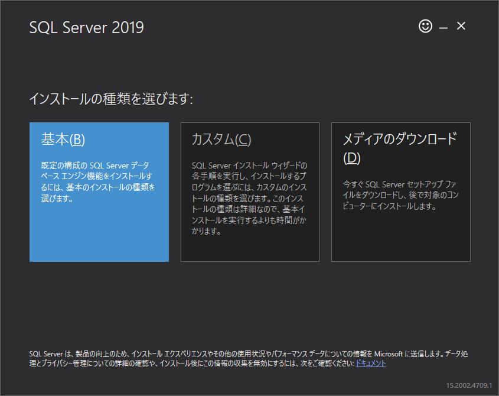  

- インストールが完了します。

### SQL Server Management Studio(GUIツール)インストール
- 以下のサイトにアクセスしてください。  
「使用できる言語」から、「日本語」をクリックし、ツールをダウンロード・インストールを行ってください。  
https://docs.microsoft.com/ja-jp/sql/ssms/download-sql-server-management-studio-ssms?view=sql-server-ver15#available-languages


### 追加設定(Windows)
※現在、WindowsにSQL Serverをインストールした場合に、下記の設定が必要なことを確認しています。

- Windowsスタートメニューより、「SQL Server 構成マネージャー」を開きます。
  

- 左メニューより、「SQL Serverネットワークの構成」→「(エディション名)のプロトコル」をクリック後、「TCP/IP」を右クリックし、「有効にする」をクリックします。
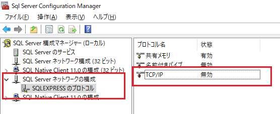  
  
  

- 「TCP/IP」を右クリックし、「プロパティ」をクリックします。  
その後、「IPアドレス」タブを開き、最下部の「TCP 動的ポート」の値を確認します。(後ほど使用します。)
  
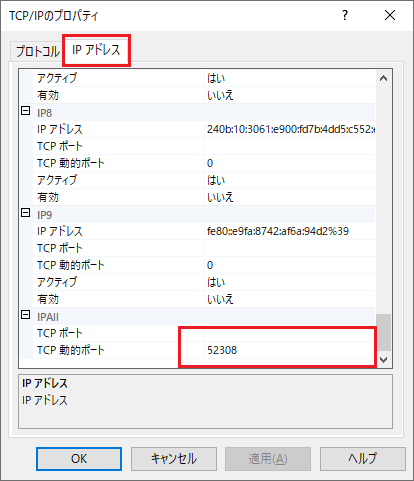  

- スタートメニューボタンをクリックし、「サービス」と記入し、表示された「サービス」アプリを実行します。
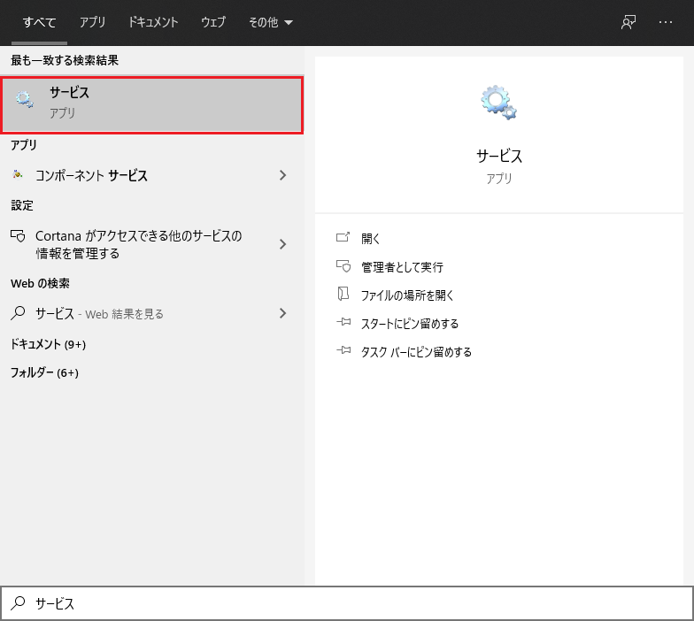  

- サービス一覧から、「SQL Server (エディション名)」を選択し、「サービスの再起動」をクリックします。
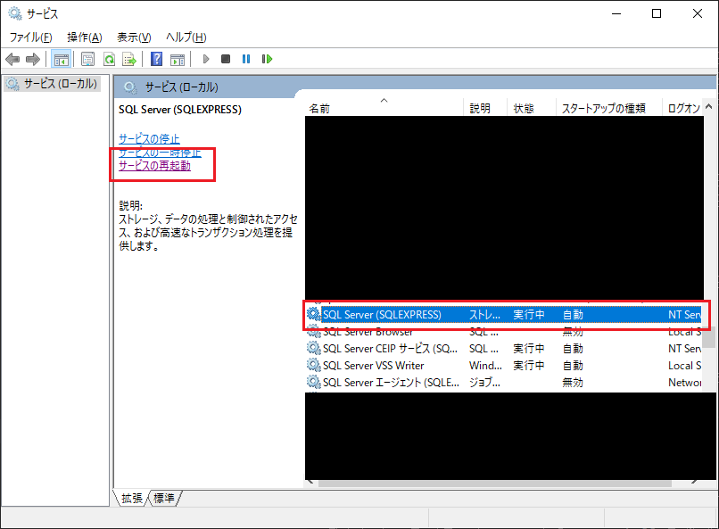  


### データベース作成、ユーザー追加
- 「SQL Server Management Studio」を実行します。
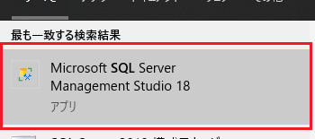  

- ログインを行います。
  

#### データベース作成
- 左メニューより、「データベース」フォルダを右クリックし、「新しいデータベース」をクリックします。
  

- 任意のデータベース名を入力し、OKをクリックします。
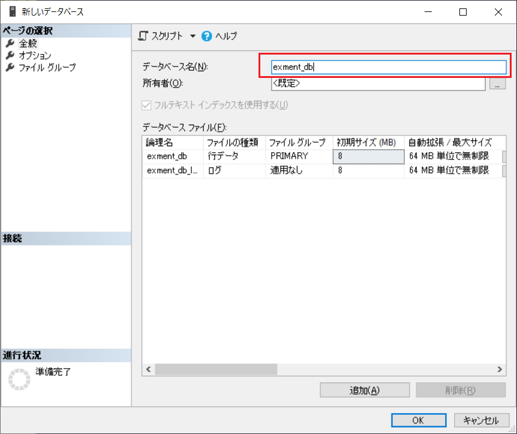  

#### ユーザー追加
- 左メニューより、「セキュリティ」→「ログイン」を右クリックします。
  


- 左メニューより、「セキュリティ」→「ログイン」を右クリックし、「新しいログイン」を選択します。
  

- ログイン名、パスワードを入力し、「SQL Server 認証」を選択します。「パスワード ポリシー」は、チェックを外すことを推奨します。(所属する会社・組織などのポリシーに従ってください。)
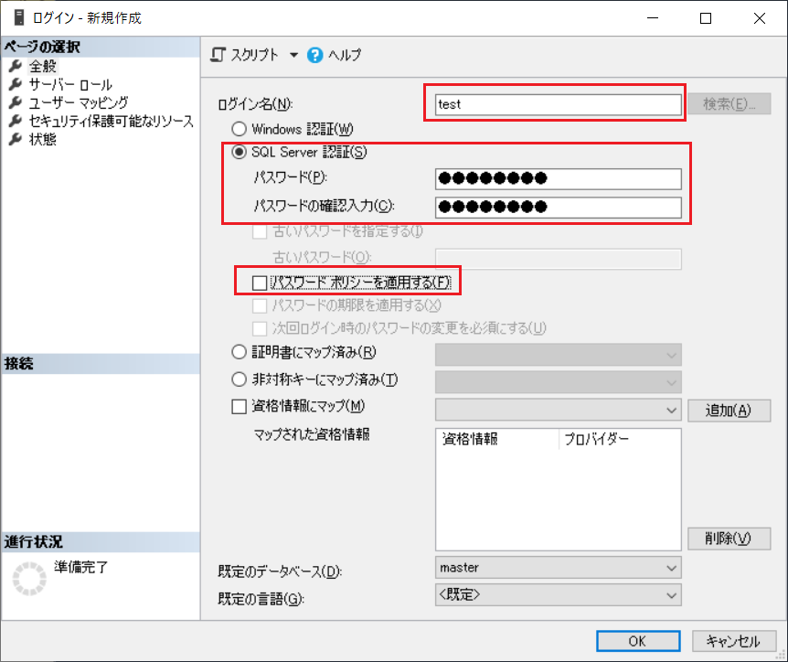    

- 左上の「ユーザー マッピング」を選択します。  
「このログインにマップされたユーザー」のデータベース一覧を、先ほど作成したデータベースを選択します。  
「データベース ロール メンバーシップ」を、以下の内容を選択します。
   - db_backupoperator
   - db_ddladmin
   - db_datawriter
   - db_datareader
   - public
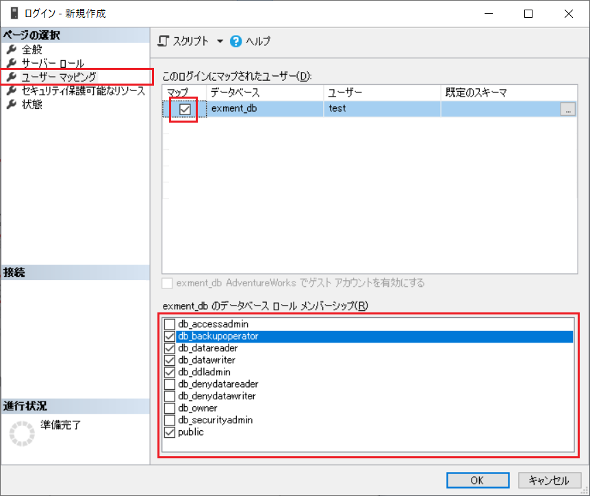    

- すべて完了したら、OKをクリックします。

#### サーバーログイン設定
- 左メニューより、左上のサーバーを右クリックし、「プロパティ」を選択します。
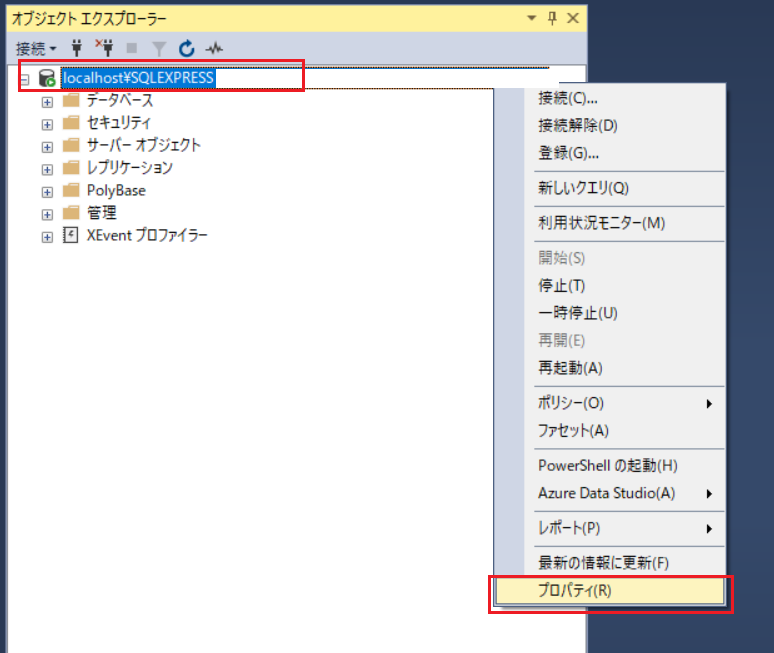 

- 「セキュリティ」メニューより、「サーバー認証」を「SQL Server 認証モードと Windows 認証モード」を選択し、OKをクリックします。  


## Exment設定
ExmentからSQL Serverに接続するための環境構築・設定を行います。  

### ドライバのインストール
ドライバのインストールは、ExmentをインストールしているサーバーのOSにより、手順が異なります。

#### Windows
- 以下のコマンドを実行します。  
実行結果で、ファイルパスが出力されるので、ファイルパスをメモします。

```
php -i | find "extension_dir"
# 結果例
extension_dir => C:\xampp\php\ext => C:\xampp\php\ext
```


- 下記のサイトより、PHPからMicrosoft SQL Serverに接続するためのドライバをダウンロードします。  
[https://docs.microsoft.com/ja-jp/sql/connect/php/download-drivers-php-sql-server?view=sql-server-ver15]

- ダウンロードしたEXEファイルを実行します。

- 実行することで、以下のようなダイアログが表示されます。  
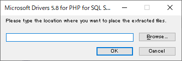

- 上記のコマンド結果のファイルパスを貼り付け、「OK」をクリックします。
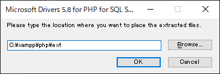

- その結果、sqlserver接続用のdllファイルが、PHPの拡張ライブラリフォルダに配置されます。


- php.iniファイルを開きます。

- ファイルの末尾に、以下の内容を記入します。

```
extension=php_pdo_sqlsrv_72_ts_x64.dll
# "72"部分：利用しているPHPのバージョン。PHP7.3を使用していれば73
# "ts"部分：コマンド「php -i | find "Thread Safety"」を実施時に、「enabled」と出れば「ts」を、「disabled」と出れば「nts」を記入
# "x64"部分：コマンド「php -v」を実施時に、1行目に「x64」が含まれていれば「x64」を、そうでなければ「x86」を記入
```

- PHPを再起動します。これにて、Windowsでの設定は完了です。


#### Linux
準備中。。。


### Exment設定
- その後は、[インストール手順](/ja/quickstart)に従い、各種インストールを進めてください。

- データベース設定画面で入力する値は、以下の値を使用してください。  
    - データベースの種類 : SQL Server
    - データベースのホスト名 : サーバー名
    - データベースのポート番号 : TCP/IP画面で確認したポート番号
    - Exment用データベース名 : 作成したデータベース名
    - Exment用データベースのユーザー名 : 作成したユーザー名
    - Exment用データベースのパスワード : 作成したユーザーのパスワード