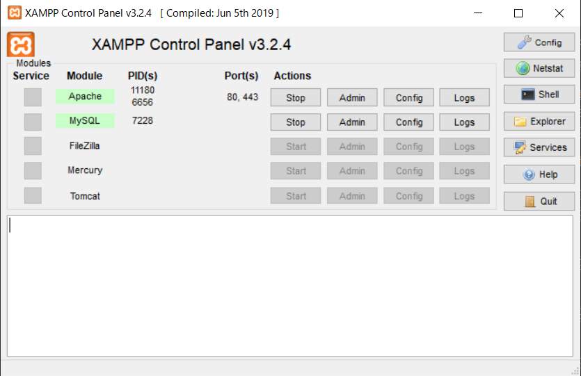
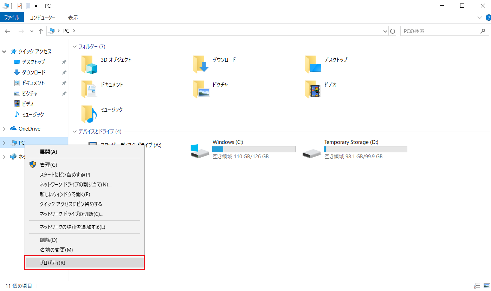
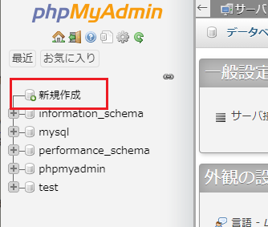
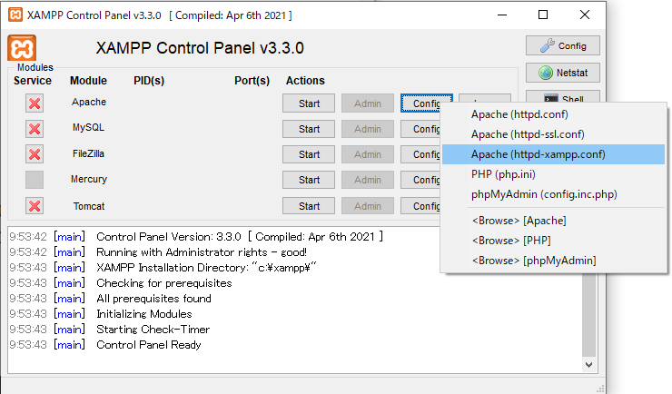

# XAMPPによる環境構築
PHPやApache、MySQLのある環境構築を、開発環境としてはじめから構築する場合、XAMPPをおすすめしております。  
なお、本マニュアルではWindowsの場合でご紹介しております。

## 注意点
- **XAMPPでのインストールは、開発・検証としてのみご利用ください。本番環境としては利用しないことをおすすめします。** 

## インストール手順

### XAMPPインストール手順
- 以下のサイトにアクセスし、XAMPPをダウンロードします。  
[XAMPPダウンロード](https://www.apachefriends.org/jp/download.html)

- 下記のページから、「PHP8.2」以上となっているものを選択し、ダウンロードを行ってください。  

- その後、XAMPPのインストールを進めます。

- 途中、XAMPPのコンポーネントを選択する画面になりますので、Apache、MySQLを選択します。  
また、「phpMyAdmin」にチェックを追加します。  
※それ以外は、任意にチェックを行ってください  
その後、「Next」をクリックします。  

- 以降は画面に従い、インストールを完了させます。

- インストールが完了したら、XAMPPコントロールパネルを起動します。  

- 一番上の「Apache」と「MySQL」の行の、「Start」をクリックしてください。

- ファイアウォール設定が表示された場合、「許可」をクリックしてください。

- これでApacheが起動します。

#### 【注意点】
- OSを再起動した場合、再度XAMPPコントロールパネルを起動し、Apacheを起動し直す必要があります。

### 環境変数追加
コマンドプロンプトからmysqlを実行する場合、「環境変数」にパスを通す必要があります。  

- エクスプローラから、「PC」を右クリックし、「プロパティ」をクリックします。

- 「システムの詳細設定」をクリックします。

- 「環境変数」をクリックします。

- 「ユーザー環境変数」の「Path」をクリックし、「編集」をクリックします。  

- 「新規」をクリックし、以下の行を追加します。  

~~~
C:\xampp\mysql\bin  
~~~

- 入力を行ったら、起動したダイアログをすべて「OK」をクリックし、完了させます。  

##### XAMPP配下のMysqlを実行する場合
- XAMPP配下のMysqlを実行する場合には、[Exmentインストール](#Exmentインストール)の手順の際に、実行ファイルがあるフォルダまでのパスを、Exmentのルートディレクトリにある.env 内に追加してください。  
~~~
#例  
EXMENT_MYSQL_BIN_DIR="C:/xampp/mysql/bin"
~~~

#### データベースを作成
- XAMPPコントロールパネルを起動後、「MySQL」行の「Admin」をクリックします。  

- 左メニューの「新規作成」をクリックします。  

-「データベースを作成する」行で、任意のデータベース名を英数字で入力し、「作成」をクリックします。  

これで、データベース作成が完了します。

### サブドメイン設定
通常の設定だと、"C:\xampp\htdocs"フォルダ内にExmentのプロジェクトファイルを配置することで、Exmentをご利用いただけます。
ですが、例えば[http://localhost/exment/.env](http://localhost/exment/.env)のURLにアクセスすることで、データベース情報を含めた設定ファイルが画面に表示されるなど、大きな問題があります。  
そのため、これらの問題が発生しないための設定を強くおすすめします。以下の手順で設定を行ってください。  

- フォルダ「C:\xampp」に、フォルダ「local」を作成します。

- "C:\xampp\apache\conf\extra\httpd-vhosts.conf"を開きます。

- 行の末尾に、以下の記述を追加します。**※DocumentRootの末尾に「/public」が必要になります**  

~~~
<VirtualHost *:80>
    DocumentRoot "C:/xampp/htdocs"
    ServerName localhost
    # v6.1.xx以上の場合、以下の記述を、末尾に追加
    Header set Content-Security-Policy "default-src 'self'; script-src 'self' 'unsafe-inline'; style-src 'self' 'unsafe-inline'; img-src 'self' data: blob:; font-src 'self' data:; object-src 'self'; frame-src 'self'; connect-src 'self'; form-action 'self'; frame-ancestors 'self'"
    Header set X-Frame-Options "SAMEORIGIN"
    Header set X-Content-Type-Options "nosniff"
    Header set X-XSS-Protection "1; mode=block"
</VirtualHost>

<VirtualHost *:80>
  DocumentRoot "C:/xampp/local/exment/public"
  ServerName exment.localapp
   # v6.1.xx以上の場合、以下の記述を、末尾に追加
   Header set Content-Security-Policy "default-src 'self'; script-src 'self' 'unsafe-inline'; style-src 'self' 'unsafe-inline'; img-src 'self' data: blob:; font-src 'self' data:; object-src 'self'; frame-src 'self'; connect-src 'self'; form-action 'self'; frame-ancestors 'self'"
   Header set X-Frame-Options "SAMEORIGIN"
   Header set X-Content-Type-Options "nosniff"
   Header set X-XSS-Protection "1; mode=block"
</VirtualHost>

<Directory "C:\xampp\local\exment\public">
  Allow from all
  AllowOverride All
  Require all granted
</Directory>
~~~

- "C:\WINDOWS\system32\drivers\etc\hosts"を開き、編集します。  
※このファイルは直接編集できないので、デスクトップなどにコピーし、編集を行った後、元の場所で上書きを行ってください。  

~~~
127.0.0.1       localhost
127.0.0.1       exment.localapp
~~~

- XAMPPコントロールパネルで、Apacheを再起動します。XAMPPコントロールパネルで、「Apache」行の「Stop」ボタンをクリック後、再度「Start」をクリックしてください。  

- これにより、今後は以下のURLで、Exmentにアクセス出来るようになります。  
http://exment.localapp/admin

### Exmentインストール
Exmentの[インストール手順](/ja/quickstart)に従って、Exmentのインストールを行います。  
Exmentのインストールは、通常"C:\xampp\local"フォルダ内で行います。  
ここでは、"C:\xampp\local\exment"フォルダ内にインストールを行ったものとします。  

- 今後のExmentのインストールで、データベースの設定を記入する画面がありますが、以下のように入力してください。  
    - データベース種類：MariaDB
    - ホスト名：127.0.0.1
    - ポート：3306
    - データベース：（上記で作成したデータベース名）
    - ユーザー名：root
    - パスワード：(空欄)

## PHPバージョンアップ時の対応
PHPのバージョンを変更する場合、以下の手順でバージョンアップを行ってください。  
※バージョンアップ作業中は、Exmentにアクセスできなくなります。  
※下記の例は、PHP7.4からPHP8.2へアップデートするための手順です。また、XAMPP全てをアップデートせずに、PHPだけを置き換える方法です。  
※環境や導入時期、バージョンやインストール方法によって、バージョンアップ方法は異なる場合があります。  

- 作業の前準備としてapacheやMySQLを停止し、XAMPPコントロールパネルを終了します。  

- 現在使用しているXAMPP配下のPHPフォルダ（デフォルトはC:\xampp\php）とApacheフォルダ（デフォルトはC:\xampp\apache）をバックアップします。フォルダの名前を変更する、別の場所にコピーする等お好きな方法を選択してください。

- 新しいXAMPPをZIP形式でダウンロードします。  

   1. [XAMPPダウンロード](https://www.apachefriends.org/jp/download.html) にアクセスします
   2. OSや使用したいPHPのバージョンに合わせてファイルをダウンロードします。  
      > その際、installer.exeではなくzipファイルを選択してください。（解凍できる環境があれば7zファイルでも構いません）
      

   3. ZIP ファイルを解凍して、展開されたフォルダ直下にあるPHPフォルダとApacheフォルダをXAMPP配下にコピーします。  

- 必要に応じてphp.iniファイルを修正します。  
※元のiniファイルを変更している場合は、新しいiniファイルにも同じ変更が必要です。バックアップしたphp.iniファイルと新しいphp.iniファイルを比較して、各種設定値などを追加してください。  

- XAMPPコントロールパネルを起動します。  

- Apacheのconfigボタンを押して、プルダウンから「Apache(httpd-xampp.conf)」を選択します。 
   

- httpd-xampp.confを編集します。 
   1. 最初に"php7_module"をすべて"php_module"に置き換えてください。
   2. 残りの"php7"をすべて"php8"に置き換えてください。
   

- Shellボタンを押して、コマンド画面を立ち上げ、PHPのバージョンが新しくなったことを確認してください。  

~~~
php -v
~~~

- 「Apache」と「MySQL」行の、「Start」をクリックします。  

   > 「Apache」の「Start」時にエラーが発生することがあります。  
   その際は、同じ行の右側にある「Logs」→「Apache(error.log)」を開いてください。  
   ログの最新行に「PHP Warning: 'vcruntime140.dll'...」と出力されていたら、「Visual C++ 再頒布可能パッケージ」をインストールする必要があります。  
   [Microsoftのダウンロードサイト](https://visualstudio.microsoft.com/ja/downloads/) にアクセスして、一番下までスクロール→「その他の Tools、Frameworks、そして Redistributables」を開きます。	  
   「Microsoft Visual C++ Redistributable for Visual Studio 2022」のダウンロードボタンをクリックしてインストーラーを入手→ 実行してください。  
