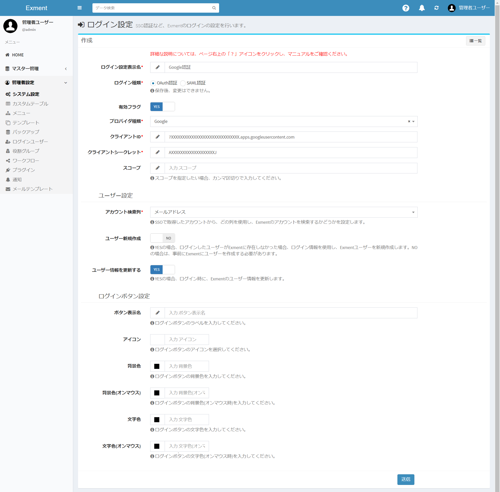

# シングルサインオン(OAuth)
Exmentでは、[ログイン設定](/ja/login_setting)により、シングルサインオン(SSO)を追加することが可能です。  
これにより、Exment専用のログインパスワードを管理することなく、各プロバイダのIDとパスワードを使用することができます。  
  
ここでは、OAuthを使用したSSOの設定方法を記載します。  

#### 注意点
- Exmentでは、[Socialite](https://github.com/laravel/socialite)でシングルサインオン処理を実装しています。
- **このマニュアルでは、OAuthに詳しい方向けの手順になります。各プロバイダのClient IDやClient Secretの作成方法などは、各資料をご参照ください。**
- v3.0.16以下で、Googleログインができない方は、[こちらの手順](/ja/patch/sso_google)で、対応を行ってください。

#### 参考リンク
- [オープンソースWebデータベース『Exment』で、GoogleアカウントによるSSOに対応する](https://qiita.com/hirossyi73/items/70dcc35305a96abace08)

## サーバー・各プロバイダ設定
ログイン設定画面でプロバイダを追加する前に、サーバーでコマンドを入力し、拡張機能をインストールする必要があります。

### 例1 Socialite標準で用意されているプロバイダの場合
- Socialite標準で用意されているプロバイダは、以下になります。（カッコの文字列は、後ほどのservice指定で使用します）
    - Google (google)
    - Facebook (facebook)
    - Twitter (twitter)
    - GitHub (github)
    - LinkedIn (linkedIn)
    - Bitbucket (bitbucket)

- 各プロバイダで、Exment用のアプリケーションを作成します。  
※callback URLは以下になります。  
http(s)://(ExmentのURL)/admin/auth/login/(socialiteのprovider名)/callback  
例1 GitHubの場合：http(s)://(ExmentのURL)/admin/auth/login/github/callback  
例2 Facebookの場合：http(s)://(ExmentのURL)/admin/auth/login/facebook/callback  
例3 Googleの場合：http(s)://(ExmentのURL)/admin/auth/login/google/callback  

- 以下のコマンドを、Exmentのルートディレクトリで実行します。

~~~
composer require laravel/socialite=~3.3.0
~~~

- [画面での設定](#画面での設定)を実施します。

### 例2 Exment拡張で用意しているプロバイダの場合
- 一部のプロバイダは、Exmentの拡張として、プロバイダを用意しております。（カッコの文字列は、後ほどのservice指定で使用します）
    - Office365、Microsoft Graph (graph)

> Office365ログインは当初、下記の「例3」の方法での案内を行っておりましたが、手間の削減のため、例2による手順に改善しました。

- 各プロバイダで、Exment用のアプリケーションを作成します。  
※callback URLは以下になります。  
http(s)://(ExmentのURL)/admin/auth/login/(socialiteのprovider名)/callback  
例 Office365の場合：http(s)://(ExmentのURL)/admin/auth/login/graph/callback

- 以下のコマンドを、Exmentのルートディレクトリで実行します。

~~~
composer require exment-oauth/microsoft-graph
~~~

- [画面での設定](#画面での設定)を実施します。

### 例3 各自でプロバイダを用意する場合
※例1、2にないプロバイダの場合は、[Socialite Providers](https://socialiteproviders.github.io/)で非公式プロバイダーを追加します。  
また、非公式プロバイダーにもアバター取得のための処理が含まれていませんので、処理を追加します。(任意)  

> 現在Exment運営では、様々なプロバイダでのログイン実装を実現したいと考えております。そのため、例1ならびに例2にないプロバイダでのログインを実装された方がいらっしゃいましたら、ソースコードをご提供いただけますと、非常に嬉しいです。

- 各プロバイダで、Exment用のアプリケーションを作成します。  
※callback URLは以下になります。  
http(s)://(ExmentのURL)/admin/auth/login/(socialiteのprovider名)/callback  
例 Office365の場合：http(s)://(ExmentのURL)/admin/auth/login/graph/callback

- 以下のコマンドを、Exmentのルートディレクトリで実行します。

~~~
composer require laravel/socialite=~3.3.0
composer require socialiteproviders/microsoft-graph
~~~

- (任意)アバター取得のために、既存のプロバイダーを継承したクラスを、App\Socialiteに作成します。  
1つ目は、MicrosoftGraphProvider.phpです。インタフェースProviderAvatarをimplementsし、getAvatarを実装します。

~~~ php
<?php

namespace App\Socialite;

use Exceedone\Exment\Auth\ProviderAvatar;
use SocialiteProviders\Graph\Provider;

class MicrosoftGraphProvider extends Provider implements ProviderAvatar
{
    /**
     * Get avatar stream
     * @param mixed $token
     * @return string
     */
    public function getAvatar($token = null){
        try
        {
            $client = $this->getHttpClient();
            $response = $client->get('https://graph.microsoft.com/v1.0/me/photo/$value', [
                'headers' => [
                    'Authorization' => 'Bearer '.$token,
                    'Content-Type' => 'application/json;odata.metadata=minimal;odata.streaming=true'
                ],
                'http_errors' => false,
            ]);

            if($response->getStatusCode() == 404){
                return null;
            }

            return $response->getBody()->getContents();

        }
        catch (Exception $exception)
        {
            return null;
        }
        return null;
    }
}

~~~ 

- 2つ目は、GraphExtendSocialite.phpです。作成したMicrosoftGraphProviderを指定します。

~~~ php
<?php

namespace App\Socialite;

use SocialiteProviders\Manager\SocialiteWasCalled;

class GraphExtendSocialite
{
    /**
     * Execute the provider.
     */
    public function handle(SocialiteWasCalled $socialiteWasCalled)
    {
        $socialiteWasCalled->extendSocialite(
            'graph', __NAMESPACE__.'\MicrosoftGraphProvider'
        );
    }
}

~~~ 

- App\Providers\EventServiceProvider.phpに、追加したプロバイダを記入します。  

~~~ php
<?php

namespace App\Providers;

use Illuminate\Support\Facades\Event;
use Illuminate\Foundation\Support\Providers\EventServiceProvider as ServiceProvider;

class EventServiceProvider extends ServiceProvider
{
    /**
     * The event listener mappings for the application.
     *
     * @var array
     */
    protected $listen = [
        'App\Events\Event' => [
            'App\Listeners\EventListener',
        ],
        
        /// 追加
        \SocialiteProviders\Manager\SocialiteWasCalled::class => [
            // 'SocialiteProviders\Graph\GraphExtendSocialite@handle', ///// 通常の取得
            '\App\Socialite\GraphExtendSocialite@handle', ///// アバター取得のために継承を行った場合
        ],
    ];

    // ...
}

~~~

- [画面での設定](#画面での設定)を実施します。

## 画面での設定
サーバーによる設定が完了したら、[ログイン設定画面](/ja/login_setting)に遷移し、プロバイダを追加します。

- 管理者アカウントで、システム設定画面に遷移します。  
ページの右上の「ログイン設定」ボタンから、ログイン設定画面に遷移します。
  

- 新規ボタンを押して、ログイン設定を作成します。  
※クライアントID／クライアントシークレットにはプロバイダから提供された文字列を設定してください。

  

<!---
  OAuth、Samlで同じものを記載
-->
### ユーザー設定
ログインを行ったユーザーの設定を行います。

  

#### アカウント検索列
SSOで取得したアカウントから、どの列を使用し、Exmentのアカウントを検索するかどうかを設定します。

#### ユーザー新規作成
YESの場合、ログインしたユーザーがExmentに存在しなかった場合に、ログイン情報を使用し、Exmentユーザーを新規作成します。  
NOの場合は、事前にExmentにユーザーを作成する必要があります。ログインしたユーザーがExmentに存在しなかった場合は、エラーが表示されます。

#### 役割グループ設定
YESの場合、Exmentユーザーを新規作成時に、役割グループに紐付けることができます。  

#### ユーザー情報を更新する
YESの場合、再ログイン時に、ユーザー名などのユーザー情報を更新します。

- データを一度以上保存することで、「有効化」ボタンと「ログインテスト」ボタンが表示されます。

- 有効フラグをYESにした場合、ログイン画面にSSO認証用のボタンが表示されます。  
※通常はユーザーIDとパスワードを入力する既定のログインフォームも併せて表示されます。[SSO設定](/ja/system_setting?id=sso設定)で画像のように非表示にすることもできます。

### ログインボタン設定
ログイン胃画面に表示する、ログインボタンの設定を行います。  
※この設定を行わなくても、上記の「例1 Socialite標準で用意されているプロバイダの場合」にあるプロバイダの場合は、それぞれのフォーマットで表示されます。

  

### 有効化とログインテスト
- データを一度以上保存することで、「有効化」ボタンと「ログインテスト」ボタンが表示されます。

  

- 有効化を実行することで、ログイン画面にSSO認証用のボタンが表示されます。  
  

- また、「ログインテスト」ボタンをクリックすることで、設定したログイン情報で、ログインのテストを行うことができます。これは、ログイン設定を有効化していなくても実施できます。  
**その際に、「テスト用リダイレクトURL」に表示されているURLを、プロバイダのOAuth認証設定のコールバックURLに、上記のURLを、一時的に追加もしくは変更してください。**

  

- 「ログイン」ボタンをクリックすることで、設定が正常に行われているか、テストを行うことができます。  
ログイン結果は、「実施結果」項目に表示されます。

### アクセストークン取得

- ログイン後、アクセストークンとリフレッシュトークンを取得する場合、以下の方法で取得を行ってください。

~~~ php
use Exceedone\Exment\Services\Login\LoginService;

$access_token = LoginService::getAccessToken();
$refresh_token = LoginService::getRefreshToken();
~~~