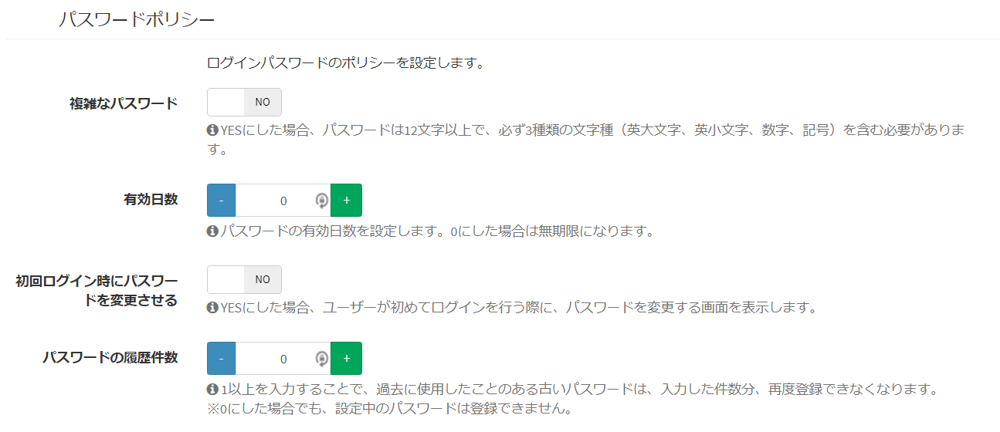

# ログイン設定
Exmentにログインを行う時の、各種ログイン設定を設定します。

## ログイン方式
Exmentでは、標準のログイン以外にも、様々なログイン方式が用意されています。  
以下、そのログイン方式について記載します。

### 標準
Exmentで作成したデータベースに、ユーザーを登録、パスワードを設定して、Exmentのデータベースと連携してログインを行う方式です。  

### OAuth
OAuth形式のシングルサインオンで、ログインを行う方式です。  
ログインボタンをクリックした時に、あらかじめ登録していたプロバイダのログイン画面にリダイレクトして、ログインを行います。  

- [シングルサインオン(OAuth)](/ja/login_oauth)
  
※プロバイダ例：  

- Google
- Facebook
- Office365

### SAML
SAML形式のシングルサインオンで、ログインを行う方式です。  
ログインボタンをクリックした時に、あらかじめ登録していたプロバイダのログイン画面にリダイレクトして、ログインを行います。  
  
- [シングルサインオン(SAML)](/ja/login_saml)
  
※プロバイダ例：  

- OpenAM
- Keycloak
- ADFS

### LDAP
LDAP形式で、ログインを行う方式です。  
Exmentのログインページで、ID・パスワード欄にユーザー情報を入力し、ログインボタンをクリックすることで、LDAP認証を行い、ユーザー情報を連携します。  
  
- [ログイン設定(LDAP)](/ja/login_ldap)
  
※プロバイダ例：  

- Active Directory

## 2段階認証
Exmentでは、2段階認証に対応しています。  
ユーザー情報を入力してログイン後、EメールもしくはGoogle認証システムによって送信されたコードを入力することで、Exmentにアクセスすることができるようになります。  
※2段階認証は、ログイン方式が「標準」「LDAP」の場合に利用できます。

- [2段階認証 システム設定](/ja/login_2factor_setting)
- [ログイン(2段階認証)](/ja/login_2factor)

## ログイン設定管理方法

- システム管理者が、以下のURLを入力します。  
http(s)://(ExmentのURL)/admin/log_setting  
※上記で記載の「システム設定変更」を行うことで、アクセスが出来るようになります。

- もしくは、メニューに「ログイン設定」を追加します。  
「管理者設定」 > 「メニュー」ページを開き、メニュー種類「システムメニュー」を選択すると、対象の「ログイン設定」が表示されますので、選択し、保存を行ってください。  
※「ログイン設定」は、デフォルトの設定ではメニューに表示されません。

  

- 新規のSSOプロバイダを追加する場合は、右上の「＋新規」ボタンをクリックします。  
    - [シングルサインオン(OAuth)](/ja/login_oauth)
    - [シングルサインオン(SAML)](/ja/login_saml)
    - [ログイン設定(LDAP)](/ja/login_ldap)
  
- 2段階認証の管理を行うには、下記のページの手順に従い、設定を行います。

    - [2段階認証 システム設定](/ja/login_2factor_setting)

### SSO設定
SSO全体の設定を管理します。  
※有効になっているSSOが1件以上存在する場合のみ表示されます。

#### 既定のログインを表示する
YESに設定した場合、ExmentのID・パスワードを使用したログインフォームと、ログインボタンを表示します。  
※SAML、OAuthによるログインのみで、この設定をNOにすることで、ユーザーIDとパスワードを入力する既定のログインフォームが非表示になります。

#### SSOログインにリダイレクト
YESに設定した場合、ユーザーがログイン画面に遷移した時、Exmentのログインページを表示せず、SSOのログインページに直接リダイレクトします。  
※SAML、OAuthによるプロバイダが、合計1件のみの場合に有効になります。

#### ログイン許可ドメイン
ログインを許可するドメインを指定する場合は記入してください。複数ある場合は改行区切りで記入してください。  
入力したドメイン以外のユーザーがログインを行った場合、エラーが表示されます。  

### パスワードポリシー設定
ログインパスワードに関連するルールを設定します。   

  

#### 複雑なパスワード
- 設定がYESの場合、3種類以上の文字種（半角英大文字、半角英小文字、半角数字、半角記号）を含んだ12文字以上のパスワードを設定する必要があります。
- 初期値は「NO」です。

#### 有効日数
- 指定日数経過後に初めてログインした場合、パスワード変更画面に誘導されます。パスワードを変更してから、再度ログイン処理を行ってください。
- 有効日数を「0」にした場合、パスワードは無期限になります。
- 初期値は「0」です。

#### パスワードの履歴件数
- 最近使用したパスワードの再利用を制限します。新しいパスワードと直近～履歴件数分のパスワードを比較して同一だった場合はエラーにします。
- 履歴件数を「0」にした場合は比較対象外です。
- 初期値は「0」です。

#### 注意

- 「複雑なパスワード」と「パスワードの履歴件数」は、ユーザー設定画面やパスワードのリセット画面などでユーザー自身がパスワードを設定する場合に適用されます。システム管理者が設定する場合は対象外です。
