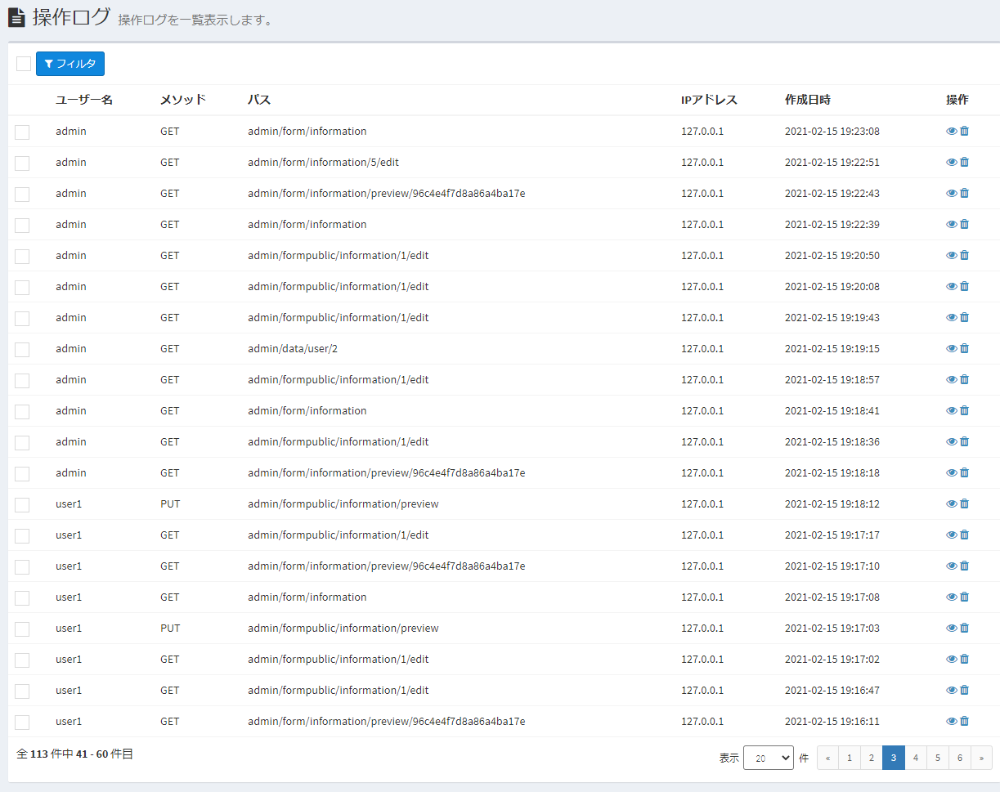
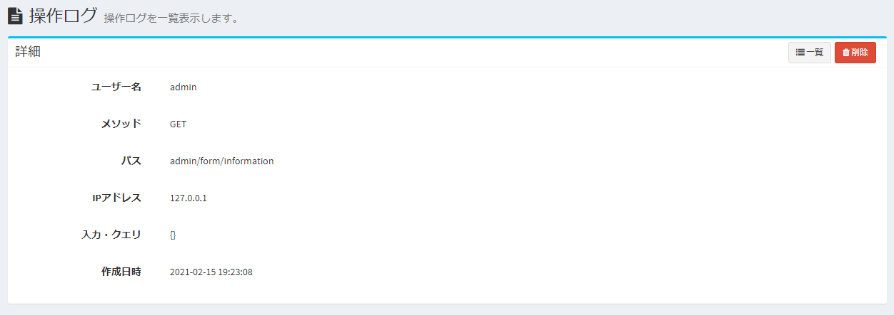

# ログ
Exmentの各種ログについて記載します。

## ログ種類
現在Exmentでは、以下のログ種類があります。

- **操作ログ**  
各ユーザーが画面で操作した内容を、Web画面で一覧表示します。  

- **ログファイル出力**  
主にエラーが発生した場合に、サーバー上にログファイルを出力します。  

## 操作ログ  
各ユーザーが画面で操作した内容を、Web画面で一覧表示します。  
操作した内容とは、主に以下があります。  

- ユーザーが画面を表示、データを新規追加、更新、削除など
- APIの認証、実行

### 確認方法
- システム管理者が、以下のURLを入力します。  
http(s)://(ExmentのURL)/admin/auth/logs  

- もしくは、メニューに「APIアプリ設定」を追加します。  
「管理者設定」 > 「メニュー」ページを開き、メニュー種類「システムメニュー」を選択すると、対象の「操作ログ」が表示されますので、選択し、保存を行ってください。  
※「操作ログ」は、デフォルトの設定ではメニューに表示されていません。

- 操作ログの一覧画面が表示されます。

  

- データの詳細を表示したい場合は、該当行をクリックしてください。  

  

### 各項目について

- ##### ユーザー名  
操作した該当のユーザーです。※未ログイン状態での操作の場合、未記入になります。

- ##### メソッド
HTTPリクエストのメソッドの種類です。

- ##### パス
HTTPリクエストの対象URIです。  
※GETメソッドで、クエリ文字列が含まれていた場合でも、この項目には出力されず、代わりに「入力・クエリ」が表示されます。

- ##### IPアドレス
操作を実施した端末のIPアドレスです。

- ##### 入力・クエリ
HTTPリクエストのクエリ文字列、もしくはPOST値です。  

- ##### 作成日時
操作を実施した日時です。

### その他
- 項目「入力・クエリ」について、以下の値は、機密情報につき、文字列"***"に置き換えて保存しています。
    - password
    - password_confirmation
    - current_password
    - _token
    - verify_code
    - access_token
    - refresh_token

## ログファイル出力  
主にエラーが発生した場合に、サーバー上にログファイルを出力します。  
※後述の設定を追加することによって、エラー以外の値を出力こともできます。

### 確認方法
- Exmentを構築しているサーバーで、以下のパスにアクセスします。  
(Exmentのルートフォルダ)/storage/logs  

- laravel.logファイルをご確認ください。

### 設定値追加
- [設定値](/ja/config)を変更することによって、以下の内容も出力することができます。※設定手順は、[こちら](/ja/config)をご確認ください。

- ##### リクエスト値出力
    - 設定キー : EXMENT_DEBUG_MODE_REQUEST
    - 既定値 ： false
    - 役割 : trueにすることで、ExmentのWebサービスへのリクエスト値をログ出力します。  

- ##### SQLログ出力
    - 設定キー : EXMENT_DEBUG_MODE_SQL
    - 既定値 ： false
    - 役割 : trueにすることで、ExmentでSQLを実行時、SQL文をログ出力することができます。

- ##### SQLログ出力 - 関数表示
    - 設定キー : EXMENT_DEBUG_MODE_SQLFUNCTION
    - 既定値 ： false
    - 役割 : ExmentでSQLを実行時で、「EXMENT_DEBUG_MODE_SQL」がtrueのときに、trueにすることで、SQL文と同時に、呼び出し元の関数一覧をログ出力することができます。

### その他
- Laravelでは、ログファイルのサーバー出力以外にも、以下のような機能があります。
    - Slackなど、他の場所にログを出力する
    - ログのフォーマットを変更する
    - ログの出力ファイルを毎日切り替える

- これらの設定は、[こちらのマニュアル](https://readouble.com/laravel/6.x/ja/logging.html)に従い、設定を行ってください。
