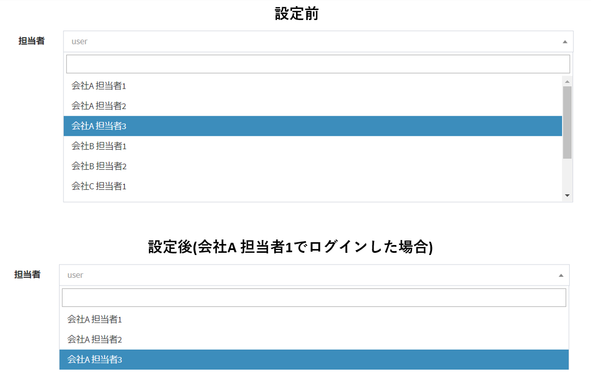

# 複数の組織のユーザーがログインするシステムを構築する場合
データ一覧画面や編集画面で、ユーザー・組織の表示時、**「ログインユーザーが所属する組織や、その所属ユーザーのみ表示させる」**という設定を行いたい場合に、推奨する内容です。

## 背景
元々Exmentでは、主に以下のような用途を想定していました。  

- 企業内・組織内での情報共有  
- グループ会社間での情報共有
- REST APIを公開し、Webデータベースとしてのデータ所持

これらの用途では、「システム内で、どのユーザーが使用しているか」「どの組織・どの会社がシステム登録しているか」ということは、大きな問題にはなりません。むしろ、閲覧できて然るべきです。  

しかし、以下のような用途を考えたときに、**「他のユーザーの情報を取得できる」**ということは、問題になることがあります。  

- グループ会社間ではない、まったく異なる企業に、それぞれExmentのアカウントを払い出し、1つのWebデータベースでデータ管理を行う。
- 個人単位でExmentのアカウントを払い出し、ポータルサイトとしてシステムを構築する。

このような用途を考えた場合、**各ユーザーの所属会社以外のユーザー情報、会社・組織情報を、閲覧・取得できることは、問題となることがあります。**  
  
例として、以下のようなExmentを構成したとします。  

- あるExment環境で、ベンダー会社A、B、Cの担当者がログインできるようになっている。
- 各ベンダーの担当者は、テーブル「製品情報」に「担当データの編集」権限を持ち、自社が担当する製品情報を入力する。
- テーブル「製品情報」では、カスタム列「担当者」がある。「担当者」列に、その製品の自社担当者を設定する。

しかし、このような設定を行った場合、通常の設定ですと、**テーブル「製品情報」のカスタム列「担当者」候補には、ベンダー会社A・B・Cすべての担当者が表示されてしまいます。**    
これは、Exmentで「ユーザー」列を設定した場合、通常の設定ですと、選択肢には、権限のあるユーザーすべてが表示されるためです。  
  
  
  
このように、**「ログインユーザーには、そのユーザーが所属する組織やユーザーのみ表示させる」**ということを実現したい場合があります。  
  
この章では、以下の設定を行うための手順を記載します。
- ログインユーザーが所属する組織以外を、表示できなくする。
- ならびに、それらの組織に所属するユーザー以外を表示できなくする。

## 設定方法
- システム設定画面に遷移し、画面右上の「詳細設定」ボタンをクリックします。

- 「組織設定」の「ユーザー・組織のフィルター」項目を、適切な設定に変更します。

  

- 設定の選択肢は、そのExmentで「組織設定を使用する」設定がYESかどうかで異なります。

### 設定値(組織を使用する設定の場合)
#### 絞り込みを行わない
- 既定値です。ログインユーザーによって、組織やユーザーの絞り込みは行いません。

#### ログインユーザーが所属する組織と、親子階層の組織。ならびに、それらの所属ユーザー
- ログインユーザーは、自身が所属する組織と、その親子階層の組織情報のみ取得できます。
- それらの組織に所属しているユーザーの情報のみ取得できます。

#### ログインユーザーが所属する組織と、親階層の組織。ならびに、それらの所属ユーザー
- ログインユーザーは、自身が所属する組織と、その親階層の組織情報のみ取得できます。
- それらの組織に所属しているユーザーの情報のみ取得できます。

#### ログインユーザーが所属する組織と、子階層の組織。ならびに、それらの所属ユーザー
- ログインユーザーは、自身が所属する組織と、その子階層の組織情報のみ取得できます。
- それらの組織に所属しているユーザーの情報のみ取得できます。

#### ログインユーザーが所属する組織。ならびに、それらの所属ユーザー
- ログインユーザーは、自身が所属する組織の情報のみ取得できます。
- それらの組織に所属しているユーザーの情報のみ取得できます。

### 設定値(組織を使用しない設定の場合)
#### 絞り込みを行わない
- 既定値です。ログインユーザーによって、ユーザーの絞り込みは行いません。

#### ログインユーザーのみ
- ログインユーザー以外のユーザー情報は取得できなくなります。

## この設定を行った場合の仕様
この設定を行う場合、以下のような仕様となります。  

- データ編集画面の、カスタム列「組織」の選択肢が、ログインユーザーが取得できる組織のみに絞り込まれます。  
ならびに、データ編集画面の、カスタム列「ユーザー」の選択肢が、ログインユーザーが取得できるユーザーのみに絞り込まれます。

  

- データの閲覧時に、特定の列で、ログインユーザーが取得できないデータが設定されていた場合、本来だと設定しているユーザー・組織のリンクが表示されますが、代わりに「(表示権限がありません)」テキストが表示されます。  

  

- データの共有画面で、選択肢が、ログインユーザーが取得できる組織・ユーザーのみに絞り込まれます。

TODO:比較画像。
