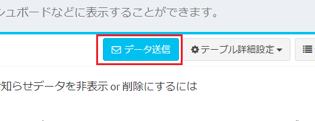
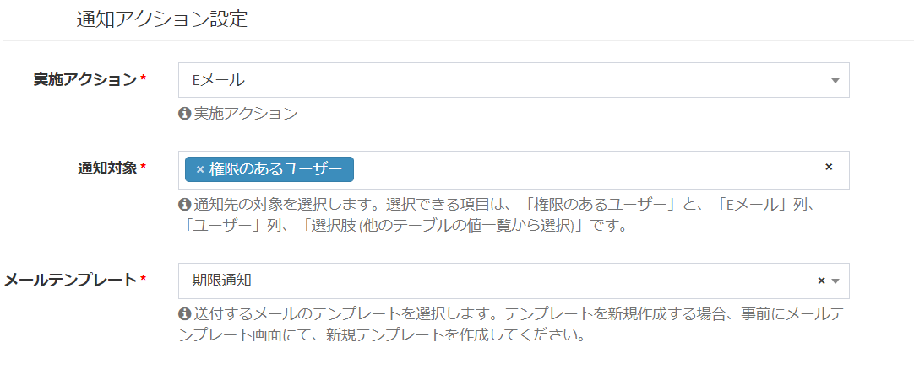

# 通知・メール送信設定
特定の条件で、ユーザーや指定のメールアドレスにメールを送信することができます。  
**※この機能を実行する場合、[メール設定](/ja/system_setting#システムメール設定)を行う必要があります。**

### 通知の種類
現在Exmentでは、以下の通知の種類があります。

#### 時間の経過
データに登録している日付の、一定日付より前の日に近付いた場合に、通知が実行されます。  
例：契約更新日が「7/31」で、設定で「10日前に通知」の設定を行っていた場合に、「7/21」にメールを送信します。    
**※この機能を実行する場合、事前に、[タスクスケジュール](/ja/quickstart_more?id=タスクスケジュール)設定を行う必要があります。**

#### データ新規作成・更新・共有・コメント
以下の条件に合致した場合に、通知が実行されます。
- データの新規作成時
- データの更新時
- データに対し、コメントが実施された時
- データに対し、ファイルが添付された時
- データが共有された時  
更新情報をいち早くキャッチしたい場合にご利用ください。  
※自分自身には通知は行われません。

#### ボタン
データ詳細画面に、通知用のボタンが表示されるようになります。  
指定のユーザーやメールアドレスに、メッセージを送信します。  
また、保存済のファイルを添付することも可能です。
  
  

## 一覧画面表示
メニューより、「管理者設定 > 通知」をクリックしてください。  
現在保存されている通知が表示されます。

  

## 新規作成 
- 一覧画面右上の［新規］ボタンをクリックします。
  
- 通知新規作成画面が表示されるので、必要事項を入力していきます。  
※入力する内容は、下記項目をご参照ください。

- 設定した内容を保存するには［送信］ボタンをクリックしてください。通知設定が作成されます。

## 編集
- 該当する行の［編集］リンクをクリックしてください。  
編集画面に移行するので、設定の変更が行えます。  

  

## 複製
- 該当する行の［複製］リンクをクリックしてください。
該当する行の設定値を複製したまま、新規作成画面に移行します。

  

## 削除
列の削除を行いたい場合、該当する行の［削除］リンクをクリックしてください。  

  

## 設定項目詳細
「通知名」と、通知を行うための条件「通知条件設定」、どのように通知を行うかの「通知アクション設定」を設定します。  

### 通知名設定

##### 通知名(英数字)
- システムで使用する通知の名称です。  
プラグイン(トリガー)のトリガー条件で通知実行直前や通知実行後を設定する際などに使用します。
- 使用できるのは、半角英数字と記号の "-" と "_" です。
- 文字数は30文字以内で、他の通知で使用している通知名は使用できません。

##### 通知表示名
- 通知名の名前を表します。

### 通知条件設定

  

##### 実施トリガー
通知を行う条件となる設定を選択します。設定の詳細は、上記の[通知の種類](#通知の種類)をご確認ください。

##### 対象テーブル
通知を行う条件となるテーブル、ならびに通知対象のテーブルを選択します。

##### 対象ビュー
通知を行う条件を絞る為に、[条件ビュー](/ja/view.md?id=条件ビュー)を選択します。

### 通知条件設定(時間の経過)

##### 日付対象列
通知の判定を行う対象の、カスタム列を選択します。  
選択できるカスタム列の種類は、「日付」「日時」です。  
※選択したカスタムテーブルが、「日付」「日時」を含んでいない場合、選択肢は表示されません。

##### 通知日
通知を行う日付を入力してください。「0」と入力することで、当日に通知を行います。

##### 通知前後
通知を行うのが、登録している日付の「前」か「後」かを選択します。  
例：「通知日」が7、「通知前後」が「前」の場合、指定したフィールドの日付の7日前に通知実行

##### 通知時間
通知を実行する時間です。0～23で入力します。  
例：「6」と入力した場合、6:00に通知実行

### 通知条件設定(データ新規作成・更新・共有・コメント)

##### 通知条件設定
通知を行う条件を設定します。
  

### 通知条件設定(ボタン)

##### ボタン表示名
画面に表示するボタンの名称を記入します。

### 通知アクション設定

  

##### 実施アクション
通知を実施するアクションを選択します。複数選択可能です。
- **Eメール**  
対象のEメールアドレスに通知メールを送信します。  

- **システム内アラート**  
対象のユーザーがログイン時、ページ右上の通知アイコンに、通知アラートが表示されます。 
  
- **Slack**  
Slackに通知を送信します。WebhookのURLが必要です。  

- **Microsoft Teams**  
Microsoft Teamsに通知を送信します。WebhookのURLが必要です。  

##### Webhook URL
SlackもしくはMicrosoft Teamsに通知を行う場合に必要となる、WebhookのURLです。URLの取得方法は、[こちら](/ja/notify_webhook)をご参照ください。

##### 通知対象
通知を行う対象を選択します。選択できる項目は、「権限のあるユーザー」と、「Eメール」列、「ユーザー」列、「選択肢 (他のテーブルの値一覧から選択)」です。  
※通知先が「Slack」もしくは「Microsoft Teams」の場合、この設定は無効になります。  
※「選択肢 (他のテーブルの値一覧から選択)」は、参照先のテーブルが、「Eメール」列を持っている場合に限ります。  
※「実施アクション」が「システム内アラート」のとき、「Eメール」列、「選択肢 (他のテーブルの値一覧から選択)」の設定は無効になります。

##### メールテンプレート
送付するメールのテンプレートを選択します。テンプレートを新規作成する場合、事前にメールテンプレート画面にて、新規テンプレートを作成してください。  
メールテンプレートについて、詳細は[こちら](/ja/mail)をご参照ください。  
  
  
>  **ファイルを添付した通知を行う場合、[こちらの設定](/ja/notify_encript)を行うことにより、添付ファイルの暗号化が行われます。**

## 通知に時間がかかる場合
通知処理は、メール・WebHookに関わらず、非常に時間がかかります。  
上級者向け機能ですが、[通知の遅延実行](/ja/additional_queue)もございますので、ご確認ください。