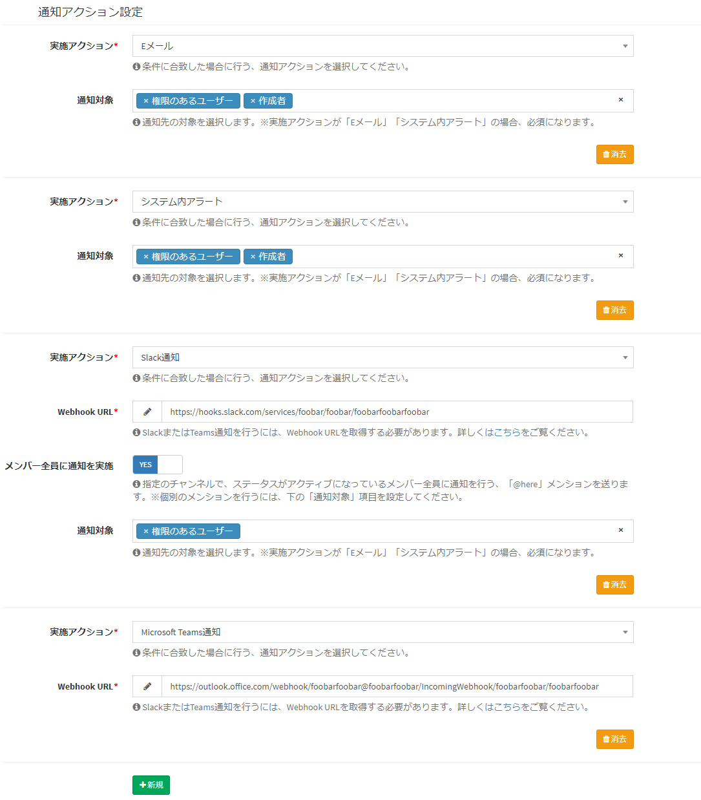
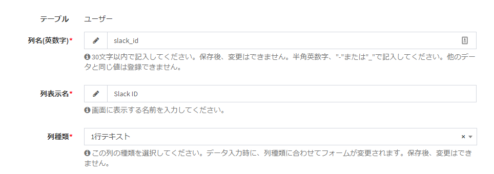

# 通知・メール送信設定
特定の条件で、ユーザーや指定のメールアドレスにメールを送信することができます。  
**※この機能を実行する場合、[メール設定](/ja/system_setting#システムメール設定)を行う必要があります。**

## 通知トリガーの種類
現在Exmentでは、以下の通知トリガーの種類があります。

### 時間の経過
データに登録している日付の、一定日付より前の日に近付いた場合に、通知が実行されます。  
例：契約更新日が「7/31」で、設定で「10日前に通知」の設定を行っていた場合に、「7/21」にメールを送信します。    
**※この機能を実行する場合、事前に、[タスクスケジュール](/ja/quickstart_more?id=タスクスケジュール)設定を行う必要があります。**

### データ新規作成・更新・共有・コメント
以下の条件に合致した場合に、通知が実行されます。

- データの新規作成時
- データの更新時
- データに対し、コメントが実施された時
- データに対し、ファイルが添付された時
- データが共有された時

更新情報をいち早くキャッチしたい場合にご利用ください。  
※初期設定の場合、データ更新などを行ったログインユーザーには、通知は行われません。設定を変更する場合、[設定値変更](/ja/config)の「通知対象がログインユーザーだった場合、通知をスキップする」の設定を行ってください。

### ボタン
データ詳細画面に、通知用のボタンが表示されるようになります。  
指定のユーザーやメールアドレスに、メッセージを送信します。  
また、保存済のファイルを添付することも可能です。

  
  

### ワークフロー実行
ワークフローが実行された際、データの作成者や次の実行ユーザーに対して通知を実行することができます。

## 通知アクションの種類
現在Exmentでは、以下の通知アクションの種類があります。  
また、通知設定画面で、通知を行う対象を選択する「通知設定」を選択します。

### Eメール
Eメールアドレスに、メールを送信します。

#### 通知対象

- ##### 権限のあるユーザー
対象のデータの権限のあるユーザーに、メールを送信します。

- ##### 作成ユーザー
対象のデータを作成したユーザーに、メールを送信します。

- ##### Eメール列
データのカスタムテーブルに、カスタム列「Eメールアドレス」を含んでいた場合、そのEメールアドレスに、メールを送信します。

- ##### ユーザー列
データのカスタムテーブルに、カスタム列「ユーザー」を含んでいた場合、そのユーザー列に設定されているユーザーに、メールを送信します。

- ##### 選択肢 (他のテーブルの値一覧から選択) 内の Eメールアドレス列
データのカスタムテーブルに、カスタム列「選択肢 (他のテーブルの値一覧から選択)」を含んでいて、その参照先のテーブルに、Eメールアドレス列を含んでいた場合、そのEメールアドレスに、メールを送信します。

### システム内アラート
対象のユーザーがログイン時、ページ右上の通知アイコンに、通知アラートが表示されます。 
  

#### 通知対象

- ##### 権限のあるユーザー
対象のデータの権限のあるユーザーに、通知を送信します。

- ##### 作成ユーザー
対象のデータを作成したユーザーに、通知を送信します。

- ##### ユーザー列
データのカスタムテーブルに、カスタム列「ユーザー」を含んでいた場合、そのユーザーに、通知を送信します。

### Slack
Slackに通知を送信します。  
※通知を行うには、WebhookのURLが必要です。URLの取得方法は、[こちら](/ja/notify_webhook)をご参照ください。

#### メンション設定
設定により、Slackのメンションを追加することができます。メンションは、以下の設定があります。

- ##### 全体メンション
Slack通知に、全体のメンションを行う「@here」を追加します。

- ##### 個別メンション
Slack通知に、個別のメンションを追加します。  
メンションを行うためのユーザーIDは、ユーザーテーブルに「Slack ID」設定用のカスタム列を追加し、その列にSlack IDを入力します。  
Slack ID設定方法は、下記の[Slack ID設定方法](#slack-id設定方法)をご確認ください。

#### メンション対象

- ##### 権限のあるユーザー
対象のデータの権限のあるユーザーに、通知を送信します。

- ##### 作成ユーザー
対象のデータを作成したユーザーに、通知を送信します。

- ##### ユーザー列
データのカスタムテーブルに、カスタム列「ユーザー」を含んでいた場合、そのユーザー列に設定されているSlack IDに、メンションを送信します。

### Microsoft Teams
Microsoft Teamsに通知を送信します。  
※通知を行うには、WebhookのURLが必要です。URLの取得方法は、[こちら](/ja/notify_webhook)をご参照ください。  
※Microsoft Teamsでは、メンションの追加はできません。

## 一覧画面表示
メニューより、「管理者設定 > 通知」をクリックしてください。  
現在保存されている通知が表示されます。

  

## 新規作成 
- 一覧画面右上の［新規］ボタンをクリックします。
  
- 通知新規作成画面が表示されるので、必要事項を入力していきます。  
※入力する内容は、下記項目をご参照ください。

- 設定した内容を保存するには［送信］ボタンをクリックしてください。通知設定が作成されます。

## 編集
- 該当する行の［編集］リンクをクリックしてください。  
編集画面に移行するので、設定の変更が行えます。  

  

## 複製
- 該当する行の［複製］リンクをクリックしてください。
該当する行の設定値を複製したまま、新規作成画面に移行します。

  

## 削除
列の削除を行いたい場合、該当する行の［削除］リンクをクリックしてください。  

  

## 設定項目詳細
「通知名」と、通知を行うための条件「通知条件設定」、どのように通知を行うかの「通知アクション設定」を設定します。  

### 通知名設定

#### 通知名(英数字)
- システムで使用する通知の名称です。  
プラグイン(トリガー)のトリガー条件で通知実行直前や通知実行後を設定する際などに使用します。
- 使用できるのは、半角英数字と記号の "-" と "_" です。
- 文字数は30文字以内で、他の通知で使用している通知名は使用できません。

#### 通知表示名
- 通知名の名前を表します。

### 通知条件設定

  

#### 実施トリガー
通知を行う条件となる設定を選択します。設定の詳細は、上記の[通知の種類](#通知の種類)をご確認ください。

#### 対象テーブル
通知を行う条件となるテーブル、ならびに通知対象のテーブルを選択します。

#### 対象ビュー
通知を行う条件を絞る為に、[条件ビュー](/ja/view.md?id=条件ビュー)を選択します。

### 通知条件設定(時間の経過)

#### 日付対象列
通知の判定を行う対象の、カスタム列を選択します。  
選択できるカスタム列の種類は、「日付」「日時」です。  
※選択したカスタムテーブルが、「日付」「日時」を含んでいない場合、選択肢は表示されません。

#### 通知日
通知を行う日付を入力してください。「0」と入力することで、当日に通知を行います。

#### 通知前後
通知を行うのが、登録している日付の「前」か「後」かを選択します。  
例：「通知日」が7、「通知前後」が「前」の場合、指定したフィールドの日付の7日前に通知実行

#### 通知時間
通知を実行する時間です。0～23で入力します。  
例：「6」と入力した場合、6:00に通知実行

### 通知条件設定(データ新規作成・更新・共有・コメント)

#### 通知条件設定
通知を行う条件を設定します。
  

### 通知条件設定(ボタン)

#### ボタン表示名
画面に表示するボタンの名称を記入します。

### 通知条件設定(ワークフロー)

#### 対象ワークフロー
通知を行う対象のワークフローを設定します。

### 通知アクション設定

通知を実施するアクションを選択します。複数選択可能です。  
アクションの詳細は、[通知アクションの種類](#通知アクションの種類)をご確認ください。

  

### 通知テンプレート
送付する通知のテンプレートを選択します。テンプレートを新規作成する場合、事前に通知テンプレート画面にて、新規テンプレートを作成してください。  
通知テンプレートについて、詳細は[こちら](/ja/mail)をご参照ください。  
  
  
>  **ファイルを添付した通知を行う場合、[こちらの設定](/ja/notify_encript)を行うことにより、添付ファイルの暗号化が行われます。**

## 通知に時間がかかる場合
通知処理は、メール・WebHookに関わらず、非常に時間がかかります。  
上級者向け機能ですが、[通知の遅延実行](/ja/additional_queue)もございますので、ご確認ください。通知の終了を待たず、後続処理を実施します。

## Slack ID設定方法
Slackで、個別メンションを実施したい場合、ユーザー列のSlack IDを入力する列設定を、はじめに行う必要があります。  
以下の手順に従い、初回設定を行ってください。

- [カスタムテーブル](/ja/table)設定で、「ユーザー」テーブルに対し、「カスタム列設定」リンクをクリックします。  
 

- ユーザーテーブルの[カスタム列](/ja/column)設定で、以下のカスタム列を追加します。
    - 列名(英数字)、列表示名：任意の名称
    - 列種類：「1行テキスト」
 

- [システム設定](/ja/system)画面の「詳細設定」で、「Slack ID設定列(ユーザー)」に、先ほど追加したSlack ID列を選択します。
 

- ユーザーデータの編集画面で、各ユーザーのSlack IDを入力します。  
※Slackの画面で、ユーザーIDを確認するには、[こちら](https://auto-worker.com/blog/?p=27)をご確認ください。
 

- これで、通知設定画面で、ユーザーデータに入力されているSlack IDに、メンションを実施することができます。  
通知設定画面では、以下のように、通知対象画面の表示が変更されます。(上：Slack ID設定を行っていない場合、下：設定を行った場合)

 
 

