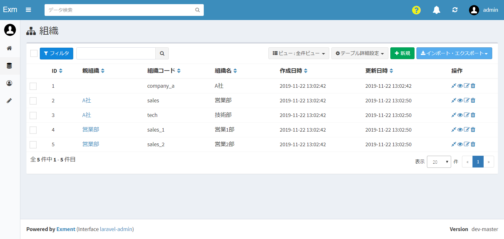
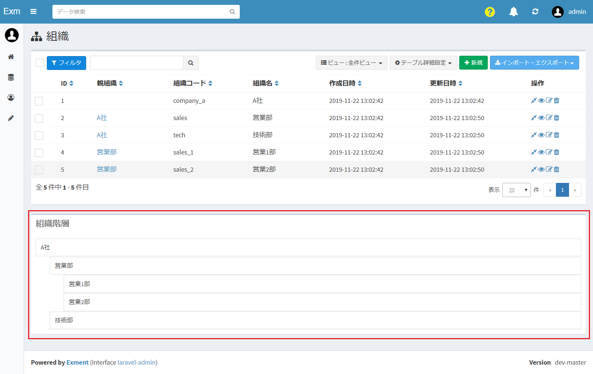
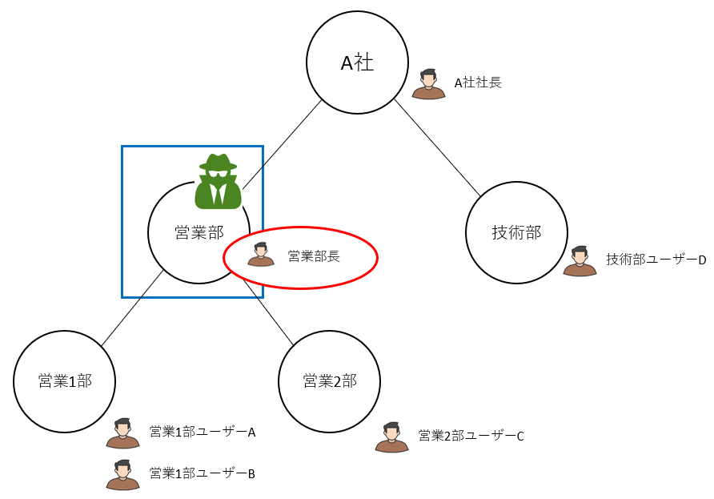
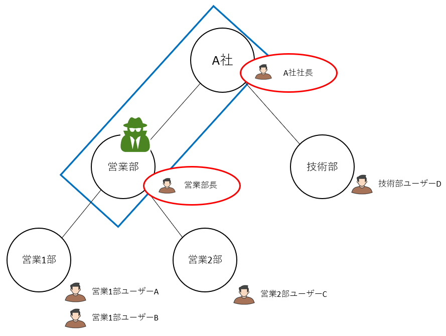
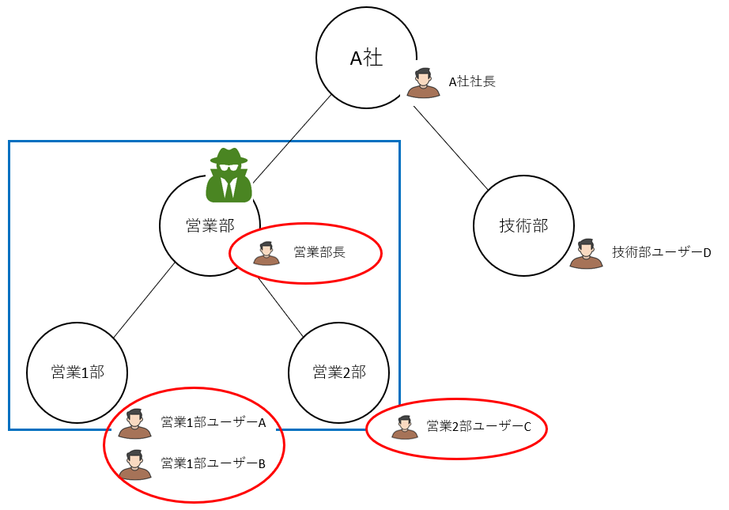
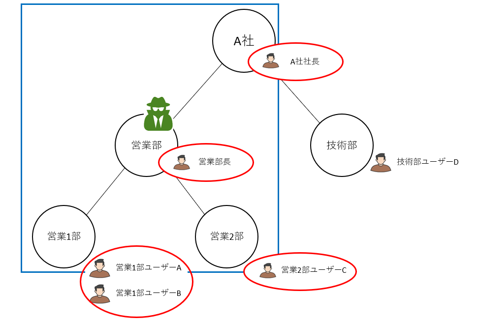
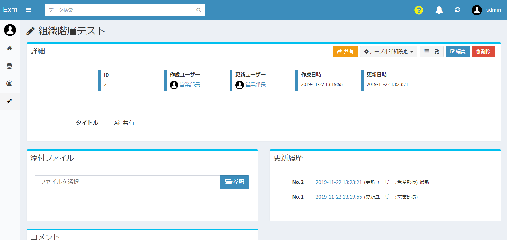
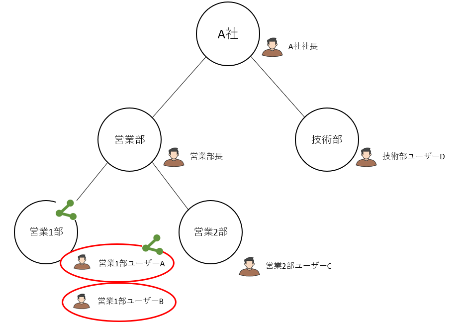

# 組織
Exmentの組織情報の管理を行います。

## 組織管理
組織情報を管理する方法について記載します。  

### 一覧画面表示
左メニューより、「組織」をクリックします。  
もしくは、以下のURLにアクセスしてください。  
これにより、ユーザー設定画面が表示されます。  
http(s)://(ExmentのURL)/admin/data/organization  
現在システムで登録されている組織の一覧が表示されます。
  
  
※[設定値](/ja/config#組織一覧ページで階層表示を行う)で、「EXMENT_SHOW_ORGANIZATION_TREE=true」とすることで、階層が表示されます。

### 組織の新規追加
- 「組織」の一覧画面で、ページ右上の「新規」ボタンをクリックします。

- 新規追加画面が表示されますので、必要事項を入力します。  
※項目「親組織」は、その組織の親階層を選択してください。

### 保存
設定を記入したら、「送信」をクリックしてください。

### 編集
組織の編集を行いたい場合、該当する行の「編集」リンクをクリックしてください。  

### 削除
組織の削除を行いたい場合、該当する行の「削除」リンクをクリックしてください。  

## 組織の使用場所
設定した組織を使用する場所は、複数存在します。
以下、その設定場所を一覧表示します。

#### 役割グループ 
- 役割グループに組織を設定することができます。

- この設定により、組織に所属しているユーザーが、ページにアクセスできる・できないが制御されます。  
この画像は、上がユーザーがアクセスできる場合、下がユーザーがアクセスできない場合です。

#### 複数フォーム切り替え 
複数フォーム切り替え条件に、組織を設定できます。  
ログインユーザーがその組織に所属していた場合、フォームが使用されます。

#### ワークフロー 
ワークフローの作業ユーザー設定に、組織を設定できます。  
ログインユーザーがその組織に所属していた場合、ワークフローのアクションを実行できます。

#### カスタムデータの共有 
カスタムデータの共有先に、組織を設定できます。  
ログインユーザーがその組織に所属していた場合、カスタムデータの権限が割り振られ、データの編集や閲覧ができるようになります。

## 組織階層について
Exmentでは、下記のような組織階層を設定することができます。

### (上級者向け)階層の種類
組織が多階層の場合に、「ユーザーが所属している組織」「親階層の組織を含む」「子階層の組織を含む」「親子階層の組織を含む」の概念があります。  
それぞれの概念によって、「その組織に所属するユーザー」の範囲が異なります。  
ここでは例として、「**営業部**」を基準とした時の、多階層の範囲を説明します。

#### ユーザーが所属している組織

対象の組織そのものに、所属しているユーザーのみです。  
例の場合、営業部に所属しているのは「営業部長」のみです。

#### 親階層の組織を含む

対象の組織と、その親階層の組織です。  
例の場合、営業部に所属している「営業部長」と、その親階層の「A社」に所属する「A社社長」が該当します。

#### 子階層の組織を含む

対象の組織と、その子階層の組織です。  
例の場合、営業部に所属している「営業部長」と、その子階層の「営業1部」「営業2部」に所属する、「営業1部ユーザーA」「営業2部ユーザーB」が該当します。

#### 親子階層の組織を含む

対象の組織と、その親子階層の組織です。  
例の場合、営業部に所属している「営業部長」と、その親階層の「A社」に所属する「A社社長」、その子階層の「営業1部」「営業2部」に所属する、「営業1部ユーザーA」「営業2部ユーザーB」が該当します。

<h4 id="kaisou_syurui">(上級者向け)階層の種類の設定</h4>

組織を設定時、多階層の組織をどこまで含めるかの設定は、「システム設定」 > 「組織設定」より設定できます。
※多階層の設定は、「役割グループ」「カスタムデータの共有」の場合のみ設定できます。「複数フォーム設定」「ワークフロー」では、ユーザーが所属している組織のみの対応になります。

### データ共有設定
Exmentでは、[カスタムデータのデータ共有設定](/ja/data_details#データ共有)で、他の組織が、対象のデータにアクセスすることができるようになります。

#### カスタムデータ共有時の有効範囲
- 組織にデータを共有した場合、その組織に所属しているユーザーがアクセスできます。
- また、上記の項目「階層の種類の設定 > 組織階層設定(データ)」によって、親組織・子組織に所属するユーザーがアクセスできるかどうかが決定されます。
- 他系列の組織はアクセスできません。

<h4 id="kyouyu_jidou">(上級者向け)データ保存時自動共有</h4>

カスタムデータを新規作成時、作成したデータに、自動的に共有設定が割り振られます。  
標準だと「ログインユーザー」にのみ、共有設定が割り振られますが、設定により、ログインユーザーが所属する組織にも、共有設定が追加されます。  
この設定は、「システム設定」 > 「組織設定」より設定できます。

ここでは、各設定内容について記載します。

##### (1)ログインユーザーのみ
カスタムデータの新規作成時、ログインユーザーにのみ共有されます。  
- **例**：「営業1部ユーザーA」がデータを新規作成時、ユーザー「営業1部ユーザーA」のみアクセスできる。  

##### (2)ログインユーザーと、所属する組織
カスタムデータの新規作成時、ログインユーザーと、**所属する組織**に、共有されます。  
- **例**：「営業1部ユーザーA」がデータを新規作成時、ユーザー「営業1部ユーザーA」と、組織「営業1部」に共有される。  
→結果として、組織「営業1部」に所属するユーザー「営業1部ユーザーB」も、アクセスできる

