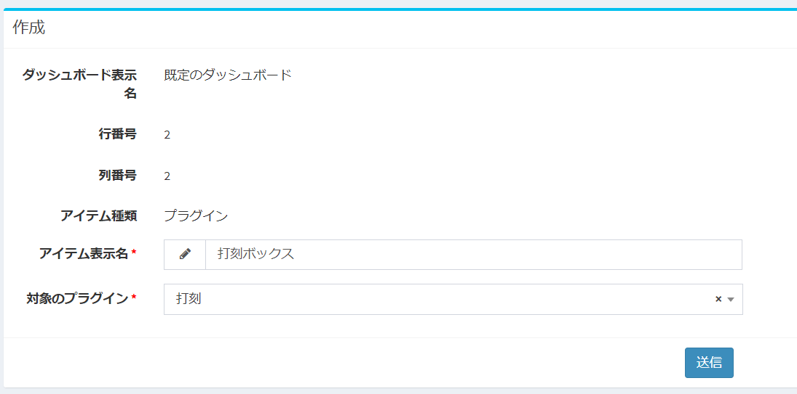

## プラグイン(ダッシュボード)
Exmentのダッシュボードに、新しい画面を作成することができます。  
ダッシュボードのアイテムとして、独自のページを使用したい場合にご利用ください。  

## はじめに
Exmentのプラグインページは、PHPのフレームワーク[Laravel](http://laravel.jp/)、ならびに[laravel-admin](https://laravel-admin.org/docs/) を使用して開発します。  
ページの開発を行う場合には、特にLaravelの知識がある方が開発することをおすすめします。

## 作成方法

### サンプル
ここではサンプルとして、以下のページを作成します。
- ユーザーの出退勤を管理するためのテーブルを作成する。    
- ダッシュボードに、出退勤、休憩開始、休憩終了のボタンを表示する。   
- ボタンをクリックすることで、クリックした時刻をデータにセットする。
  
   

※事前に、[こちら](https://exment.net/downloads/sample/template/dakoku.zip)のテンプレートをインポートしてください。

- サンプルプラグイン[こちら](https://exment.net/downloads/sample/plugin/Dakoku.zip)  

### config.json作成
- 以下のconfig.jsonファイルを作成します。  

~~~ json

{
    "plugin_name": "Dakoku",
    "plugin_view_name" : "打刻",
    "description": "ダッシュボードで打刻を行うためのプラグインです。",
    "uuid":  "691a24f2-2c7a-42c5-8cff-23c5277f6f22",
    "author":  "Kajitori",
    "version": "1.0.0",
    "plugin_type": "dashboard",
    "route": [
        {
            "uri": "post",
            "method": [
                "post"
            ],
            "function": "post"
        }
    ]
}

~~~

- plugin_nameは、半角英数で記入してください。
- uuidは、32文字列+ハイフンの、合計36文字の文字列です。プラグインを一意にするために使用します。  
以下のURLなどから、作成を行ってください。  
https://www.famkruithof.net/uuid/uuidgen
- plugin_typeは、dashboardと記入してください。  
- routeは、実行するURLのエンドポイントと、そのHTTPメソッド、Contoller内のメソッドを一覧で定義します。
    - uri：ページ表示のためのuriです。実際のURLは、「http(s)://(ExmentのURL)/admin/plugins/(プラグイン管理画面で設定したURL)/(指定したuri)」になります。  
    - method：HTTPメソッドです。get,post,put,deleteで記入してください。
    - function：実行するContoller内のメソッド
- routeには必ず、uriが空（""）となるものを含めてください。メニューからプラグインのページに画面遷移するときに、このエンドポイントにアクセスします。

### Pluginファイル作成

#### メインロジック作成
以下のようなPHPファイルを作成します。ファイル名は「Plugin.php」としてください。

~~~ php
<?php

//(1)
namespace App\Plugins\Dakoku;

use Exceedone\Exment\Services\Plugin\PluginDashboardBase;
use Exceedone\Exment\Model\CustomTable;

class Plugin extends PluginDashboardBase
{
    /**
     *
     * @return Content|\Illuminate\Http\Response
     */
    public function body()
    {
        if(is_null(CustomTable::getEloquent('dakoku'))){
            return '打刻テーブルがインストールされていません。';
        }
        
        $dakoku = $this->getDakoku();
        $status = $this->getStatus($dakoku);
        $params = $this->getStatusParams($status);

        // (3)
        return view('exment_dakoku::dakoku', [
            'dakoku' => $dakoku,
            'params' => $params,
            'action' => $this->getDashboardUri('post'),
        ]);
    }

    /**
     * 送信
     *
     * @return void
     */
    public function post()
    {
        $dakoku = $this->getDakoku();
        
        $now = \Carbon\Carbon::now();

        if(!isset($dakoku)){
            $dakoku = CustomTable::getEloquent('dakoku')->getValueModel();
            $dakoku->setValue('target_date', $now->toDateString());
        }

        $status = null;
        switch(request()->get('action')){
            // 出勤
            case 'syukkin':
                $dakoku->setValue('syukkin_time', $now);
                $status = 1;
                break;
            // 休憩開始
            case 'kyuukei_start':
                $dakoku->setValue('kyuukei_start_time', $now);
                $status = 11;
                break;
            // 休憩終了
            case 'kyuukei_end':
                $dakoku->setValue('kyuukei_end_time', $now);
                $status = 21;
                break;
            // 退勤
            case 'taikin':
                $dakoku->setValue('taikin_time', $now);
                $status = 99;
                break;
        }
        if(isset($status)){
            $dakoku->setValue('status', $status);
        }
        $dakoku->save();

        admin_toastr(trans('admin.save_succeeded'));
        return back();
    }

    /**
     * 現在の勤怠状況を取得
     *
     * @return void
     */
    protected function getDakoku(){
        $table = CustomTable::getEloquent('dakoku');
        if(!isset($table)){
            return null;
        }
        
        
        // 現在時刻を取得
        $now = \Carbon\Carbon::now();

        // 基準時間より前であれば、前日として扱う
        if($now->hour <= 4){
            $now = $now->addDay(-1);
        }

        // 該当の打刻を取得
        $query = getModelName('dakoku')::query();
        $query->where('value->target_date', $now->toDateString())
            ->where('created_user_id', \Exment::user()->base_user_id);

        $dakoku = $query->first();

        return $dakoku;
    }

    /**
     * ステータスを取得
     *
     * @param [type] $dakoku
     * @return int
     */
    protected function getStatus($dakoku){
        if(!isset($dakoku) || is_null($dakoku->getValue('syukkin_time'))){
            return 0;
        }

        return $dakoku->getValue('status');
    }

    protected function getStatusParams($status){
        switch($status){
            case 0:
                return 
                [
                    'status_text' => '未出勤',
                    'buttons' => [
                        [
                        'button_text' => '出勤',
                        'action_name' => 'syukkin',
                        ]
                    ]
                ];
            // 出勤
            case 1:
                return  
                [
                    'status_text' => '出勤中',
                    'buttons' => [
                        [
                            'button_text' => '休憩',
                            'action_name' => 'kyuukei_start',
                        ], 
                        [
                            'button_text' => '退勤',
                            'action_name' => 'taikin',
                        ], 
                    ]
                ];
        
            case 11:
                return 
                [
                    'status_text' => '休憩中',
                    'buttons' => [
                        [
                            'button_text' => '休憩終了',
                            'action_name' => 'kyuukei_end',
                        ], 
                    ]
                ];
            case 21:
                return 
                [
                    'status_text' => '出勤中',
                    'buttons' => [
                        [
                            'button_text' => '休憩終了',
                            'action_name' => 'kyuukei_syuryo',
                        ], 
                    ]
                ]; 
                
            case 99:
                return 
                [
                    'status_text' => '退勤',
                    'buttons' => [
                    ]
                ];
        }
    }
}
~~~
- (1) namespaceは、**App\Plugins\\(プラグイン名のパスカルケース)**としてください。[詳細はこちら](/ja/plugin_quickstart#プラグイン名のnamespace)  
また、クラス名は「Plugin」とし、PluginDashboardBaseを継承してください。

- (2) クラス内のpublicメソッド名は、config.jsonのfunctionに記載の名称になります。  

- (3) ビューを使用する場合、ビュー名の接頭辞は「exment_（プラグイン名のスネークケース）::」を追加してください。  

- (4) プラグインのエンドポイントを取得したい場合、関数「$this->getDashboardUri('エンドポイント名')」を使用してください。  
※URLフルパスを取得したい場合、admin_url($this->getDashboardUri('エンドポイント名'))を使用してください。

#### (任意)ビューについて
ビューを分離する場合、bladeファイルはフォルダ「resources/views」以下に保存してください。  

#### (任意)css、js、それ以外の静的ファイルについて
- cssファイルは、フォルダ「public/css」に配置してください。  
- jsファイルは、フォルダ「public/js」に配置してください。  
- それ以外のファイル(画像ファイルなど)は、フォルダ「public/assets」に配置してください。  

### zipに圧縮
上記2ファイルを最小構成として、zipに圧縮します。  
zipファイル名は、「(plugin_name).zip」にしてください。  
- Dakoku.zip
    - config.json
    - Plugin.php
    - (その他、必要なPHPファイル、画像ファイルなど)

### その他
- 特定のID値のデータ詳細を表示したい場合、config.jsonのrouteに以下のような記述を追加してください。  
「{id}」のようにuriを指定することができます。  

~~~ json

{
    "route": [
        {
            "uri": "show_details/{id}",
            "method": [
                "get"
            ],
            "function": "show_details"
        }
    ]
}

~~~

## ダッシュボードに反映
ダッシュボードに、今回アップロードしたプラグインを反映させる場合、以下の手順を行います。  

- ダッシュボードの「新規」をクリックします。  
種類が「ダッシュボード」のプラグインをアップロードした場合、選択肢に「プラグイン」が表示されます。  
   

- 表示名と、対象のプラグインを入力し、送信します。
   

- ダッシュボードに、選択したアイテムが表示されます。  
   

### サンプルプラグイン
[打刻管理](https://exment.net/downloads/sample/plugin/Dakoku.zip)  
※[こちらのテンプレート](https://exment.net/downloads/sample/template/dakoku.zip)をインポートしてください。
