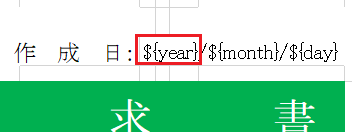
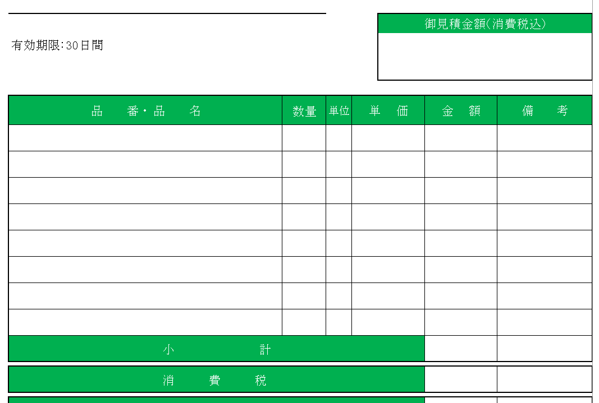
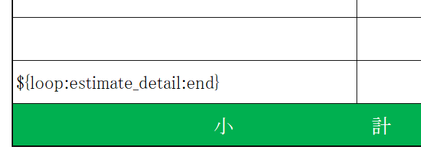
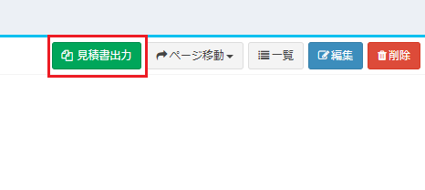

# プラグイン(ドキュメント出力)
見積書や帳票など、独自のドキュメント資料を作成することができます。  
ドキュメントの元となるテンプレートはExcel形式で、出力もExcel形式で出力されます。  

> PDF形式での出力は、[こちら](/ja/plugin_quickstart_docurain)をご参照ください。  

## 作成方法

### config.json作成
- 以下のconfig.jsonファイルを作成します。  

~~~ json
{
    "plugin_name": "PluginDemoDocument",
    "uuid": "1e7881d0-324f-11e9-b56e-0800200c9a66",
    "plugin_view_name": "Plugin Document",
    "description": "ドキュメント出力を行うテストです。",
    "author": "(Your Name)",
    "version": "1.0.0",
    "plugin_type": "document",
    "filename": "見積書_${ymdhms}",
    "target_tables": "estimate",
    "label": "見積書出力",
    "icon": "fa-files-o",
    "button_class": "btn-success"
}
~~~

- plugin_nameは、半角英数で記入してください。
- uuidは、32文字列+ハイフンの、合計36文字の文字列です。プラグインを一意にするために使用します。  
以下のURLなどから、作成を行ってください。  
https://www.famkruithof.net/uuid/uuidgen
- plugin_typeは、documentと記入してください。  
- file_nameは、出力する際のファイル名です。[パラメータ変数](/ja/params)を使用できます。
- target_tablesは、出力対象となるテーブルです。複数ある場合、カンマ区切りで入力してください。※プラグインの設定画面で後から変更できます。
- labelは、ドキュメント出力のためのボタンのラベルです。※プラグインの設定画面で後から変更できます。
- iconは、ドキュメント出力のためのボタンのアイコンです。※プラグインの設定画面で後から変更できます。
- button_classは、ドキュメント出力のためのボタンのクラスです。※プラグインの設定画面で後から変更できます。

### テンプレートExcelファイル作成
ドキュメントの元となる、テンプレートファイルを作成します。  
テンプレートファイルはExcel形式(xlsx)です。出力されるファイルも同様に、Excel形式(xlsx)です。  
※テンプレートExcelファイルのファイル名は、「document.xlsx」としてください。  
※テンプレートファイルのパラメータは、下記の「テンプレートExcelファイルのパラメータ」を参照してください。  

#### パラメータ
テンプレートのExcelファイルに設定するパラメータです。
Excelセルに、特定の形式の変数を入力することで、ドキュメント出力時に、システムに登録しているパラメータが出力されます。  
##### 基本ルール
- 「**${変数名}**」のルールで、Excelのセルに入力します。  
例：「${year}」「${month}」「${value:estimate_code}」  
  

- 同一のセルに、複数のパラメータを設定することができます。  

- Excelには、関数を設定しておくことができます。※一部関数は正常に動作しない可能性があります。必ず動作確認を行ってください。  

- 設定できるパラメータ変数は、以下のページをご確認ください。  
[パラメータ変数](/ja/params)

##### 子テーブルデータの一覧出力方法
ドキュメントの種類によっては、対象データの子テーブル一覧表に、データ出力を行う必要があります。  
例：見積日や顧客情報を登録する「見積」と、見積する製品の一覧を登録する「見積明細」  
  
この表に、データ一覧出力を行う方法を記載します。  

- 出力する表の1行目の1列目に、以下のパラメータを設定します。  
**「${loop:(子テーブルのテーブル名):start}」**  
例：${loop:estimate_detail:start}  
  

- 出力する表の2行目の、出力したい項目の各列に、以下のパラメータを設定します。  
**「${loop-item:(子テーブルのテーブル名):(子テーブルの列名)}」**  
例：${loop-item:estimate_detail:product_detail_name}  
  

- 出力する表の最終行の1列目に、以下のパラメータを設定します。  
**「${loop:(子テーブルのテーブル名):end}」**  
例：${loop:estimate_detail:end}  
  

### PHPファイル作成(任意)
- 以下のようなPHPファイルを作成します。名前は「Plugin.php」としてください。  

~~~ php
<?php
namespace App\Plugins\PluginDemoDocument; // (PluginDemoDocument:プラグイン名)

use Exceedone\Exment\Services\Plugin\PluginDocumentBase;
class Plugin extends PluginDocumentBase
{
    protected function executing(){
        // ドキュメント作成前に実行する関数
        // 例：
        \Log::debug('見積出力実施前');
        
    }

    protected function executed(){
        // ドキュメント作成後に実行する関数
        // 例：
        \Log::debug('見積出力実施後');
    }
}

~~~

- namespaceは、**App\Plugins\\(プラグイン名のパスカルケース)**としてください。[詳細はこちら](/ja/plugin_quickstart#プラグイン名のnamespace)

- ドキュメント出力実行前、ならびにドキュメント出力実行後に、これらの関数は実行されます。  
出力前になにかの処理を実行したい場合に、このPlugin.phpファイルを作成し、処理を追加してください。  
(例：見積日時を追加する、請求書番号を追加する)  
**※ドキュメント出力実行前・実行後に、呼び出したい処理が特にない場合、このPlugin.phpファイルは必要ありません。**

- Pluginクラスは、クラスPluginDocumentBaseを継承しています。  
PluginDocumentBaseは、呼び出し元のカスタムテーブル$custom_table、テーブル値$custom_valueなどのプロパティを所有しており、  
execute関数が呼び出された時点で、そのプロパティに値が代入されます。  
プロパティの詳細については、[プラグインリファレンス](plugin_reference.md)をご参照ください。  

### zipに圧縮
上記のファイルを最小構成として、zipに圧縮します。  
zipファイル名は、「(plugin_name).zip」にしてください。  
- PluginDemoDocument.zip
    - config.json
    - document.xlsx
    - Plugin.php(任意)
    - (その他、必要なPHPファイル、画像ファイルなど)

### アップロード
プラグインをアップロードします。  
※アップロード方法は、[プラグイン](/ja/plugin)をご参照ください。  

### ドキュメント出力実行
すべての設定を正常に完了した場合、データの表示画面にボタンが表示されます。  
  
  
ボタンをクリックすることで、「添付ファイル」に一覧が表示されます。  
 

### サンプルプラグイン
[ユーザー情報出力](https://exment.net/downloads/sample/plugin/document_demo_user.zip)  
※ユーザー情報画面で、「ユーザー情報出力」ボタンが表示されます。  