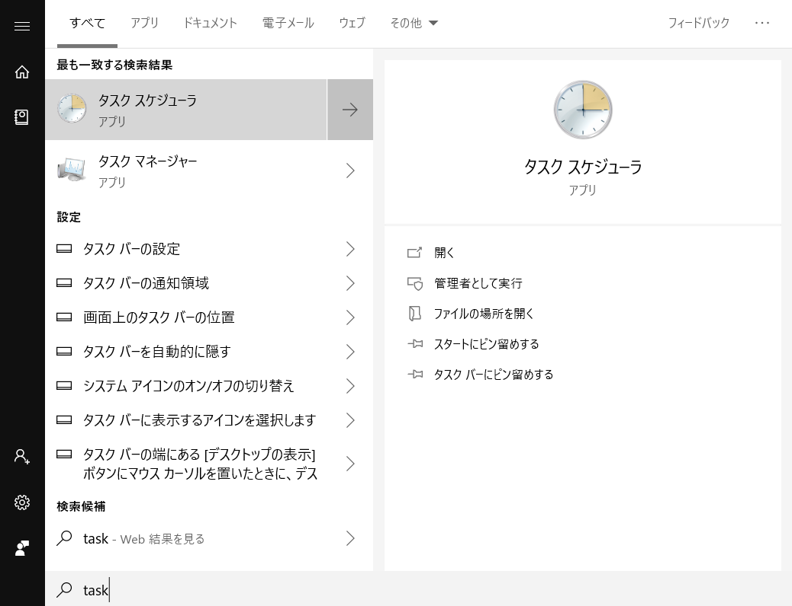

# インストール追加設定
[インストール手順](/ja/quickstart.md)を実施することで、Exmentを実行することができます。  
ですが、一部の機能を使うために、追加で設定が必要になる場合があります。  
以下の機能を使用する場合、手順に従って設定を行ってください。  
- [URLに含む「admin」の変更・削除](#URLに含む「admin」の変更・削除)
- [タスクスケジュール](#タスクスケジュール)
- [サーバー外部通信オフ](#サーバー外部通信オフ)
- [ファイルアップロード上限サイズ変更](#ファイルアップロード上限サイズ変更)
- [メモリ量変更](#メモリ量変更)
- [エキスパートモード](#エキスパートモード)

## URLに含む「admin」の変更・削除
Exmentの標準設定では、URLに「admin」というパスを含みます。  
例： http://localhost/admin  
  
「admin」を付けない ([http://localhost](http://localhost)) 場合、以下のようなページが表示されます。これは使用しているフレームワークの仕様です。  
  
この仕様により、「admin」がついていないURLでは、ログイン不要な一般ユーザーが閲覧できる、別のサイトを構築することが可能です。
  
しかし場合によっては、以下のようなケースもあります。

1. Exment単独で構成したい場合。「admin」なしのURLで、Exmentを表示させる
1. 「admin」というパス名を変更したい場合

これらの場合の手順を記載します。

### 変更手順

- Exmentのルートディレクトリで、「.env」ファイルを開きます。

- 以下の値のいずれかを追加します。

~~~
### 1.「admin」を完全に削除したい場合
ADMIN_ROUTE_PREFIX=
# http://localhost が、ExmentのURLになる

### 2.「admin」を別の名前に変更する場合
ADMIN_ROUTE_PREFIX=admin184628
# http://localhost/admin184628 が、ExmentのURLになる
~~~

※なお、本マニュアルではすべて、「admin」が付いている前提で記載しておりますので、ご了承ください。

## シングルサインオン
[こちら](/ja/sso)に移動しました。 
  

## タスクスケジュール
Exmentでは、タスクスケジュール機能があります。  
具体的には、以下の用途で使用されます。  
- データベースやファイルを、決まった時間に日次バックアップする。  
- あらかじめ設定しておいた通知設定により、特定の条件に合致したデータの関係者に、特定の時刻にメールを送信する。

これらの機能を実行するためには、サーバー側で追加の作業を行う必要があります。  
なお、LinuxとWindowsによって、手順が異なります。

### 設定手順(Linux)
- 以下のコマンドを実行します。

~~~
crontab -e
~~~

- Cronの設定画面が表示されるので、以下の内容を記入します。  
この設定により、artisan scheduleコマンドが毎分実行されます。その後はExmentのシステムにより、決まった時間にタスクが実行されます。  

~~~
* * * * * php /(Exmentのルートディレクトリ)/artisan schedule:run >> /dev/null 2>&1
~~~

### 設定手順(Windows)
- 以下のコマンドを実行し、php.exeファイルがあるパスをコピーします。  

~~~
where php
// C:\xampp\php\php.exe
~~~

- windowsメニューで、「task」と入力し、タスクスケジューラを起動します。  

- タスクスケジューラで、「タスクの作成」をクリックします。

- 「全般」タブで、以下のように設定します。（「名前」は任意の名称です）

- 「トリガー」タブをクリックします。2つのトリガーを作成します。  
    (1)「新規」ボタンをクリックします。  
    その後、以下のように入力します。  
    - タスクの開始：スタートアップ時
    - 繰り返し間隔：1分間
    - 継続時間：無期限
    - 「有効」にチェック  
    完了したら「OK」をクリックします。  

    (2)再度、「新規」ボタンをクリックします。  
    その後、以下のように入力します。  
    - タスクの開始：タスクの作成/変更時
    - 繰り返し間隔：1分間
    - 継続時間：無期限
    - 「有効」にチェック  
    完了したら「OK」をクリックします。  

- 「操作」タブで、「新規」ボタンをクリックします。  
その後、以下のように入力します。
    - 操作：プログラムの開始
    - プログラム/スクリプト：先ほどコピーしたphpまでのパス
    - 引数の追加： (Exmentのルートディレクトリ)/artisan schedule:run

- 「設定」タブで、「スケジュールされた時刻にタスクを開始できなかった場合、すぐにタスクを実行する」にチェックします。

- ノートPCの場合、「条件」タブで、「コンピューターをAC電源で使用している場合のみタスクを開始する」のチェックを外します。 

- これらの設定が完了したら、OKをクリックします。  
その後、ユーザーの資格情報を入力する画面が表示されるので、パスワードを入力してください。  

- 設定完了後、「タスク スケジューラ ライブラリ」にて、作成したタスクを選択肢、「実行」をクリックしてください。 

これで設定完了です。

## サーバー外部通信オフ
Exmentでは、Exmentサーバーから他のサーバーへ通信を行うことがあります。  
具体的には、以下の用途で実行されます。 
- Exmentに最新バージョンがあるか判定するために、パッケージシステムと通信し、最新バージョン情報を取得する  
  
しかし、完全なオンプレミス環境で構築した場合など、他のサーバーへ通信を行わない場合があります。  
その場合の設定を記載します。 

### 設定手順 
> 本手順はv1.3.0より変更になりました。

- 左メニューより、「システム設定」画面に遷移します。  

- 一覧の中から、「サーバー外部通信を行う」項目をNOに設定します。  

- 保存し、設定完了です。

## ファイルアップロード上限サイズ変更
Exmentでは、画面からファイルをアップロードする機能があります。  
アップロードできるファイルサイズは、サーバーによって上限値があります。  
（デフォルトの上限値は、インストールしたサーバーによって異なります）  

そのファイルサイズ上限値を変更するには、以下の手順のいずれかを実施してください。  

### 設定手順1（推奨） .htaccessファイル修正
- Exmentをインストールしたフォルダの、「public/.htaccess」ファイルを開きます。

- 以下の値を追加します。

~~~
#POSTデータに許可される最大サイズ
php_value post_max_size 20M
 
#1つのファイルアップロードに許可される最大サイズ
php_value upload_max_filesize 20M
~~~

- これにより、ファイルアップロードサイズ上限が変更されます。

### 設定手順2 php.ini修正
- .htaccessファイル修正で、上限値が変更されなかった場合にこちらを実施してください。上級者向けです。  

- PHPをインストールしたフォルダにある、「php.ini」ファイルを開きます。

- php.iniファイルより、以下の値を修正します。※すでに数値がセットされている場合が多いので、数値を書き換えてください。

~~~
#POSTデータに許可される最大サイズ
post_max_size=20M
 
#1つのファイルアップロードに許可される最大サイズ
upload_max_filesize=20M
~~~

- サーバーを再起動します。

- これにより、ファイルアップロードサイズ上限が変更されます。

## メモリ量変更
Exment(PHP)で使用するメモリ量を変更します。  
メモリ量が大きいほど、処理が早くなったり、一度に実行できる内容が変動しますが、大きすぎると、サーバー動作に影響がある場合があります。

そのメモリ上限値を変更するには、以下の手順のいずれかを実施してください。  

### 設定手順1（推奨） .htaccessファイル修正
- Exmentをインストールしたフォルダの、「public/.htaccess」ファイルを開きます。

- 以下の値を追加します。

~~~
#メモリ最大サイズ
php_value memory_limit 256M
~~~

- これにより、メモリサイズが変更されます。

### 設定手順2 php.ini修正
- .htaccessファイル修正で、上限値が変更されなかった場合にこちらを実施してください。上級者向けです。  

- PHPをインストールしたフォルダにある、「php.ini」ファイルを開きます。

- php.iniファイルより、以下の値を修正します。※すでに数値がセットされている場合が多いので、数値を書き換えてください。

~~~
#メモリ最大サイズ
memory_limit 256M
~~~

- サーバーを再起動します。

- これにより、メモリサイズ上限が変更されます。

## エキスパートモード
Exmentでは、より柔軟で、システムに詳しい方向けの設定を行う機能があります。  
現在、以下の機能があります。  
- カスタム列が「1行テキスト」の場合に、入力内容の正規表現によるバリデーション
- カスタムテーブル設定の[見出し表示列設定](/ja/table#見出し表示列設定)で、パラメータ列による設定

### 設定手順 
- .envファイルに、以下の内容を追加し、保存します。

~~~
EXMENT_EXPART_MODE=true
~~~

- これにより、カスタムテーブル設定、カスタム列設定画面で、設定項目が表示されます。

