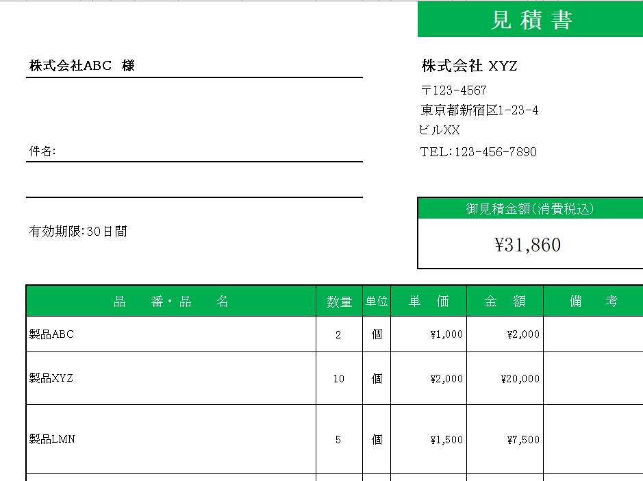

# リレーション設定
テーブルとテーブルは、データの関連性をもつ場合があります。  
例：
- 見積と、その見積明細情報  
- 会社の組織と、その組織に所属するユーザー  

ここでは、それらのテーブルの関連性をどのように設定するか、記載します。

## Exmentにおけるリレーションの概念
Exmentの、テーブル間の関連付けの概念は、少々複雑です。  
「1.リレーションの種類」と「2.設定方法」の2種類を、ご理解いただけなければいけません。  
Exmentの画面で設定いただく前に、以下の内容をお読みください。

### 1. リレーションの種類
一般的に、データ間のリレーションは、以下の2種類あります。  
##### 1対多：1つの親テーブルのデータに、明細として、子テーブルの複数のデータが紐付く   
※例
- 見積とその見積明細  
「見積」テーブルには「見積日」や「顧客情報」や「件名」を、「見積明細」にはその見積の対象となる品名や数量や金額の情報を、明細として複数登録する  

- 契約と、その契約の主担当者  
ユーザーは、複数の契約の主担当者になることがあるので、ユーザーと契約で、1対多の関係となる  

##### 多対多：子テーブルは、1つのテーブル(親テーブル)のデータに、明細として、テーブル(子テーブル)の複数のデータが紐付く  
例：組織と、その組織に所属するユーザー  
ユーザーは、複数の組織に所属する可能性がある（兼任など）ので、多対多の関連性となる  
  
まずは、今回関連付けを行いたいデータが、上記のどちらのパターンなのか考える必要があります。  

### 2.「(1)関連テーブル設定」と「(2)カスタム列の選択肢 (他のテーブルの値一覧から選択)」
Exmentにおける、データの関連付けの方法として、「(1)関連テーブル」と「(2)選択肢 (他のテーブルの値一覧から選択)」という、2種類あります。  
それぞれの設定方法についてご説明します。

##### (1)関連テーブル設定
当ページでご紹介している方法です。
「カスタムテーブル」ページから、「リレーション設定」ボタンをクリックして、操作することによって登録を行います。    

##### (2)カスタム列の選択肢 (他のテーブルの値一覧から選択)
[カスタム列](/ja/column)画面で設定する方法です。  
カスタム列で設定できる列種類の1つとして、「選択肢 (他のテーブルの値一覧から選択)」という列をもつことができます。  

この設定を行うことにより、[データフォーム画面](/ja/data_form)で、他のテーブルから値を選択することができるようになります。  
例（顧客はテストデータです）：

### リレーション設定方法の決定
これらのリレーション設定は、どちらで行うべきなのか、非常に悩ましく、分かりにくい問題です。
以下の判断基準で、リレーション設定を決めるように考えてください。

#### 1. リレーションの種類が「1対多」の場合
この場合、以下の2つの判断基準で決定してください。
1. **親データと子データは、常にセットで、密かどうか**  
例えば「見積」テーブルと「見積明細」テーブルの場合、見積明細のデータは常に、見積データがあり、セットとなります。  
このような場合、「(1)リレーション設定」で関連を設定します。  
一方で、「見積」テーブルと、その見積の「主担当者」は、データの参照先としては関連を持ちますが、見積と主担当者は常にセットというわけではありません。  
このような場合は、「(2)カスタム列の選択肢 (他のテーブルの値一覧から選択)」で関連を設定します。  

2. **親データを削除するとき、子データを削除するのが常に正しいか**  
例えば「見積」テーブルと「見積明細」テーブルの場合、親となる「見積」データを削除するときには、子となる「見積明細」データもすべて削除するのが正常です。  
このような場合、「(1)リレーション設定」で関連を設定します。  

一方で、「見積」テーブルと、その見積の「主担当者」の場合、「主担当者」のデータを削除したからといって、主担当者となっている「見積」データをすべて削除するのは、問題があります。  
このような場合は、「(2)カスタム列の選択肢 (他のテーブルの値一覧から選択)」で関連を設定します。  

#### 1. リレーションの種類が「多対多」の場合
この場合、基本的には「(1)リレーション設定」で設定を行ってください。  
「(2)カスタム列の選択肢 (他のテーブルの値一覧から選択)」で、「複数選択を許可」することでも対応は可能ですが、データ検索に弱いなど、課題があります。  
そのため、基本的には「(1)リレーション設定」で設定を行ってください。  

これらの手順によって、テーブル関連付けの設定をどのように行うかの方針が決定されます。  
以下、「(1)関連テーブル設定」を行う場合、どのような手順となるかの解説です。  

## リレーション設定の操作方法

### ページ表示
- カスタムテーブル画面で、変更を行いたいテーブルにチェックを1つ入れ、「ページ移動」の「関連テーブル設定」をクリックします。  

- これで、チェックしたカスタムテーブルがもつ、関連テーブルの一覧を表示します。  

### 新規追加
- 「関連テーブル設定」画面で、ページ右上の「新規」ボタンをクリックします。

- 関連付ける子テーブルと、そのリレーションの種類を選択し、「送信」を行ってください。
  

### 編集
列の編集を行いたい場合、該当する行の「編集」リンクをクリックしてください。  
  

### 削除
列の削除を行いたい場合、該当する行の「削除」リンクをクリックしてください。  
  
