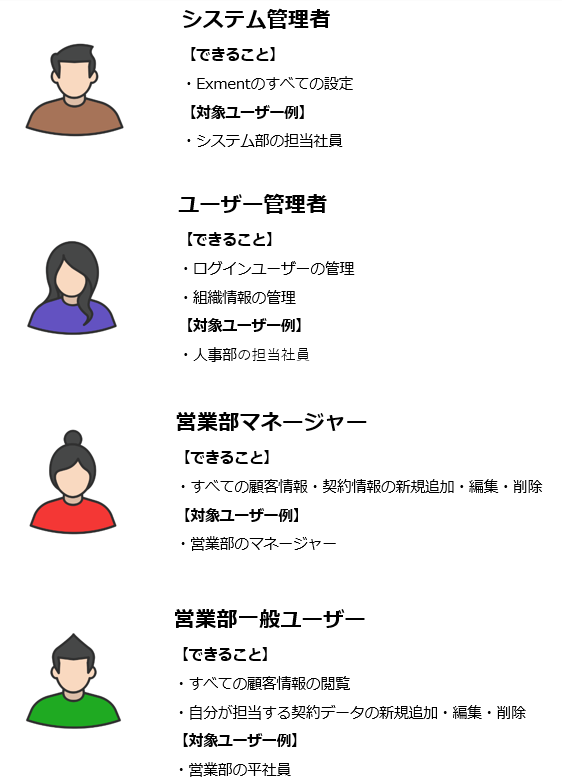
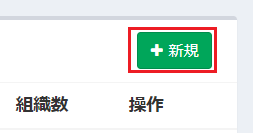
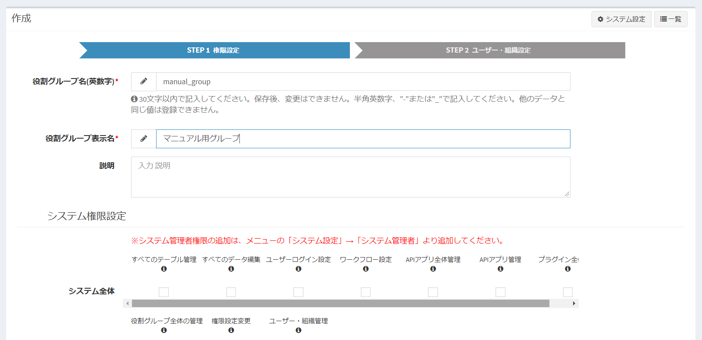
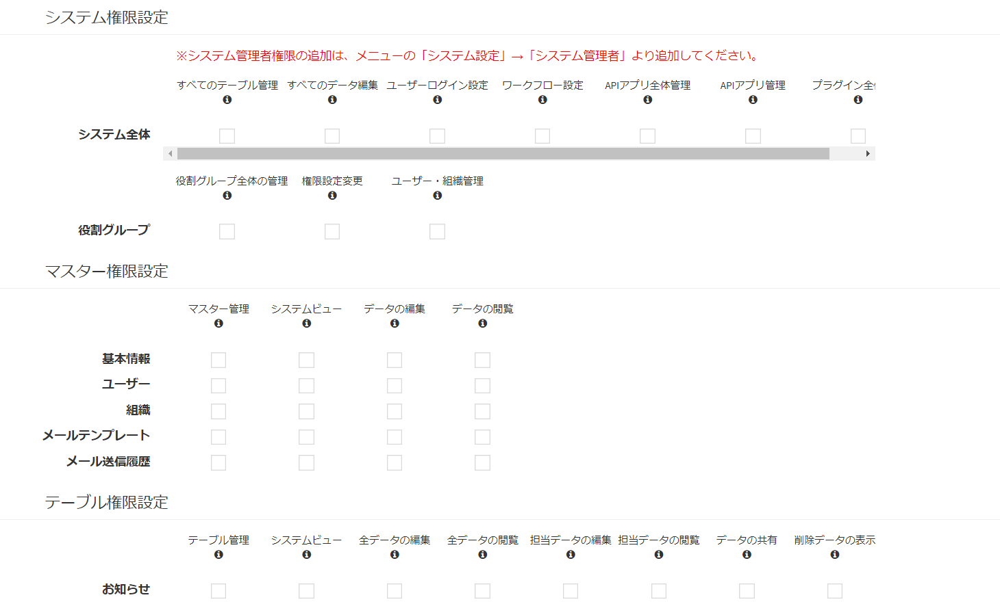
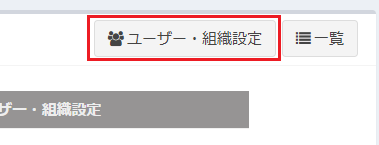
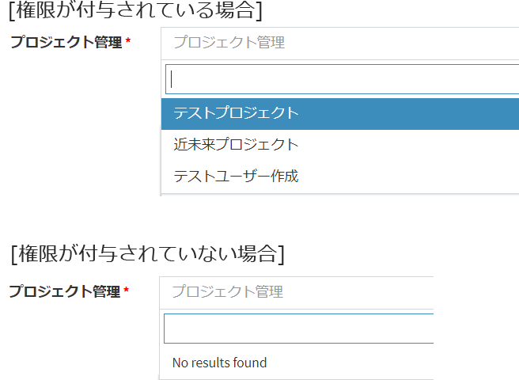

# 役割グループ・権限設定
> 本機能は、v1.Xでの「役割・権限設定」に代わって、v2.0.0より使用する機能です。

Exmentでは、システムを操作するための権限を制御するために、「役割グループ」という管理方法を使用します。  
これはExmentにおいて、特定のデータやページを、指定のユーザーのみが管理できるようにするために、重要な考え方です。  

新規にユーザーを追加し、そのユーザーがログインを行った場合、そのログインユーザーは、ほとんどの機能を使用できません。  
システム管理者は、新規追加したユーザーに対し、適切に役割グループを割り振る必要があります。  

## 役割グループのイメージ図
Exmentを使用するユーザーの部署や役職によって、各ユーザーに実施させたい内容を制御することができます。  
例えば、以下のような部署や役職で、適切に権限を割り振ることができます。

## 初期役割グループの一覧
インストール時に初期設定されている、役割グループの説明です。

### 全データ管理者グループ
ユーザーが登録した、すべてのテーブルのデータを編集・閲覧可能な役割グループです。

### ユーザー・組織管理グループ
ユーザー・組織情報、ならびにログインユーザーの設定を管理する役割グループです。  
役割グループに所属するユーザー・組織の変更も行うことができます。

### お知らせ情報管理グループ
Exmentに初期インストールされている「お知らせ情報」に、データを新規作成、編集、削除することができる役割グループです。  

### 一般グループ
上記以外のユーザーに登録させるグループです。  
※初期インストールの場合、特に権限は設定されていません。

## 役割グループのデータ構成
役割グループでは、以下のようなデータ構成を持ちます。

### (1)権限設定
権限(パーミッション)とは、Exmentにおける特定の動作を実施してよいかの可否を決めるものです。  
例えば、以下のような権限があります。
- ログインユーザーの管理 ： 各ユーザーにログイン権限の付与や、パスワードリセットを行う権限
- すべてのデータの編集 : 特定のテーブル上の、すべてのデータを追加・編集・削除できる権限
- 担当者データの閲覧 : 自分が担当者となっているデータの、閲覧ができる権限
権限設定は、役割グループに紐付かれます。

### (2)ユーザー・組織
役割グループに所属するユーザー・組織を設定します。  
この設定を行ったユーザーがログインを行った時、設定されている権限の操作を実行できるようになります。

## 設定方法

### 設定の全体的な流れ
1. 役割グループ名の設定など、役割グループの初期設定を行います。
1. その役割グループで実施できる権限の設定を行います。
1. その役割グループに所属するユーザー・組織の設定を行います。

※システム管理者の設定は、<a href="https://exment.net/docs/#/ja/system_setting">システム設定ページ</a>にて行ってください。

### 一覧
メニューにある「役割グループ」をクリックしてください。  
作成してある役割グループ設定の一覧画面が表示されます。  

### 役割グループ新規作成
役割グループを新規作成する方法です。

- 一覧画面の右上の「新規」ボタンをクリックします。

- 役割グループ新規作成画面が表示されるので、必要事項を入力し、「送信」をクリックします。  

- 保存後、一覧画面が再度表示され、作成した役割が作成されています。

### 権限設定変更方法
権限設定を変更する方法です。

- 役割グループ一覧画面で、作成した役割グループの行をクリックします。  
もしくは、権限リンクをクリックします。

- 権限設定画面が表示されるので、権限設定を行っていきます。

### 権限の種類と一覧
設定可能な権限の種類を記載します。

#### システム権限
Exment全体の操作を決定することができる権限です。  
##### 権限一覧
- **すべてのデータ** : すべてのカスタムテーブルの、すべてのデータの追加・編集・削除が可能な役割です。  
- **ログインユーザーの管理** : Exmentにログインするユーザーを管理できます。ログイン権限の付与や、パスワードリセットなどを行うことができます。

#### テーブル権限
Exmentでは、データを管理するためのテーブルを作成する事ができます。  
そのテーブルごとに、権限を割り振ることができます。  
例えば、以下のような利用方法があります。  
- 営業部のユーザーは、テーブル「営業活動」のすべてのデータを編集・閲覧することができる。
- 技術部のユーザーは、テーブル「技術管理」のすべてのデータを編集・閲覧することができる。
- パートナー会社のユーザーは、テーブル「発注依頼」の、自分に権限があるデータのみ閲覧する事ができる。  
  
##### 権限一覧
- **テーブル管理** : 指定したカスタムテーブルに対して、テーブル定義やフォームの修正などが可能です。  
また、指定したカスタムテーブル内の、すべてのデータの追加・編集・削除が可能な権限です。
- **ビュー** : 指定したカスタムテーブルの、システムビューを管理することができます。  
- **全データの編集** : 指定したカスタムテーブル内の、すべてのデータの追加・編集・削除が可能な権限です。
- **全データの閲覧** : 指定したカスタムテーブル内の、すべてのデータの閲覧が可能な権限です。  
※データの編集・削除はできません。
- **担当データの編集** : 指定したカスタムテーブル内の、ログインユーザー自身が担当者に設定されているデータの追加・編集・削除が可能な権限です。  
- **担当データの閲覧** : 指定したカスタムテーブル内の、ログインユーザー自身が担当者に設定されているデータの閲覧が可能な権限です。  
※データの編集・削除はできません。
- **データの共有** : 自分が編集権限を持つデータを、他のユーザーや組織に共有することが可能な権限です。  
- **削除データの表示** : 論理削除されたデータを再表示することができます。※データの復元には、そのデータに対する編集権限が必要です。  

### ユーザー・組織設定方法
役割グループに所属する、ユーザーならびに組織の設定を変更する方法です。

- 一覧画面で、ユーザーリンクをクリックします。
  
もしくは、権限設定画面の右上の「ユーザー・組織設定」ボタンをクリックします。  
  

- ユーザー・組織設定画面が表示されます。この役割グループに所属する、ユーザー・組織を登録してください。  

### 削除
- 役割グループ一覧画面で、「削除」リンクをクリックします。

## 権限を設定した場合の変化
権限を設定した場合、以下のように表示が変わります。  

##### ■メニューに表示される項目が少なくなる  
→権限がないメニューは表示されないためです。  

##### ■アクセスエラーになる  
→URLを直接入力などを行い、権限がないページを表示しようとした場合、アクセスエラーになります。

##### ■データフォームの選択肢に項目が表示されない  
→カスタム列設定で「選択肢 (他のテーブルの値一覧から選択)」を選択していた場合で、参照先のテーブルに適切な権限を振られていなかった場合に、選択肢の項目が表示されなくなります。  

