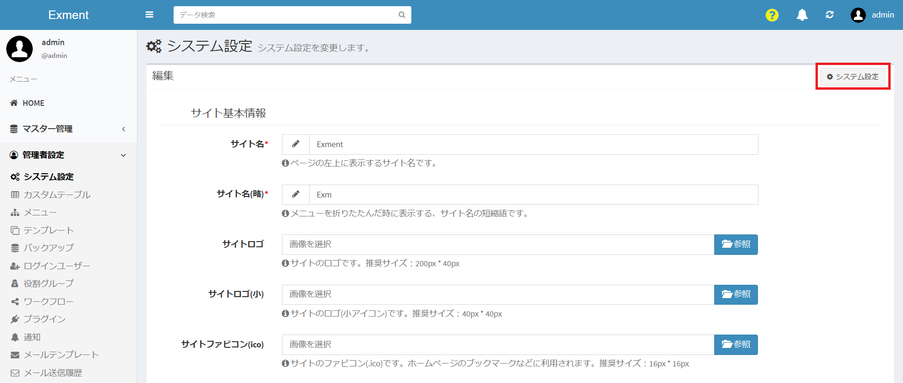

# システム設定
サイトの基本情報や権限の付与など、Exmentのシステム全体を対象とした設定を行います。  

## 設定画面
メニューにある「システム設定」をクリックしてください。  
システム設定の画面が表示されます。  

  

## サイト基本情報
Exmentで情報管理をするにあたり、サイトとしての基本情報を設定します。

- Exmentのメニューレイアウトに関しては、「標準」と「小アイコン」２種類の表示形式があります。  
表示の違いは下記画像をご参考ください。  
- メニューレイアウトに関して、既定の表示形式は[サイトメニューレイアウト](#サイトメニューレイアウト)にて設定しますが、画像の赤枠部分をクリックすることにより、その都度の切り替えも可能です。

標準
  

小アイコン
  

#### サイト名 ※必須
- メニューレイアウトが標準時にページの左上に表示するサイト名です。  
- 初期値は「Exment」です。  

#### サイト名(略) ※必須
- メニューレイアウトが小アイコン時に左上に表示するサイト名です。
- 初期値は「Exm」です。  

#### サイトロゴ
- メニューレイアウトが標準時にページの左上に表示するサイトのロゴです。  
- 「参照」ボタンをクリックして使用したい画像を選択してください。  
- 推奨サイズ：200px * 40px  

※サイトロゴを設定すると、メニューレイアウトが標準時には、左上の該当箇所にサイト名ではなくサイトロゴが表示されます。

#### サイトロゴ(小)
- メニューレイアウトが小アイコン時にページの左上に表示するサイトのロゴです。  
- 「参照」ボタンをクリックして使用したい画像を選択してください。  
- 推奨サイズ：40px * 40px  

※サイトロゴ(小)を設定すると、メニューレイアウトが小アイコン時には、左上の該当箇所にサイト名ではなくサイトロゴ(小)が表示されます。

#### サイトファビコン(ico)  
- 下記画像のように、サイト閲覧時や、ブックマークを行う時に使用されるアイコン画像です。  
- 「参照」ボタンをクリックして使用したい画像を選択してください。  
- 推奨サイズ：16px * 16px  

  

#### サイトスキン
- サイトのテーマ色の設定です。ヘッダーとサイドバーの色を下記の組み合わせから選択します。  
- ヘッダー(初期設定は青)：青・黄・緑・紫・赤・白  
- サイドバー(初期設定は白)：黒・白  

※設定の保存後にWEBページの再読込を行うと、設定が反映されて表示されます。

#### サイトメニューレイアウト
- 「標準」or「小アイコン」どちらかのレイアウトをサイトメニューとして選択します。  
それぞれのレイアウト例は上部の画像をご参考ください。
- 初期値は「標準」です。  

※設定の保存後にWEBページの再読込を行うと、設定が反映されて表示されます。

#### データ一覧の表示件数
- データ一覧のページにおける既定のデータ表示件数です。  
  「10件」「20件」「30件」「50件」「100件」いずれかを選択します。
- 初期値は「20件」です。  

#### 検索・ダッシュボードの表示件数
- [キーワード検索](/ja/search.md?id=単語検索)を行った際や、[ダッシュボードのデータ一覧](/ja/dashboard.md?id=データ一覧)における既定のデータ表示件数です。  
「5件」「10件」「20件」いずれかを選択します。  
- 初期値は「5件」です。  

#### 日時表示書式
- 日付の表示形式を３種類の中から設定することができます。

#### サーバー外部通信を行う
- 設定がYESの場合、Exmentの最新バージョンの通知など、外部サーバー通信（データ受信のみ）を行う処理を実行できます。
- 初期値は「YES」です。  

#### 権限管理を使用する
- 設定がYESの場合、[システム全体に対する権限](#権限設定)や、[カスタムテーブル毎の権限](/ja/table.md?id=権限)を設定することができます。  
- この設定がYESの場合、ユーザーを指定した権限の付与が可能になります。
- 初期値は「YES」です。  

#### 組織管理を使用する
- 設定がYESの場合、[権限管理を使用する](#権限管理を使用する)にあたり、組織を指定した権限の付与が可能になります。  
- 初期値は「YES」です。  

#### アップロード上限サイズ
- Exmentにアップロードできるファイルサイズの上限値です。
- ファイルサイズの上限値を変更するには[ファイルアップロード上限サイズ変更](/ja/quickstart_more.md?id=ファイルアップロード上限サイズ変更)をご参照ください。

## システムメール設定
システムからメールを送信する場合の設定を行います。  
画面から設定を行う場合、SMTPによる設定値を記入します。  
詳細は[こちら](/ja/mailsend_setting)をご確認ください。

#### 注意
- 送信メールが迷惑メールになる場合、多くはドメインの「SPFレコード」の設定の不備になります。ドメイン設定で、SPFレコードを登録してください。  
[参考1](https://sendgrid.kke.co.jp/blog/?p=3509)  
[参考2](https://salt.iajapan.org/wpmu/anti_spam/admin/operation/information/spf_i01/)  
なお、SPFレコードの設定については、弊社サポート対象外となります。ご了承ください。

#### 注意(システムに詳しい方向け)

- 本来Laravelでは、「.env」ファイルの設定値を、メール送信のパラメータとして使用しますが、v1.3.6より、.envファイルの設定値は使用せず、画面の「システム設定」で登録した値を使用するようになりました。
- ただし、場合によっては「.env」ファイルの設定を継続したい場合もあるはずです。特にLaravelでは、SMTP以外の送信方法でメール送信も可能です。
- その場合、「.env」ファイルに「EXMENT_MAIL_SETTING_ENV_FORCE=true」を記入してください。引き続き、「.env」ファイルで記入した設定値を使用するようになります。

## パスワードポリシー
ログインパスワードに関連するルールを設定します。   

  

#### 複雑なパスワード
- 設定がYESの場合、3種類以上の文字種（半角英大文字、半角英小文字、半角数字、半角記号）を含んだ12文字以上のパスワードを設定する必要があります。
- 初期値は「NO」です。

#### 有効日数
- 指定日数経過後に初めてログインした場合、パスワード変更画面に誘導されます。パスワードを変更してから、再度ログイン処理を行ってください。
- 有効日数を「0」にした場合、パスワードは無期限になります。
- 初期値は「0」です。

#### パスワードの履歴件数
- 最近使用したパスワードの再利用を制限します。新しいパスワードと直近～履歴件数分のパスワードを比較して同一だった場合はエラーにします。
- 履歴件数を「0」にした場合は比較対象外です。
- 初期値は「0」です。

#### 注意

- この設定欄を表示するには、「.env」ファイルに「EXMENT_PASSWORD_POLICY=true」を追加する必要があります。
- 「複雑なパスワード」と「パスワードの履歴件数」は、ユーザー設定画面やパスワードのリセット画面などでユーザー自身がパスワードを設定する場合に適用されます。システム管理者が設定する場合は対象外です。

## 権限設定
上記の[権限管理を使用する](#権限管理を使用する)をYESにしている場合に、システム全体を対象とする権限の設定を行います。  
Exmentにおける権限に関して、詳しくは[役割・権限](/ja/permission.md) をご参照ください。  

  

#### システム管理者
- 設定したユーザー・組織でログインした場合に、Exmentにおけるシステム全体の操作が可能になります。  
- Exmentの初期設定時にID・パスワードを設定したユーザーは、システム管理者として設定されています。  
- 複数ユーザー・組織の設定が可能です。  

#### データ管理者
- 設定したユーザー・組織でログインした場合に、Exmentで管理する全てのカスタムテーブルの全データの追加・編集・削除が可能になります。  
- 複数ユーザー・組織の設定が可能です。  
