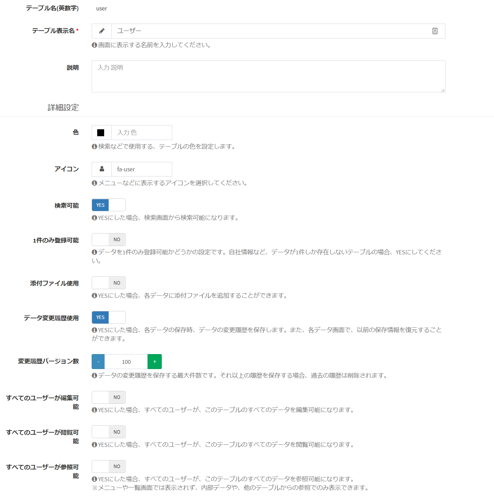

# カスタムテーブル設定
Exmentでは、情報管理を行うためのテーブル「カスタムテーブル」を使用します。  
カスタムテーブルを使用するためには、あらかじめ設定が必要です。
設定方法を記載します。

## 一覧
- 左メニューより、「カスタムテーブル」を選択します。  
もしくは、以下のURLにアクセスしてください。  
http(s)://(ExmentのURL)/admin/table  
これにより、カスタムテーブル設定画面が表示されます。

## 新規追加
カスタムテーブルを新規追加するための手順です。  

- 一覧画面の"新規"ボタンをクリックします。

- テーブル新規追加画面が表示されますので、必要事項を入力します。

※項目の詳細は、ページ下部の「記入項目の詳細」をご確認ください。

## 権限
このテーブルにアクセスできるユーザー、または組織を管理します。  
この設定で保存したユーザー・組織に該当するユーザーのみ、このテーブルにアクセスできます。  
※ただし、メニューの「システム設定」で登録しているユーザー・組織も、このテーブルにアクセスできます。  
  
このテーブルにアクセス許可を行いたいユーザー・組織を、該当する権限の項目に、追加を行ってください。  

## 保存
設定を記入したら、「送信」をクリックしてください。  
テーブルが作成されます。

- テーブルを新規作成した場合、保存後、[カスタム列一覧画面](/ja/column.md)にリダイレクトします。  
そのまま、カスタム列の登録を行ってください。

## 編集
テーブル項目の編集を行いたい場合、該当するカスタムテーブル行の「編集」リンクをクリックしてください。  

## 削除
テーブルの削除を行いたい場合、該当するカスタムテーブル行の「削除」リンクをクリックしてください。  

**※ただし、システムでインストールしているテーブルは削除できません。**

## 記入項目の詳細

- テーブル名(英数字) ※必須: テーブルの名前を表します。URLなどで使用します。  
(例："user", "information", "estimate")  
半角英数字、"-"または"_"で記入します。また、他のテーブルで使用しているテーブル名は使用できません。  
※テーブル名の文字数は30文字以内、テーブル名の先頭は英字を指定してください。  
※テーブルの新規作成時のみ設定できます。保存後は変更できなくなります。  
- テーブル表示名 ※必須: 画面に表示する名称です。日本語などを使用できます。  
(例："ユーザー", "お知らせ", "見積")  

- 説明: そのテーブルの説明文です。データ画面では、こちらで記載した説明文を記載しています。  

- 色: そのテーブルの色を設定します。ここで設定した色は、検索時のサジェストなどで使用します。  

- アイコン: そのテーブルのアイコンを設定します。ここで設定したアイコンは、メニューのデフォルトのアイコンや、検索結果のアイコンとして表示します。  

- 検索可能: 検索画面から検索を行う場合に、そのテーブルを検索対象とするかどうかを設定します。既定値はYESです。  
隠しテーブルにしたい場合など、検索結果から除外したい時に、NOに設定してください。

- 1件のみ登録可能: データを複数件登録せず、1件のみ許可するテーブルの場合、YESに設定してください。既定値はNOです。  

- 添付ファイル使用: テーブルのデータに、添付ファイルのアップロードを行わせたい場合には、YESに設定してください。既定値はYESです。  

- データ変更履歴使用: テーブルのデータを、誰がどのような内容で更新したかどうかを、リビジョン（履歴）として管理したい場合に、YESに設定してください。既定値はYESです。  

- 変更履歴バージョン数: 「データ変更履歴使用」がYESの場合、その変更履歴を保持しておくバージョン数を、整数で記入します。  
「200」と入力した場合、201回目の更新で、1回目の変更履歴情報は削除されます。  
既定値は100です。  

- すべてのユーザーが編集可能: YESにした場合、すべてのユーザーが、このテーブルのすべてのデータを編集可能になります。個別に権限を振る必要がなくなります。既定値はNOです。  

- すべてのユーザーが閲覧可能: YESにした場合、すべてのユーザーが、このテーブルのすべてのデータを閲覧可能になります。個別に権限を振る必要がなくなります。既定値はNOです。  
※インストール時のテーブルの場合、「お知らせ」テーブルが、「すべてのユーザーが閲覧可能」がYESになっています。これは、すべてのユーザーが、お知らせ情報を閲覧できるようにするためです。  
一方で、お知らせ情報を編集できるのは、管理者のみとなります。

- すべてのユーザーが参照可能: YESにした場合、すべてのユーザーが、このテーブルのすべてのデータを参照可能になります。個別に権限を振る必要がなくなります。既定値はNOです。  
※「すべてのユーザーが参照可能」のみYESにした場合、そのテーブルは、メニューや一覧画面は表示できませんが、他のテーブルからの参照は可能になります。  
例えば「消費税」テーブルは、一般ユーザーは一覧画面を表示する必要はありませんが、選択肢として「消費税」を選択してもらう必要があります。このようなテーブルの場合、「すべてのユーザーが参照可能」をYESに設定してください。  

- メニューに追加する: YESにした場合、新規追加後に、そのテーブルへのリンクをメニューに追加することができます。既定値はNOです。  
※テーブルを新規作成する場合のみ表示されます。保存後は、[メニュー](/ja/menu.md)画面にて設定を行ってください。  

- 追加先の親メニュー: 「メニューに追加する」をYESにした場合表示されます。メニュー追加時に、親となるメニュー名を選択してください。  
例えば「管理者設定」を選択した場合、新規作成するテーブルのメニューは、「管理者設定」の下に作成されます。  

