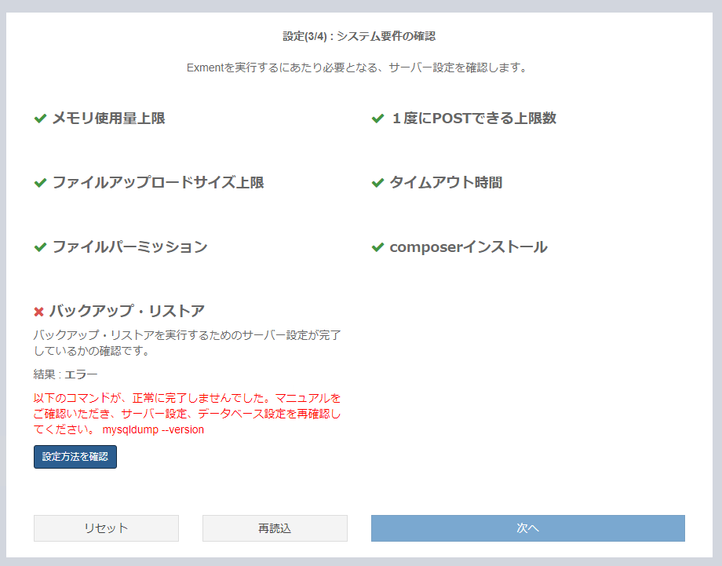

# よくある質問、トラブルシューティング
Exmentのインストールやアップデート、操作に関するよくある質問、トラブルシューティングをまとめております。  
内容は随時更新していきます。  

## ログファイル
Exmentのログファイルは、Exmentのルートプロジェクトフォルダを基準にし、以下のパスに配置されます。エラーなどが発生した場合、このファイル内に、ログが記載されます。  
/storage/logs/laravel.log


## インストール・アップデート

### ファイル・フォルダのPermission Deniedが発生する
かんたんインストール実施時や、ログファイルの書き込みの時に、権限エラーが発生する場合があります。  
また、システム要件の確認を実施時に、以下のエラーが表示される場合があります。  

  

Webサーバーを実行するユーザー(apache, www-dataなど)の権限が不足している可能性があります。  
Exmentのプロジェクトフォルダのうち、以下のフォルダに、Webサーバーを実行するユーザー(apache, www-dataなど)の書き込み権限を追加してください。  

- storage
- bootstrap/cache

また、Web画面からインストールを実行する「[かんたんインストール](/ja/quickstart)」の場合は、追加で以下のフォルダに、Webサーバーを実行するユーザー(apache, www-dataなど)の書き込み権限が必要になります。  
※インストール時のみ必要です。より厳密に権限設定する場合は、かんたんインストール実行後に、フォルダの書き込み権限を削除してください。

- .env
- app
- config
- public

### composer requireや、アップデートバッチが途中で終了する
Linuxへのインストール時、composer requireコマンドや、アップデートバッチを実行時に、以下の表示になることがあります。  

```
# パターン1
Killed

# パターン2
mmap() failed: [12] Cannot allocate memory
PHP Fatal error:  Out of memory (allocated XXXXX) (tried to allocate XXXXX bytes) in phar:///usr/local/bin/composer/src/Composer/Console/Application.php on line 82

# パターン3
Fatal error: Allowed memory size of XXXXXXXX bytes exhausted
```

これはメモリ不足によるエラーです。  

その場合、以下のいずれかの内容を実施することで、解決する場合があります。

#### swap作成
以下のコマンドでswapを作成後、再度インストールやアップデートを実施してください。  
※環境に応じ、適宜コマンドの頭に"sudo"を追加してください。

~~~
dd if=/dev/zero of=/swapfile bs=2M count=2048
chmod 600 /swapfile
mkswap /swapfile
swapon /swapfile
~~~

#### メモリ上限の変更
以下の内容を実施してください。

- php.iniファイルのmemory_limitを修正します。

```
memory_limit=000M #適宜、現在よりサイズを大きくする
memory_limit=-1 #もしくはこちらの指定。メモリを無制限に使用する可能性があるので、自己責任で設定してください
```

- composerの環境変数を設定(アップデート時の問題の場合、バッチに追加してください)
COMPOSER_MEMORY_LIMIT=-1 composer update


### 手動インストールやアップデート時、composerエラーが発生する

手動インストールやアップデート時、以下のようなエラーが発生する場合があります。

```
Installation failed, reverting ./composer.json to its original content.

  [RuntimeException]
  Could not load package XXX/XXX in http://repo.packagist.org: [UnexpectedValueException] Could not parse version constraint ~4.*: Invalid version string "~4.*"
```

この場合、composerのバージョンを上げることにより、解決する場合があります。以下のコマンドで、composerのバージョンを最新版に更新してください。  
**※環境により、アップデート方法が異なるようです。以下の内容のいずれかで、composer更新をご検証ください。**


#### (1)以下のコマンドを実施

```
composer selfupdate
```

#### (2)以下のコマンドを実施

```
composer self-update
```

#### (3)上記のどちらでも更新ができない場合、以下の手順を実施

- ##### composer削除
すでにインストールされているcomposerを、一度削除します。

```
# Linux・Macの場合
which composer
# Windowsの場合
where composer
#結果例 : /usr/bin/composer
###以下のコマンドを実施
rm /usr/bin/composer
```

- ##### composer再インストール
以下の手順で、composerを再インストールしてください。
    - [公式サイト](https://getcomposer.org/download/)
    - [Windows版 解説サイト](https://weblabo.oscasierra.net/php-composer-windows-install/)
    - [Linux版 解説サイト](https://weblabo.oscasierra.net/php-composer-centos-install/)
    - [Mac版 解説サイト](https://weblabo.oscasierra.net/php-composer-macos-homebrew-install/)


### 初回インストール後、管理画面にアクセス時、「SQLSTATE[HY000][202] Permission denied」エラーが発生する
ApacheからMySQLにアクセスを行う場合、SELinuxの設定が必要になる場合があります。  

上記の現象が発生した場合、以下のようにコマンドを実行してください。

~~~
sudo setsebool -P httpd_can_network_connect_db=1
~~~


### アップデート時、「Migrating: 2019_08_19_000000_create_failed_jobs_table」でエラーが発生する
アップデートによるデータベースの変更処理で、以下のようなメッセージが出力されることがあります。  
~~~
Migrating: 2019_08_19_000000_create_failed_jobs_table  
SQLSTATE[42S01]: Base table or view already exists: 1050 Table 'failed_jobs' already exists。  
~~~

上記の現象が発生した場合は「インストール先のフォルダ\database\migrations」にある「2019_08_19_000000_create_failed_jobs_table」ファイルを削除してから、もう一度アップデートを実行してください。


### レンタルサーバーで、「composer require」などのコマンドを実行時に、「Killed」と表示される
これはメモリに負荷がかかる場合に、時々発生する現象です。  
※常に発生するわけではありません  

上記の現象が発生した場合、以下のようにコマンドを実行してください。

~~~
nice -n 20 composer .....
~~~

コマンドの冒頭に「nice -n 20」と付けて、composerを実行してください。  
これにより、優先度を下げてコマンドを実行します。  
※上記のようにコマンドを実行しても、再度「Killed」が表示される場合があります。ご了承ください。


### composerのパスを通すには
composerのパスを通す手順を記載します。  

#### 設定値を追加する
- [こちらの手順](/ja/config)の「Composerパス」で、composerまでのパスを設定します。

```
# 例：以下のコマンドを実行
which composer
#出力例：/usr/local/bin/composer

# 以下の値を.envに記入
EXMENT_COMPOSER_PATH=/usr/local/bin/composer
```

- これにより、composerまでのパスが通ります。


### メンテナンスモードの解除
データベースのリストア、ならびに画面からアップデート機能では、アップデート中にメンテナンスモードに変更します。  
アップデート完了後に、メンテナンスモードは自動的に解除されますが、何らかの理由でメンテナンスモードが解除されなくなった場合に、以下の手順でメンテナンスモードを手動で解除してください。

- プロジェクトのルートフォルダで、以下のコマンドを実施してください。  

```
php artisan up
```


## バックアップ・リストア

### バックアップ・リストアに失敗する
バックアップ画面やコマンドで、以下のようなメッセージが表示される場合があります。

  

もしくは、インストール画面で以下のような表示がされる場合があります。
  

このエラーが表示される場合、Exmentのバックアップ・リストアに必要な設定が行われていない場合があります。  
以下の内容をご確認ください。

#### mysql-clientがWebサーバーにインストールされていない、パスが通っていない  
Exmentのバックアップ・リストアでは、以下のコマンドを、Webサーバー上で実行しています。  

- mysqlコマンド
- mysqldumpコマンド  

これらのコマンドがインストールされていない場合、mysqlコマンド・mysqldumpコマンドをインストールする必要があります。  
これらのコマンドのインストール方法は、環境によって異なります。  
例：[Amazon Linux 2](http://tech-wiki.pomme-verte.net/?p=793)  

また、Webサーバーを動作させるユーザーでは、mysqlコマンド・mysqldumpコマンドまでのパスが通っていない可能性があります。  
その場合、以下の方法で、フルパスでコマンドを実行できるよう、修正してください。  
※設定変更の詳細は、[こちら](/ja/config)からご確認ください。  

- envファイルを開く。  
- 以下の記載を追加する。  

```
EXMENT_MYSQL_BIN_DIR=("mysql"実行ファイルがあるフォルダまでのパス)
#例
EXMENT_MYSQL_BIN_DIR=/usr/bin
```

#### php.iniで"safe_mode=Off"を追加する
mysqlコマンド・mysqldumpコマンドをサーバーから実行する都合上、safe_modeをOffにする必要があります。  
以下の内容を実施してください。

- php.iniファイルを開く。
- 以下の内容を追記する。

```
safe_mode=Off
```

## その他
### 大量の入力項目の送信に失敗する
現在、一部の設定画面で、同一画面で非常に多数の入力が発生した場合に、正常に動作しない場合があります。  
これは、PHPの設定値「max_input_vars（一度にPOSTできる上限数）」を、実際のPOST値が超えた場合に発生します。  
この問題が発生した場合、[PHP設定値変更](/ja/additional_php_ini)を実施し、パラメータ値を変更してください。  
  
現在、以下の機能で発生しやすいことを確認しています。

- ワークフロー利用設定で、テーブル数・ワークフロー数が多い時
- カスタムフォーム設定画面にて、登録する列項目の件数が非常に多い場合
- カスタムデータ入力画面にて、項目の件数が非常に多い場合

### Excelをテンプレートとしたドキュメント出力で、画像の出力に失敗する
Exmentのプラグイン(ドキュメント出力、もしくはエクスポート)機能で、Excelテンプレートに画像を含めてドキュメント出力を行った場合、作成されたファイルに画像が含まれない現象が発生する場合があります。  
使用しているライブラリ「PhpSpreadSheet」のバージョンによって、本現象が発生する場合があります。以下の手順を実施してください。  

#### PHPのバージョンが7.3、7.4の場合
現在(2022/02/25)のPhpSpreadSheetの最新版である1.22.0では、本現象が発生しなくなります。  
PhpSpreadSheetを、以下の手順で1.22.0に変更してください。  

```
composer require phpoffice/phpspreadsheet=~1.22.0
```

#### PHPのバージョンが7.2の場合
PhpSpreadSheet1.22.0は、PHP7.2に対応していません。  
そのため、お手数ですが、PHPのバージョンを7.3以上にアップデートしてください。

