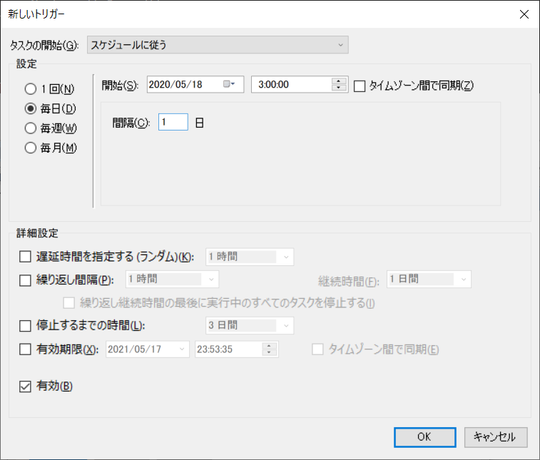
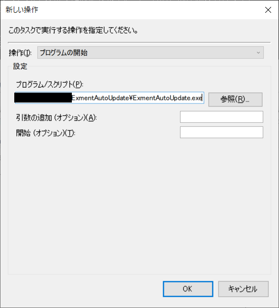
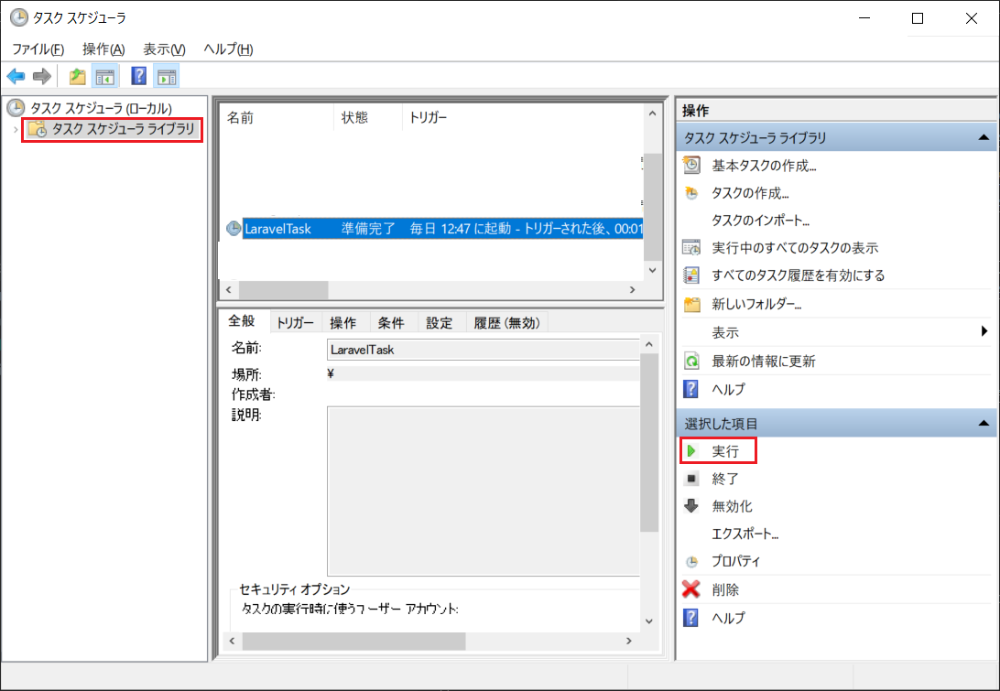

# (上級者向け)自動アップデート
あらかじめ定期更新処理を設定する事により、Exmentのバージョンが更新された場合に、自動的にアップデートを行います。  

> ※現在、このアップデートはプレビュー中です。利用の際は、その点をご理解いただいた上でお願いします。

## 自動アップデート仕様
- Web APIを実行し、Exmentの最新バージョン情報(1)を取得する
- インストールされているExmentのバージョン(2)を取得する
- (2)より(1)が新しければ、アップデートバッチを実行する
- なお、(2)が「dev」からはじまるバージョンであれば、アップデートは行わない

## 設定方法
LinuxとWindowsによって、手順が異なりますので、それぞれの手順を記載します。   

### 設定手順(Linux)
- [アップデートバッチ](/ja/update)をダウンロードし、Exmentプロジェクトフォルダに配置します。  
環境によって、以下のファイルをダウンロードしてください。
    - さくらインターネットの場合 : ExmentUpdateLinuxSakura.sh
    - XServerの場合 : ExmentUpdateLinuxXserver.sh
    - それ以外の場合 : ExmentUpdateLinux.sh

> アップデートを行うシェルが更新されましたので、[アップデート](/ja/update)をご確認いただき、差し替えをお願いします。  
シェルファイルの2行目に「v1.1.0」以上のバージョンが記載されていることをご確認ください。


- 以下のコマンドを、Exmentのルートディレクトリで実行し、ダウンロードを行ってください。
~~~
wget https://exment.net/downloads/cmd/ExmentAutoUpdate.bash
chmod 775 ExmentAutoUpdate.bash
~~~


- ライブラリ「jq」をインストールします。  
以下のコマンドを実行し、「jq」コマンドがインストールされているかどうかを確認します。

```
jq --help
```

- 「コマンドがありません」のような表記が表示された場合、jqコマンドがインストールされていません。  
[公式ドキュメントの方法](https://stedolan.github.io/jq/download/)で、jqコマンドをインストールしてください。


- 以下のコマンドを、Exmentプロジェクトのルートディレクトリで実行し、更新チェック用バッチのダウンロードを行ってください。

~~~
wget https://exment.net/downloads/cmd/ExmentAutoUpdate.bash
chmod 775 ExmentAutoUpdate.bash
~~~


- composerのパスをコピーします。以下のコマンドを任意のパスで実行し、結果をコピーします。

```
which composer
# 結果例
# /home/xxx/usr/local/bin/composer
```

- ダウンロードしたExmentUpdateLinux.sh(または、ExmentUpdateLinuxSakura.sh、ExmentUpdateLinuxXServer.sh)を編集します。  
ファイル内のcomposer_pathの値を、「which composer」の結果に変更します。

```
# composer_path=''
# 下記に修正
composer_path='/home/xxx/usr/local/bin/composer'
```


- 以下のコマンドを実行します。

~~~
crontab -e
~~~

- Cronの設定画面が表示されるので、以下の内容を記入します。

~~~

###以下の記述を追加
(実行する分) (実行する時) * * * cd /(Exmentのルートディレクトリ); bash ExmentAutoUpdate.bash
# 例：パス/var/www/exment配下のExmentを、毎日3:00に実行する場合
0 3 * * * cd /var/www/exment; bash ExmentAutoUpdate.bash >> storage/logs/ExmentAutoUpdate.log  2>&1
~~~


#### 以下、XServerの場合、追加で実施

- 以下のコマンドを実行し、HOMEパスを取得します。

```
echo $HOME
# 結果例
# /home/xxx
```

- その後、ダウンロードしたExmentUpdateLinuxXServer.shを編集します。  
home_pathの値を、「echo $HOME」の結果に変更します。

```
# home_path=''
# 下記に修正。最後に「/」は付けないこと
home_path='/home/xxx'
```


#### 設定完了
- これにより、毎日決まった時間に、ExmentAutoUpdate.bashが実行され、最新版があった場合に、自動的にバージョンアップが行われます。
- 自動アップデートの実行ログは、storage/logs/ExmentAutoUpdate.logに保持されます。


### 設定手順(Windows)
- [アップデートバッチ ExmentUpdateWindows.bat](/ja/update)をダウンロードし、Exmentプロジェクトフォルダに配置します。  

- [こちら](https://exment.net/downloads/cmd/ExmentAutoUpdateWindows.zip)より、アップデートバッチzipをダウンロードします。  

- ダウンロードしたzipファイルを解凍し、Exmentプロジェクトフォルダに、"ExmentAutoUpdateWindows"フォルダごと配置します。

```
# フォルダ階層(一部)
- app
- bootstrap
- config
- ExmentUpdateWindows.bat
- ExmentAutoUpdateWindows
    - ExmentAutoUpdate.exe
    - ExmentAutoUpdate.exe.config
    - Newtonsoft.Json.dll
```


- windowsメニューで、「task」と入力し、タスクスケジューラを起動します。  


- タスクスケジューラで、「タスクの作成」をクリックします。


- 「全般」タブで、以下のように設定します。（「名前」は任意の名称です）


- 「トリガー」タブをクリックします。2つのトリガーを作成します。  
    (1)「新規」ボタンをクリックします。  
    その後、以下のように入力します。  
    - タスクの開始：スケジュールに従う
    - 開始：開始する日付の、実行時間
    - 間隔：1日
    - 「有効」にチェック  
    完了したら「OK」をクリックします。  


- 「操作」タブで、「新規」ボタンをクリックします。  
その後、以下のように入力します。
    - 操作：プログラムの開始
    - プログラム/スクリプト：配置した「ExmentAutoUpdate.exe」までのパス


- ノートPCの場合、「条件」タブで、「コンピューターをAC電源で使用している場合のみタスクを開始する」のチェックを外します。 


- これらの設定が完了したら、OKをクリックします。  
その後、ユーザーの資格情報を入力する画面が表示されるので、パスワードを入力してください。  


- 設定完了後、「タスク スケジューラ ライブラリ」にて、作成したタスクを選択肢、「実行」をクリックしてください。 


これで設定完了です。


#### 設定完了
- これにより、毎日決まった時間に、ExmentAutoUpdate.exeが実行され、最新版があった場合に、自動的にバージョンアップが行われます。

