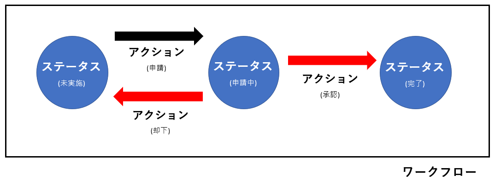
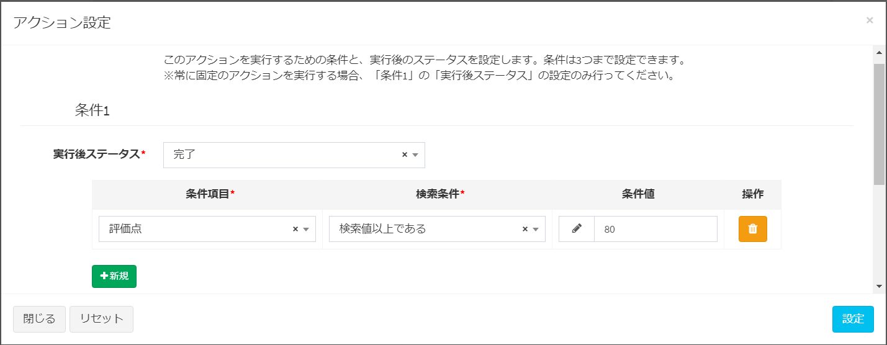
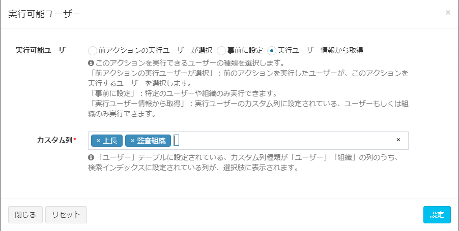

# ワークフロー設定
Exmentで使用する、ワークフローの設定を行います。

## ワークフローとは
ワークフローとは、「業務の一連のやりとりの流れ」のことを指します。  
組織で行われる多くの業務では、「誰がどのようにスタートし、判断や処理をし、完了させるのか」という流れが存在します。  
Exmentでワークフローを設定することで、以下のような業務の流れを実行することができます。

  
- ユーザーは、管理部に経費を申請する
- 管理部は、経費申請を承認する。もしくは却下する
- 承認された経費は、以降データを修正することはできない

## 用語集
Exmentのワークフローで使用する、用語を説明します。

  

##### ワークフロー  
申請や承認など、業務の流れ全体を表します。  

##### ステータス  
ワークフローの現在の状態を表します。  
例：未申請、承認待ち、完了  

##### アクション  
各ユーザーが実行し、特定のステータスからステータスに移動することです。  
例：申請、承認、却下、差し戻し

##### 作業ユーザー  
次のアクションを実行すべきユーザーです。

## 一覧画面表示
システム管理者が、メニューより、「管理者設定 > ワークフロー」をクリックしてください。  
現在保存されているワークフロー一覧が表示されます。

## 新規作成

- 一覧画面右上の［新規］ボタンをクリックします。
  
- ワークフロー作成画面の、「Step1.ステータス設定」が表示されるので、必要事項を入力していきます。

### Step1.ステータス設定
ワークフローのステータスを設定します。

  

#### ワークフロー表示名 ※必須
- 画面に表示する、ワークフロー名称です。日本語の使用も可能です。(例：承認フロー)  

#### ワークフロー種類 ※必須
- 作成するワークフローの種類です。「汎用」もしくは「テーブル専用」のどちらかを選択してください。  
※作成後の変更はできません。  
##### 汎用  
複数のテーブルで、ワークフローを使用できます。  
「申請」「承認」「却下」など、標準的なステータス・アクションのみ使用したい場合にこちらを選択してください。  
##### テーブル専用  
新規作成時に選択したテーブルでしか利用できませんが、そのテーブルのカスタム列を利用して、アクションの実行先を変更することができます。  
例：「経費精算」テーブルで、カスタム列「金額」が100,000円以上であれば「部長承認」アクションを実行、カスタム列「金額」が100,000円未満であれば「課長承認」アクションを実行、といったアクションの切り分けを実行することができます。

#### 開始ステータス名 ※必須
- まだワークフローを実行していない状態でのステータス名を設定します。

#### ステータス設定
- ワークフローの設定や、使用するステータスを定義します。  
※表の最終行のステータスは、フロー完了を表すものとしてください。
##### ステータス名  
そのステータスの名称です。
##### データの編集不可  
ワークフローがこのステータスのときに、対象のデータを編集不可にするかどうかを設定します。編集させたくない場合は、YESに設定してください。  
例：ステータスが「未申請」の場合はデータの編集・削除が可能だが、「申請中」「完了」の場合は編集・削除を行わせたくない、という場合はYESにする

### Step2.アクション設定

  

#### アクション設定
- ワークフローで実施するアクションを設定します。  
##### アクション名  
そのアクションの名称です。
##### 実行前ステータス  
そのアクションを実行するための、ステータス状態を設定します。  
例：実施前ステータスを「未実施」としていた場合、各データのステータスが「未実施」であれば、そのアクションを実行できる。  
##### アクション設定  
どのようなアクションを実行できるかを設定します。［変更］ボタンをクリックすることで、設定変更を行います。  
ワークフロー種類によって、設定内容が異なります。  

  ※ワークフロー種類が「汎用」の場合：  
    このアクションを実行した後のステータスを設定します。「実行前ステータス」とは別のアクションを選択してください。

  ※ワークフロー種類が「テーブル専用」の場合：  
アクションを実行する条件と実行後のステータスを設定します。条件とステータスの組合せは最大3つまで設定できます。

#### 実行可能ユーザー  
このアクションを実行できるユーザー・組織などを選択します。［変更］ボタンをクリックすることで、設定変更を行います。  
- ユーザー  
指定したユーザーが、アクションを実行できます。  

- 組織  
指定した組織に所属するユーザーが、アクションを実行できます。  

- カスタム列  
対象データのカスタム列に設定されたユーザーまたは組織が、アクションを実行できます。「テーブル専用」のみの機能です。  

- システム > 作成ユーザー  
カスタムデータを作成したユーザーが、アクションを実行できます。
  

#### オプション設定 > 次のステータスへ進む条件  
このアクションを実行したときに、次のステータスへ進行するための人数を設定します。  
※通常は、1人でも実行した場合に、フローが進行するのが基本です。ですが、時には「3人以上承認した場合のみ、次のステータスへ進む」「管理組織の全ユーザーが承認した場合のみ、次のステータスへ進む」といった場合もあります。  
その場合に、この設定値を変更してください。  

#### オプション設定 > コメント  
各ユーザーがアクションを実行する場合に、コメントを入力することができます。  
「必須」「任意」「使用しない」から選択できます。

#### オプション設定 > 特殊なアクション  
チェックすることで、アクションに設定されている「実行可能ユーザー」を現在の作業ユーザーに含めません。  
（現在の作業ユーザーとは、現時点のステータスにおいて、なんらかのワークフローアクションが実行可能なユーザーのことです）  
「却下」「差し戻し」など、前のステータスに戻るアクションや、管理者が特例で承認を行うアクションなどに、チェックを行ってください。  
※作業ユーザーが、「特殊なアクション」にのみ割り振られていた場合、対象のユーザーには通知が行われません。また、「現在の作業ユーザー」にも表示されません。

### 設定完了する
ステータス設定、アクション設定の両方を行った場合に、ページ右上に「設定完了する」ボタンが表示されます。  

  

クリックすることで、ワークフローの設定を完了します。  
※設定完了すると、以下の内容が実施できなくなります。 
- ワークフローの削除
- ステータスの追加、削除、順番変更

### Step3.利用設定
どのテーブルで、どのワークフローを実行するかを設定します。  
  

- 各テーブルごとに表示されるワークフローは、「汎用」もしくはそのテーブル専用に作ったもののうち、「設定完了済」となっているワークフローが表示されます。

- ワークフローを使用する場合、「使用する」チェックボックスにチェックを行ってください。  

- 特定の日付で、ワークフローを振り分ける場合、「使用開始日」「使用終了日」に日付を入れます。その際、日付の期間に重複がないように、保存を行ってください。

これで、ワークフロー設定が完了します。  
実際にワークフローを実行する場合には、[ワークフロー実施](/ja/workflow_execution)をご確認ください。