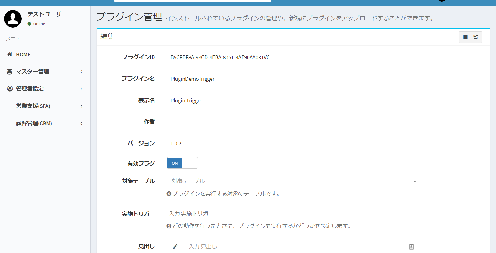

# Plugin

## What is a plugin
Exment has a function called "plugin".  
If the functions that Exment has as standard are insufficient for your business, you can add functions as an extension by uploading a program from the screen.  
There are currently the following types of plugins:  

- [trigger](#trigger)
- [page](#page)
- [dashboard](#dashboard)
- [document output](#document-output)
- [batch](#batch)
- [import](#import)
- [script](#script)
- [style](#style)
- [validation](#validation)

#### trigger
This is executed when a specific operation is performed on the screen of Exment, and processing such as updating the value can be performed.  
Alternatively, you can add a button to the list screen or form screen and process it when clicked.  
Specific operations include the following:  
- mmediately before saving: Processing starts immediately before saving data.  
- After saving: The process starts after the data is saved.  
- Menu button on the list screen: Adds a button at the top of the data list screen to generate an event when clicked.  
- Form menu button (when creating new): Add a button at the top when creating new data, and raise an event when clicked.  
- Form Menu Button (Updating): Adds a button at the top of the data update and raises an event when clicked.  
※ Please refer to [here](/plugin_quickstart_trigger) for mounting method.

#### page
You can create a new screen in Exment.  
Use this if you want to use a page that is completely different from the existing features.  
※ Please refer to [here](/plugin_quickstart_page) for mounting method.

#### dashboard
You can create a new screen on the Exment dashboard.  
Use this if you want to use your own page as a dashboard item.  
※ Please refer to [here](/plugin_quickstart_dashboard) for mounting method.

#### document output
You can create your own document materials such as quotes and reports.  
The template that is the basis of the document is in Excel format, and the output is also output in Excel format.  
※ At present, the output in PDF format has technical issues and we are studying the corresponding policy.  
※ Please refer to [here](/plugin_quickstart_document) for mounting method.

#### batch
This can be used when you want to execute periodic processing automatically.  
It can also be used when you want to perform certain operations at once, such as updating the status in bulk.  
※ Please refer to [here](/plugin_quickstart_batch) for mounting method.

#### import
You can use this if you want to implement your own custom table import process.
Use it when importing files in the original format or implementing special conversion processing.  
※ Please refer to [here](/plugin_quickstart_import) for mounting method.

#### script
You can execute your own script (javascript).  
Currently supported are the data list screen, the data detail screen, the new data creation screen, and the update screen.  
※ Please refer to [here](/plugin_quickstart_script) for mounting method.

#### style
You can set your own style (style sheet / css) and change the design.  
※ Please refer to [here](/plugin_quickstart_style) for mounting method.

#### validation
This can be used when you want to implement your own custom table validation.  
Please use it to implement complicated checks and related checks between items.  
※ Please refer to [here](/plugin_quickstart_validate) for mounting method.

## Management method
### Page display
- Select "Plug-in" from the left menu.  
Or access the following URL.  
http (s): // (Exment URL) / admin / plugin  
This will display the plugin screen.  
  

### Plugin upload
Click "Choose File" and select the created plugin zip file.  
Then click "Upload" and upload from the screen.
  
When completed, the plugin information will be displayed in the list at the bottom of the page.

### Plugin management
Change information such as enable / disable of plugin, trigger of plugin, and URI of page.  
Click the "Edit" link in the appropriate row.
  

This will bring up the plugin management page.
  

### Management items

##### Valid flag
Toggles the use of the plugin on the system.  
Enabled when set to YES. If NO, it is disabled and will not be executed on the system.  
※ When uploading plug-ins, the default is YES. However, if the plug-in type is "batch", it will be NO by default when uploading.

##### Target table
Specify a custom table on which to run the plugin.  
When the page of the set table is displayed, the plug-in is executed.

##### Enforcement trigger
Set whether to execute the plug-in when performing any operation.  
The plug-in is executed when you perform the operation of the set contents.  

##### Button heading
When displaying "Menu button of list screen" or "Menu button of form", set the headline to be displayed on the button.

##### Button icon
When displaying "Menu button of list screen" or "Menu button of form", set the icon to be displayed on the button.

##### Button class
When displaying "Menu button of list screen" or "Menu button of form", set the class to be added to the HTML of the button.

## Remove plugin
To delete a plug-in, click the "Delete" link in the corresponding row from the list screen.  
  
※  When "Delete" is executed, the plug-in file itself is deleted.
If you want to disable the plugin temporarily, set the "Enable Flag" to NO.

## Other
For information on how to develop plug-in, [plug-in development method](/plugin_quickstart.md), please refer to.