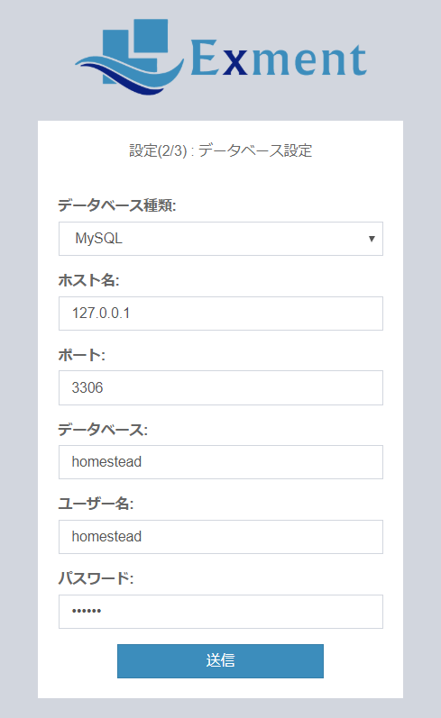

# Installation procedure
This is the procedure required to start Exment. You can make settings on the screen and install.

> ※Please refer to [here](/quickstart_manual) for manual installation or installation by specifying the version.

## important point
- If you encounter an error during installation, please refer to [Troubleshooting](/troubleshooting).
- ※We are very sorry, but we are not accepting individual inquiries regarding the installation procedure or server construction. If you would like individual support, please request paid support.

## Server construction
If you haven't built the server yet, build a web server or database server.  
Please check [here](/server) for the construction method.

### Web server construction
Exment requires PHP 7.2.0.  
If you have not built the server yet, please check [here](/server) and build it.

### Introduced composer
Exment requires composer to be installed on the web server.  
Please refer to here for the installation method.  
※Those who have already installed it are not required.  
- [Official site](https://getcomposer.org/download/)
- [Windows version commentary site](https://weblabo.oscasierra.net/php-composer-windows-install/)
- [Linux version commentary site](https://weblabo.oscasierra.net/php-composer-centos-install/)
- [Mac version commentary site](https://weblabo.oscasierra.net/php-composer-macos-homebrew-install/)

### Database construction
Exment's database engine requires one of the following:

- MySQL 5.7.8 or higher and less than 8.0.0
- MariaDB 10.2.7 and above
- SQL Server 13.0.0 or higher (Currently, automatic backup・restore is not supported)

If you have not set up the database server yet, please check [here](/server #database) and build it.

## Exment app settings
After the server construction is completed, set the application of Exment.

### zip Download / Extract
- Download the zip file from the following URL.
[Exment zip file] (https://exment.net/downloads/ja/exment.zip)

- Extract the zip file to a PHP executable path.
Example 1 (XAMPP Windows): C: \ xampp \ local \ extension
Example 2 (XAMPP Mac): / Applications / XAMPP / local / extension
Example 3 (XServer): $ HOME / domain.com.foobar/exment/
  
-  Do not put the zip file directly under the public folder of each server (eg linux: / var / www / html). Installation files containing database settings and email passwords will be disclosed to the outside, leading to fatal information leakage. 

Be sure to check the [Server Settings](/server) of each procedure for the installation procedure.

### Create database
- Create a database for Exment in your database environment.

### Installation of initial data
- Access the Exment page and configure the settings.  
Example: http (s): // (your site URL) / admin  

- Set the language and time zone.  
Change from the initial value if necessary.  

- Set the database.  
Please change the following contents according to your environment.  
~~~
Database type
Database host name
Database port number
Database name for Exment
Database user name for Exment
Database password for Exment
~~~

  
- Click Run Installation.

### Setting completed
After the quick start is complete, continue with [Initial Settings](/first_setting.md).

## Other initial settings
With the above work, it is possible to start Exment, but additional settings may be required to use some functions.
Please check the link below.
- [Additional settings](/quickstart_more)