# Search
This will explain the search using the search bar at the top of the page and the search on the data list screen.

## Search by search bar (free word search)
A search bar is displayed at the top of each page.   
  
You can search for data registered in Exment by entering words in this search bar.   
There are two types of search functions.   

### Word search
This is a normal search. Data that includes the entered word (starting match) will be displayed in the results.   
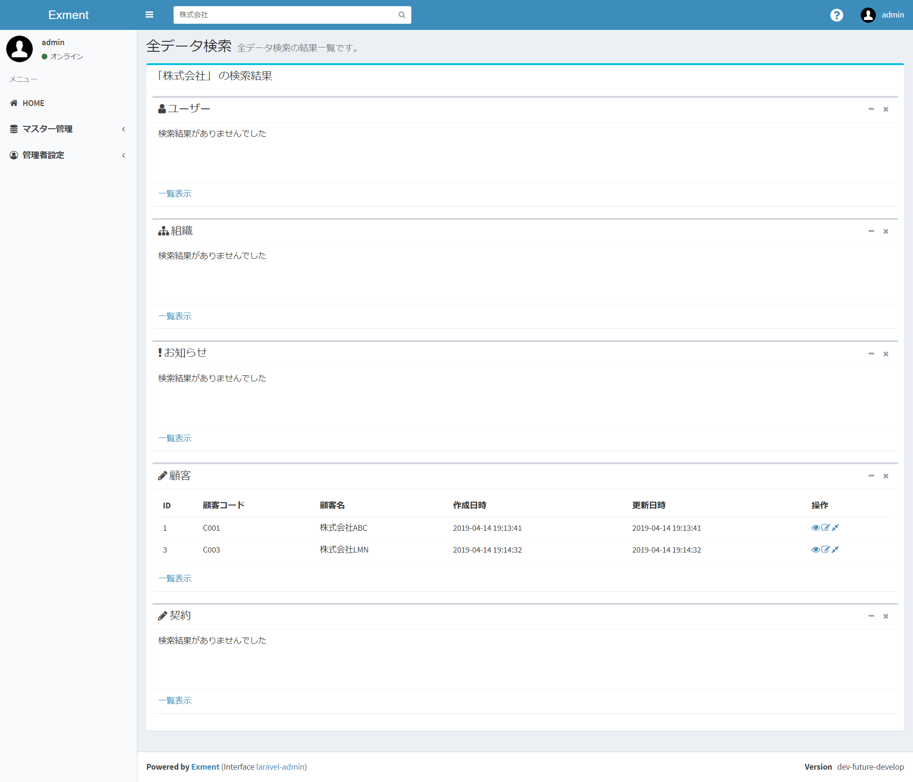  

- The table to be searched is the table whose search target is set to YES in the custom table settings.   

- The custom columns to be searched are those for which the search index is set to YES and the free word search target is set to YES in the custom column settings.   
※ Tables that do not have at least one custom column with search index set to YES will not be displayed in search results.   

> From v3.4.0, the free word search target must be set to YES as a condition to be searched.   
Before that, searches were performed using all columns for which the search index was set to YES, but if 10 to 20 search indexes were set, there was a concern that performance would drop, so free word search was performed. This allows you to narrow down your target.

- Search only tables that the user has permission to view.   

- **Default search setting is prefix match**This is for search performance reasons.   
If you want to change to partial match, please refer to (Supplementary) Switching data search to partial match below.

Enter a word in the search bar and click the search button to perform the search.   
A list of tables to be searched is displayed first, and then matching data is searched.

The search result data displays the following icons: View, Edit, and Search Related Data.   
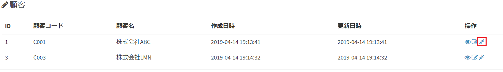    
If you click the [Related data search] icon, the following related data search will be executed.   
- If the column type is Choice/Choice (value/heading)/Choice (from another table), searching will not be possible due to switching in the middle of multiple selection.

### Related data search
Related data searches are performed in the following patterns:   
- If you type a word in the search bar and select the suggestions that appear   
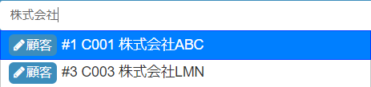  
>The words displayed in the list as candidates can be changed in [Heading display column settings](/table#heading-display-column-setting).

- If you perform a word search and select the Related Data Search icon that appears in the results   
  

Related data search is a function that searches for data that is linked to that data.   
For example, if you have a customer table, you may want to display a list of contract data associated with that customer.   
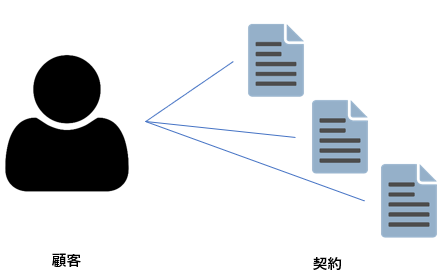  
In that case, by performing this related data search, you can display a list of contract data linked to the customer.   
  
Related data search can display a list of linked data based on the following conditions.   
- The data selected as the search target in the custom column selection (however, the search index must be set to YES in the custom column settings)  
- Data whose parent is registered as 1:n or n:n with the data selected in the search target   
  
In related data search, the selected data itself and related data with the above conditions are displayed in a list.   
In the example below, the data for the selected customer ABC Co., Ltd. and the contracts related to that customer are displayed in a list.   
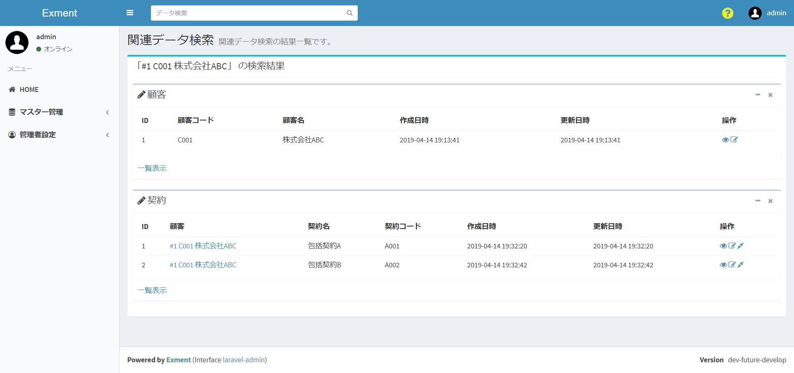  

## Search data list screen
You can search on the data list screen.
There are two types of searches on the data list screen: search using the search bar and filter search by specifying columns.

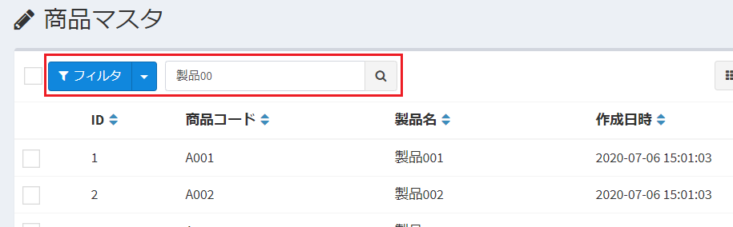  

### Search by search bar (free word search)
Free word search is a function independent of the currently selected custom view.   
The search scope is all data in the target table, and all free word search columns are searched.   
Therefore, the results will be displayed in the full view format instead of the currently selected custom view.

By entering a word in this search bar, you can search for data within the displayed table.   

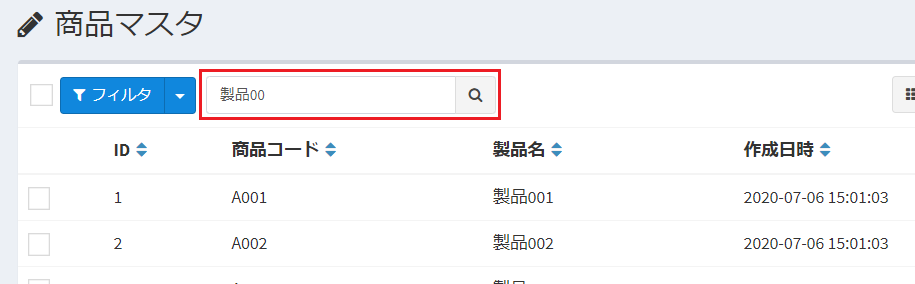  

- The custom columns to be searched are those for which the search index is set to YES and the free word search target is set to YES in the custom column settings.   

> From v3.4.0, the free word search target must be set to YES as a condition to be searched.   
Before that, searches were performed using all columns for which the search index was set to YES, but if 10 to 20 search indexes were set, there was a concern that performance would drop, so free word search was performed. This allows you to narrow down your target.

- **Default search setting is prefix match**This is for search performance reasons.   
If you want to change to partial match, please refer to Switching data search to partial match below.

Enter a word in the search bar and click the search button to perform the search.   

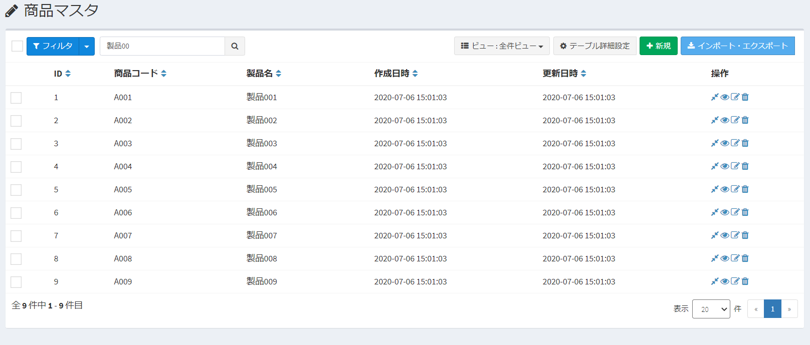  
- If the column type is Choice/Choice (value/heading)/Choice (from another table), searching will not be possible due to switching in the middle of multiple selection.

### Filter search by specifying columns
When you click the filter button, a box will appear to allow you to specify a column and perform an advanced search.

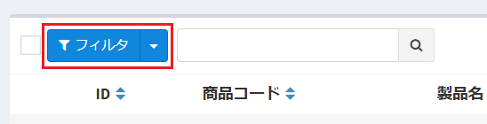  

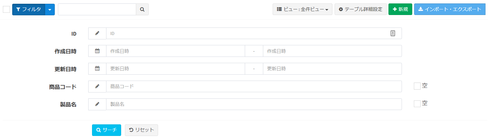  

- The following items are displayed as search column items.
    1. ID, creation date and time, update date and time
    2. For columns with workflow settings, you can filter the workflow status and data for which you are the person in charge.
    3. If a relationship is set with that table as a child, options to narrow down the parent data will be displayed.
    4. Custom columns whose custom column setting search index is set to YES for that table.

※Of these, 1 and 2 can be hidden on the detailed settings screen of the system settings.

  

## Additional information

### Switch data search to partial match
By default, word searches for data are prefix matches.   
This is to improve search performance. This is because partial matching does not provide sufficient search performance.   
  
However, you can switch the search method to broad match.   
To change to partial match, please change the data search method to partial match from the menu administrator settings > system settings (detailed settings).   
  
  

This setting allows your search to be a partial match.   
※This setting may reduce search performance. note that.

### About free word search specifications using custom column types
When performing a free word search, you can basically search only with values ​​stored in the database.   
However, for some custom columns, before performing a free word search, the system can rewrite the search values ​​entered by the user before performing the search.   
The specifications are listed below.

> Currently, we do not support AND searches of multiple columns by entering half-width spaces, such as in Google search.

#### Choices (value and text)
You can search by the value set in the setting value value or the value set in the setting value text.

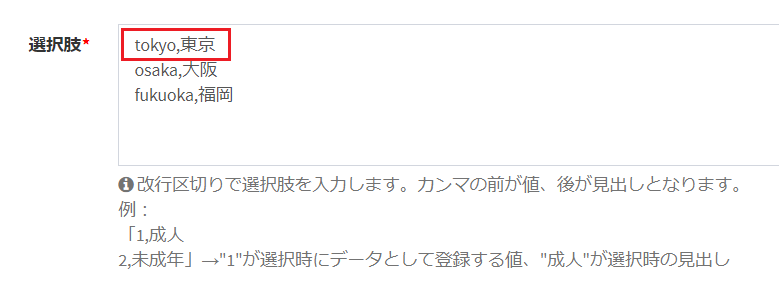  

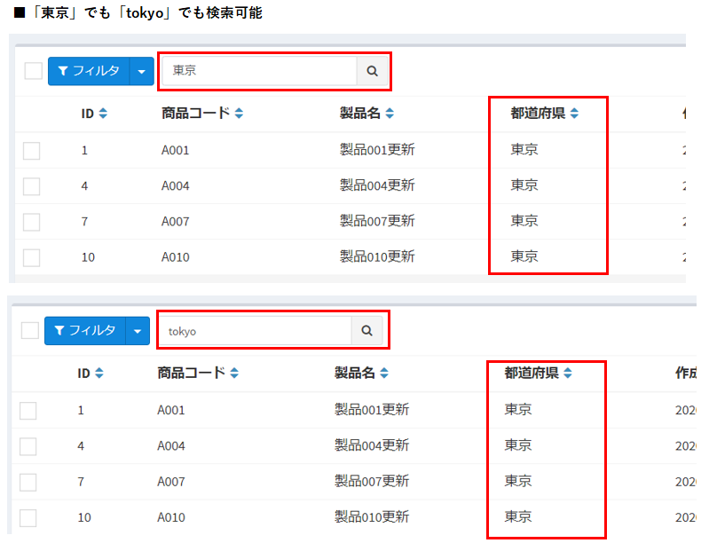  

#### Choices (select from list of values ​​in other tables)
You can search using the words set in the heading column.   

example:  
- There is a product master.   

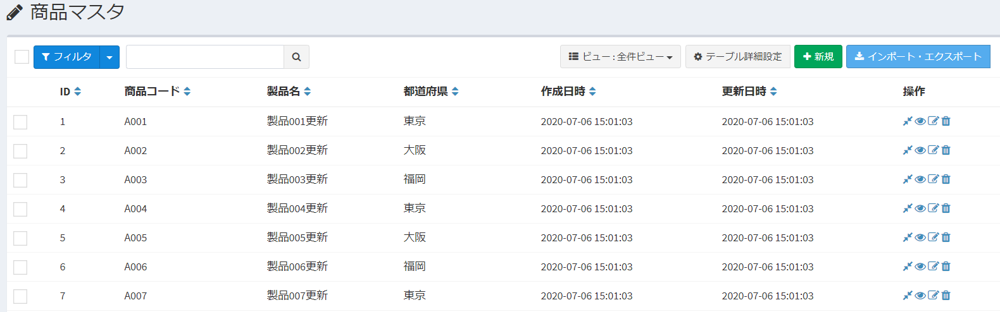  

- In the product master, the product code is set in the heading column settings of the table settings (extended settings).   

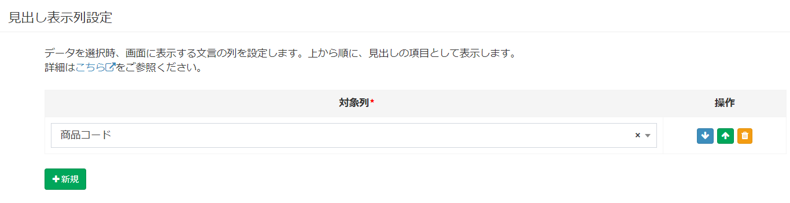  

- Add a column product master that references the product master to the product inventory information table.   

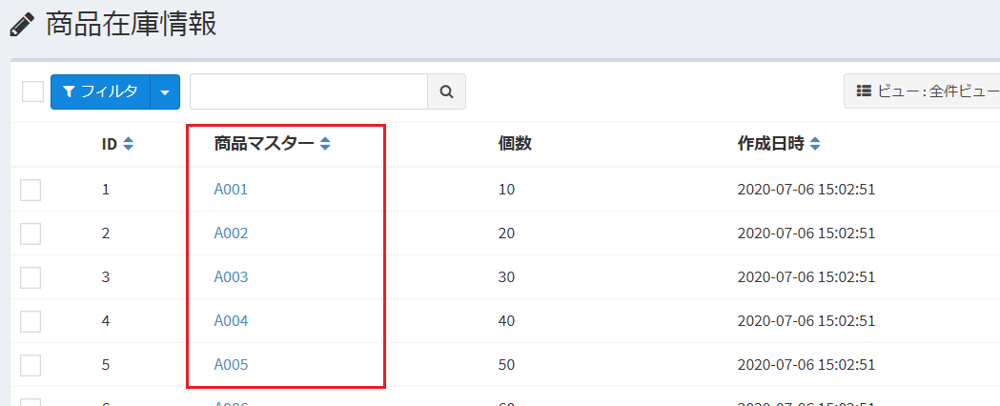  

- With these settings, by entering product code A001 in a free word search, you can obtain a list of product inventory information that refers to product master A001.

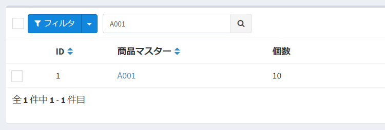  

#### YES/NO
You can search with 0/1 or NO/YES strings.   
(Since searches are performed using general-purpose character strings such as 0, 1, NO, and YES, we do not recommend using them as targets for free word searches.)

#### Binary selection
You can search by option value or heading.   

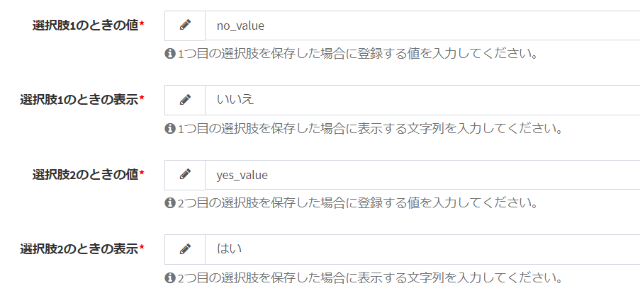  
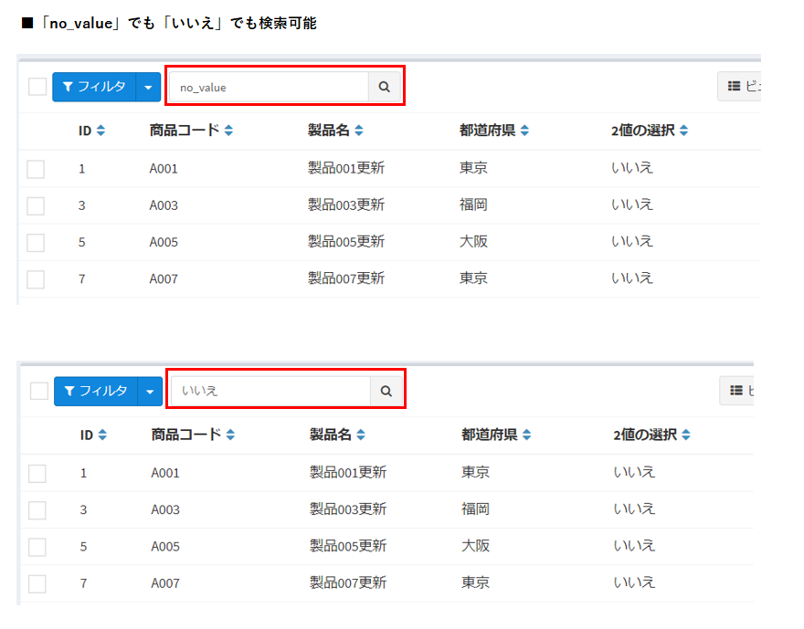  

