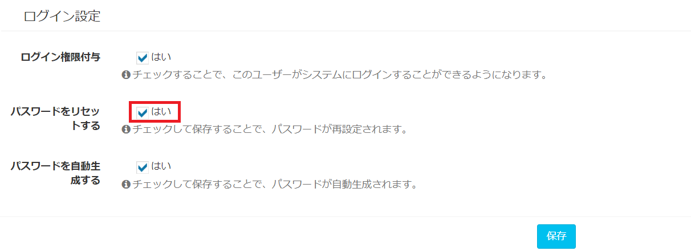

# User/Login User Setting
We will manage users who use this system or login users.

## Name definition
#### user
It is an employee or a person belonging to your company or organization.  
Even those who do not use this system can add as a user.  
User code and e-mail address are required.  
You can register users by associating them with other tables, but you can not log in to the system.  

#### Login User
It is an employee / person who can log in to this system among users.  
Password is allocated, you can log in from the login screen, register and reference data etc.

## User management
I will describe how to manage all user information.

### List screen display
From the left menu, click "User".  
Or please visit the following URL.  
This displays the user setting screen.  
http(s)://(URL of Exment)/admin/data/user
A list of users currently registered in the system is displayed.  

### Add a new user
- On the "Users" screen, click the "New" button at the top right of the page.

- New addition screen will be displayed, so enter necessary information.  

### Save
After filling in the settings, please click "Send".

### Edit
If you want to edit a user, please click the "Edit" link in the corresponding line.  

### Delete
If you want to delete a user, please click the "Delete" link on the corresponding line.  

## Login user management
We will manage login users based on the user created on the above screen.  
You can add password information, reissue a password, delete login role, and so on.

### Screen display
From the left menu, click "Login User".  
Or please visit the following URL.  
This displays the user setting screen.  
http(s)://(URL of Exment)/loginuser  
The user currently registered in the system and its login information are displayed.  
  

### Add login information
Click the "Edit" link in the user's line to add login information.  
  
  
The login information edit screen is displayed.  
  
To add login privileges, click the "Login role" checkbox.  

#### Automatic password generation
When adding login permission, check if you want to generate passwords automatically.  
After automatic generation, password mail is automatically sent to the corresponding mail address.  
  

#### password input
If you do not want to generate a password automatically, uncheck it.
In that case, the item for entering the password will be displayed.
Please enter the password of the login user.

### Save
After filling in the settings, please click "Save".  
The login user is added.  
*If you have checked "Automatic password generation", password mail will be sent automatically.

## Password reset
Perform password reset.  
On the list screen, click the "Edit" link of the user whose column "Login user setting" is "YES".  
  
  
Add a "Reset password" checkbox.  
  
Then click "Save".  

## Remove login user
Delete the login permission.  
On the list screen, click the "Edit" link of the user whose column "Login user setting" is "YES".  
  

Clear the "Grant login role" check box.  
  
Then click "Save".