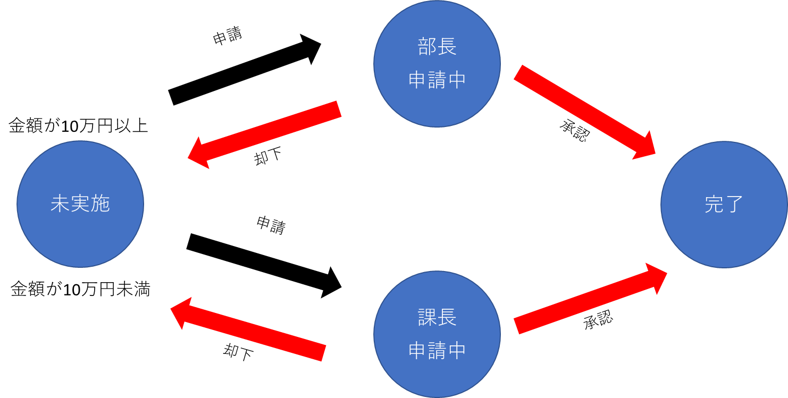

# Workflow setting example
Here are some examples of workflow settings used in Exment.

- [Application → Approve / Reject](#example1)  
Introducing a simple flow for applying, approving and rejecting data.

- [Application → Section Manager Approval or Section Manager Approval / Rejection](#example2)  
This is an introduction of the setting method when allocating the action and changing the person in charge according to the amount of the applied data.  

- [Lock data](#example3)  
This is an introduction of setting method when you want to lock (cannot edit / delete) specific data.

<h2 id="example1">Workflow setting example-Application → Approve / Reject</h2>
This is a simple flow setup method for data application, approval / rejection.  

  
- User applies to management department
- The administration approves the application. Or reject
- Approved data can no longer be modified

### Step1. Status setting

  

- **Workflow display name** : Any name

- **Workflow type** : "General"

- **Start status name** : Not implemented

- **Status 1st** :  
line Status name: "Applying"  
Data cannot be edited: "YES"

- **Status Second line**  
Status name: "Completed"  
Data cannot be edited: "YES"  

### Step2.Action setting

  

- **Action setting 1st line**  
Action name:  
Status before “Application” execution: “Not implemented”  
action setting> Status after execution: “Applying”  
Executable user: “Created user”  
option setting> Condition to go to next status: “1” Run more than one person  
option setting> Comment: "Arbitrary"  

- **Action setting 2nd line**  
Action name: "Approval"  
Status before execution: "Applying"  
Action setting> Status after execution: "Complete"  
Executable user: "Management group" * Create organization "Management group" in advance  
Option setting> Condition for proceeding to the next status:  
Option setting for "Run two or more people" > Comment: "Optional"  
option setting> Special action: Unchecked  

- **Action setting 3rd line**  
Action name: "Reject"  
Status before execution: "Applying"  
Action setting> Status after execution: "Not implemented"  
Executable user: "Management group" * Create organization "Management group" in advance Please  
set options> Conditions for proceeding to the next status:  
Set "One or more people" option> Comments: Set "Required"  
option> Special action: Checked  

<h2 id="example2">Application → department manager approval or section manager approval / rejection</h2>
This is an introduction of the setting method when allocating the action and changing the person in charge according to the amount of the applied data.  

  
- User applies for expenses.
- If the "amount" of the application data is 100,000 yen or more, it will be automatically allocated to the manager if it is less than 100,000 yen, and will be automatically allocated to the section manager.
- The director or section manager approves the application. Or reject.
- Approved data can no longer be modified.

### Step1.Status setting

  

- **Workflow display name** : Any name

- **Workflow type** : "Table only"

- **Table** : Select the table to execute the workflow

- **Start Status Name** : "Not Submitted"

- **Status 1st line**  
Status name: “General manager pending”  
Data cannot be edited: “YES”

- **Status Second line**  
Status name: "Department manager pending"  
Data cannot be edited: "YES"

- **Status Third line**  
Status name: "Completed"  
Data cannot be edited: "YES"

### Step2.Action setting

  

- **Action setting 1st line**  
Action name:  
Status before “application” execution: “Not applied”  
action setting> Status after execution: Refer to the following image  

  

Executable user: "Create user"  
option setting> Conditions for proceeding to the next status: "One or more users"  
option setting> Comment: "Any"  

- **Action setting 2nd line**  
Action name: "Approval"  
status before execution: "Applying for manager"  
action setting> Status after execution: "Complete"  
Executable user: "Manager" * Create organization "Manager" in advance  
option Settings> Conditions for proceeding to the next status: "One or more people"  
option setting> Comment: "Optional"  
option setting> Special action: Unchecked  

- **Action setting 3rd line**  
Action name: "Approve"  
Status before execution: "Applying for section manager"  
Action setting> Status after execution: "Complete"  
Executable user: "section manager" * Create organization "section manager" in advance  
Option Settings> Conditions for proceeding to the next status: "One or more people"  
option setting> Comment: "Optional"  
option setting> Special action: Unchecked  

- **Action setting 4th line**  
Action name: "Reject"  
Status before execution: "Applying for manager"  
Action setting> Status after execution: "Not implemented"  
Executable user: "Manager" * Create organization "Manager" in advance  
Option setting> Conditions for proceeding to the next status:  
Option setting for "Run one or more people" > Comment:  
Option setting for "Required" > Special action: Checked  

- **Action setting 5th line**  
Action name:  
Status before "Reject" execution: "Applying for section manager"  
Action setting> Status after execution: "Not implemented"  
Executable user: "Manager" * Create organization "Manager" in advance  
Option setting> Conditions for proceeding to the next status:  
Option setting for "Run one or more people" > Comment:  
Option setting for "Required" > Special action: Checked  